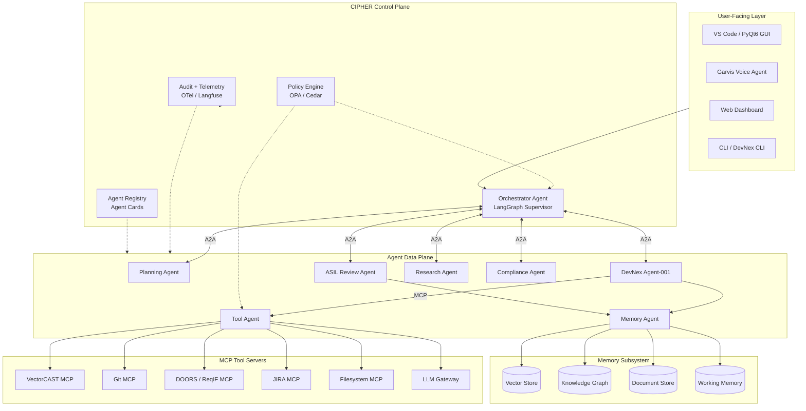

# CIPHER

**Cognitive Intelligent Platform for Holistic Embedded R&D Automation**

An agentic AI operating fabric for automotive and embedded V-cycle SDLC automation.

## Overview

CIPHER is an enterprise-grade, multi-agent platform for safety-critical automotive and embedded software development. It is designed as an agentic operating fabric, or Agentic OS, that coordinates specialized AI agents, shared memory, tool execution, compliance gates, traceability, audit logging, and human approvals across the software V-cycle.

The project is aimed at teams that need more than isolated code generation or test generation. CIPHER is intended to connect requirements, design, implementation, verification, and evidence generation into one governed execution model, with policy enforcement and full traceability built into the runtime architecture.

Its design is local-first and cloud-ready. The same contracts are intended to support a laptop-scale MVP and a production deployment on Kubernetes, with protocol-level compatibility across both modes.

This repository currently serves three roles:

- `docs/CIPHER_archi.md` is the primary architecture and implementation contract for the broader CIPHER platform.
- `cipher/` contains the local MVP scaffold for the future CIPHER runtime.
- `cipher/agents/devnex_assistant/` contains the existing DevNex implementation that is intended to plug into CIPHER as Agent-001.

## Why CIPHER?

Most AI tooling for software engineering optimizes one isolated step: code completion, test generation, requirements drafting, or document summarization. That is useful, but it leaves the real systems-engineering problem unsolved in safety-critical environments.

CIPHER is intended to connect the full workflow:

`Requirements -> HLD -> LLD -> Code -> Tests -> Coverage -> Traceability -> Audit evidence`

In automotive and embedded programs, that chain is constrained by ISO 26262, ASPICE, AUTOSAR, MISRA, review obligations, and evidence requirements. CIPHER treats those constraints as runtime architecture, not post-hoc paperwork.

## Key Features

- End-to-end V-cycle automation across requirements, design, code, tests, and traceability
- Multi-agent orchestration with an Orchestrator supervising specialized agents
- A2A-based agent-to-agent collaboration using explicit contracts
- MCP-based tool integration for compilers, SCM, requirements systems, test tools, and LLM gateways
- Policy-driven compliance gates for ISO 26262, ASPICE, AUTOSAR, and MISRA C:2025 workflows
- Human-in-the-loop approval for irreversible or high-risk actions
- Temporal knowledge graph for bidirectional traceability and impact analysis
- OpenTelemetry-based auditability and observability across tasks, tool calls, and artifacts
- Local-first MVP architecture with a defined path to cloud/Kubernetes deployment
- DevNex integration as Agent-001 without rewriting its internal workflow engine

## Architecture

CIPHER is structured as a layered platform:

- **User-facing layer**: IDE, CLI, GUI, web dashboard, and voice interfaces
- **CIPHER Control Plane**: orchestrator, agent registry, policy engine, and audit/telemetry services
- **Agent Data Plane**: the multi-agent mesh where planning, DevNex, review, compliance, memory, and tool agents collaborate
- **Memory subsystem**: working memory, document persistence, vector retrieval, and temporal graph storage
- **MCP Tool Servers**: sandboxed access to Git, DOORS/ReqIF, VectorCAST, filesystems, issue trackers, and LLM gateways
- **Security and governance layer**: least-privilege access, policy enforcement, approval gates, and audit controls
- **Observability layer**: tracing, logs, metrics, and artifact lineage

For the full architectural contract, see [docs/CIPHER_archi.md](docs/CIPHER_archi.md).



## Agent Taxonomy

| Agent ID | Agent Name | Purpose | Trust Tier |
| --- | --- | --- | --- |
| AGT-000 | Orchestrator Agent | Decompose intent, route tasks, enforce gates, manage lifecycle | T0 |
| AGT-001 | DevNex Agent-001 | Execute V-cycle workflows from design through traceability artifacts | T2 |
| AGT-002 | Planning Agent | Build ASPICE-aligned work breakdowns and execution plans | T1 |
| AGT-003 | ASIL Review Agent | Review artifacts against ISO 26262 and ASIL criteria | T2 |
| AGT-004 | Compliance Agent | Enforce MISRA, AUTOSAR, and ASPICE rule checks | T0 |
| AGT-005 | Research Agent | Retrieve supporting technical and project context | T1 |
| AGT-007 | Memory Agent | Own memory reads, writes, consolidation, and graph persistence | T0 |
| AGT-008 | Tool Agent | Mediate and scope access to MCP tool servers | T0 |
| AGT-009 | Test Agent | Generate tests, drive execution tools, and collect coverage evidence | T2 |
| AGT-010 | Traceability Agent | Maintain requirement-design-code-test linkage and impact analysis | T1 |
| AGT-011 | Doc Agent | Render engineering work products and evidence packages | T1 |

Trust tiers from the architecture:

- **T0**: system infrastructure agents
- **T1**: advisory agents that produce proposals
- **T2**: gated agents that may mutate artifacts only under policy and approval controls

## Core Concepts

### Agent-as-process model

Each agent is treated as a managed process with identity, lifecycle, budgets, scoped permissions, and checkpoint/resume behavior. The orchestrator acts like a scheduler rather than a chat session router.

### A2A for agent-to-agent communication

CIPHER uses A2A for explicit agent collaboration, capability discovery, and task delegation. Agents communicate through typed protocols rather than shared in-memory state.

### MCP for agent-to-tool communication

External tool use is routed through MCP servers and a tool gateway. That gives CIPHER a stable contract for LLM access, filesystem actions, SCM, requirements systems, and test infrastructure.

### Policy-driven compliance gates

Compliance rules are intended to be encoded as executable policy, not informal guidance. The architecture calls for OPA/Cedar-style enforcement before gated actions are allowed to proceed.

### Temporal knowledge graph

Traceability is modeled as a time-aware graph spanning requirements, design artifacts, code, tests, runs, approvals, and violations. This supports impact analysis, audit evidence, and artifact lineage.

### Human-in-the-loop approvals

Irreversible or high-risk actions require explicit approval. Humans are treated as approval gates inside the workflow, not as an external fallback.

### Local/cloud contract compatibility

The architecture is designed so local MVP deployments and cloud production deployments share the same contracts, schemas, and protocol boundaries. The transport and storage backends can change without changing the agent contract model.

## Technology Stack

### Recommended MVP stack

The architecture document recommends the following stack for the initial local MVP:

- Python 3.12
- LangGraph
- FastAPI
- A2A Python SDK
- MCP Python SDK
- SQLite
- Redis
- Memgraph
- Qdrant
- OpenTelemetry
- Langfuse
- OPA
- Docker

### Cloud production targets

For the later production architecture, CIPHER targets:

- Kubernetes
- Kafka
- Postgres or Aurora PostgreSQL
- Neo4j Aura or Memgraph Cloud
- Vault
- SPIFFE/SPIRE
- Grafana stack

### Current repository reality

This repository does not yet contain the full CIPHER runtime implementation, but it now includes a root-level local MVP scaffold under `cipher/` plus the concrete `cipher/agents/devnex_assistant/` subproject, which includes:

- Local MVP package scaffold for control plane, agent boundaries, memory, tooling, governance, observability, and local deployment
- Python package metadata in [cipher/agents/devnex_assistant/pyproject.toml](cipher/agents/devnex_assistant/pyproject.toml)
- Python `>=3.11`
- CLI and PyQt6 GUI
- Local workflow orchestration, persistence, prompts, and tests

## Repository Structure

### Current repository structure

```text
.
|- README.md
|- cipher/
|  |- core/
|  |- orchestrator/
|  |- memory/
|  |- tools/
|  |- agents/
|  |- governance/
|  |- observability/
|  `- deploy/
|- docs/
|  |- CIPHER_archi.md
|  |- AI-Powered V-Cycle Quality and Traceability.md
|  |- ASIL_B_ReviewAgentWF.md
|  |- BaseKnowledge.md
|  |- CIPHER_CORE_IDea.md
|  |- CIPHER_CORE_IDeaV2.md
|  |- GravisVoiceAsisstantAgent.md
|  `- ...
|  `- agents/
|     |- devnex_assistant/
|     |  |- core/
|     |  |- gca/
|     |  |- interfaces/
|     |  |- persistence/
|     |  |- prompts/
|     |  |- skills/
|     |  |- tests/
|     |  |- workflows/
|     |  |- docs/
|     |  `- pyproject.toml
|     `- ...
```

### Local MVP scaffold

The root `cipher/` package has been scaffolded around the architecture's Phase 1 boundaries:

```text
cipher/
  core/
  orchestrator/
  memory/
  tools/
  agents/
  governance/
  observability/
  deploy/
```

Current intent:

- `core/`, `orchestrator/`, `memory/`, `tools/`, `governance/`, and `observability/` define the MVP platform boundaries
- `agents/` includes Phase 1 targets (`devnex_assistant`, `compliance`, `memory_agent`, `tool_agent`) plus early stubs for later agents
- `deploy/local/` is reserved for MVP bootstrap assets once service definitions land

## Getting Started

### Current state

This repository currently contains the architecture contract for CIPHER, a root-level local MVP scaffold in `cipher/`, and the existing `cipher/agents/devnex_assistant/` codebase that is intended to become Agent-001.

The full CIPHER runtime is not yet present as a runnable root-level platform.

**The file structure for Phase 1 now exists, but runtime wiring and service bootstrap are still to be implemented.**

### Working with the current repository

To inspect the architecture:

```powershell
git clone <repository-url>
cd AI_agents
```

Read:

- [docs/CIPHER_archi.md](docs/CIPHER_archi.md)
- [cipher/agents/devnex_assistant/README.md](cipher/agents/devnex_assistant/README.md)

### Running the existing DevNex implementation

The `cipher/agents/devnex_assistant/` subproject is runnable today.

```powershell
cd cipher/agents/devnex_assistant
python -m venv .venv
.\.venv\Scripts\Activate.ps1
pip install -e .
pip install -r requirements.txt
python main_gui.py
```

CLI examples for the current DevNex implementation:

```powershell
cd cipher/agents/devnex_assistant
python devnex.py run-stage S1N1
python devnex.py run-all
python devnex.py status
python devnex.py config --show
```

## Example Usage

### Planned CIPHER flow

The following example is architectural and planned, not a currently implemented root-level CIPHER API:

> "Add an indicator-lamp blinking feature to the Body Control ECU per requirement BC-SR-189."

Intended lifecycle:

1. User submits intent through CLI, GUI, IDE, or web UI.
2. Orchestrator creates a task context and delegates decomposition to the Planning Agent.
3. Planning Agent derives work packages and identifies impacted requirements, design artifacts, and verification scope.
4. DevNex Agent-001 executes relevant V-cycle nodes for LLD, code updates, trace links, and test artifacts.
5. ASIL Review Agent and Compliance Agent review generated artifacts against safety and coding constraints.
6. Human approval is requested before irreversible mutations or sign-off actions.
7. Memory and Traceability services persist the resulting artifacts, lineage, and audit evidence into the temporal graph.

## DevNex Integration

DevNex is intended to be the seed operational agent inside CIPHER as **Agent-001**.

The architecture is explicit about the integration model:

- Existing DevNex internals do not need to be rewritten
- DevNex V-cycle nodes become A2A-exposed skills
- Tool access is routed through the MCP gateway rather than direct unrestricted calls
- Generated artifacts are persisted into the knowledge graph with lineage metadata
- Existing GUI and CLI surfaces can continue to operate while sharing the same backend execution contract

This lets CIPHER grow around a working implementation instead of requiring a greenfield rewrite.

## Roadmap

### Phase 1: Local MVP

- Wrap DevNex as Agent-001
- Add the core agent contract layer, orchestrator, memory subsystem, tool gateway, and audit baseline
- Demonstrate end-to-end traceable execution from requirement input to generated artifacts

### Phase 2: Team-scale multi-agent system

- Add planning, review, research, and voice/UX agents
- Introduce shared transport, approval UI, hybrid retrieval, and team deployment patterns

### Phase 3: Cloud production deployment

- Move to Kubernetes, durable eventing, managed state services, stronger isolation, and enterprise identity/secrets controls

### Phase 4: Continuous expansion

- Add domain-specialized agents for AUTOSAR, cybersecurity, SOTIF, and other embedded engineering domains

## Security and Compliance

CIPHER is designed for safety-critical engineering workflows, but it should not be confused with automatic certification or guaranteed compliance.

The architecture emphasizes:

- Least-privilege tool access
- Policy enforcement through OPA/Cedar-style controls
- Audit logging of tasks, tool calls, and artifact generation
- Sandboxed execution boundaries
- Human approval for irreversible actions
- Prompt-injection and tool-abuse defenses
- Secrets management and workload identity controls

CIPHER is designed to support compliant workflows. It does not by itself certify outputs or replace qualified engineering review.

## Observability

Observability is a first-class concern in the architecture. The platform is intended to expose:

- OpenTelemetry traces and metrics
- Langfuse or LangSmith-style LLM execution telemetry
- Prometheus-compatible metrics
- Grafana dashboards
- Structured logs
- Artifact and decision lineage across the graph

Every task, tool call, review step, and generated artifact should be traceable.

## Documentation

| Document | Purpose |
| --- | --- |
| [docs/CIPHER_archi.md](docs/CIPHER_archi.md) | Full architecture and implementation contract |
| [README.md](README.md) | Project overview and repository onboarding |
| [cipher/agents/devnex_assistant/README.md](cipher/agents/devnex_assistant/README.md) | Current DevNex implementation usage and structure |

Additional background material is available under [`docs/`](docs).

## Contributing

Contributions are welcome, especially in architecture refinement, protocol integration, safety/compliance workflows, memory/traceability design, and DevNex-to-CIPHER integration work.

Standard contribution flow:

1. Fork the repository.
2. Create a feature branch.
3. Make focused changes with clear rationale.
4. Run relevant tests and linting where available.
5. Open a pull request describing the problem, approach, and impact.

Today, the most concrete testable code lives in `cipher/agents/devnex_assistant/`. A more detailed `CONTRIBUTING.md` can be added as the platform structure stabilizes.

## License

This project does not currently specify a license.

## Disclaimer

CIPHER is intended to support engineering automation, traceability, and review workflows. Safety-critical artifacts must still be reviewed and approved by qualified engineers according to the organization's safety, quality, and compliance processes.
