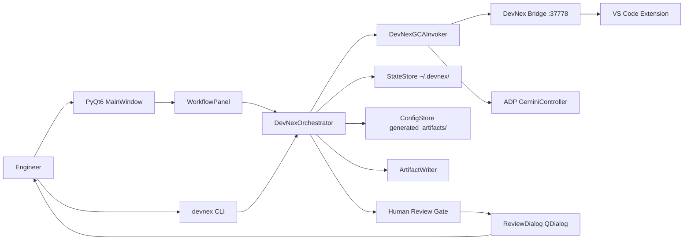
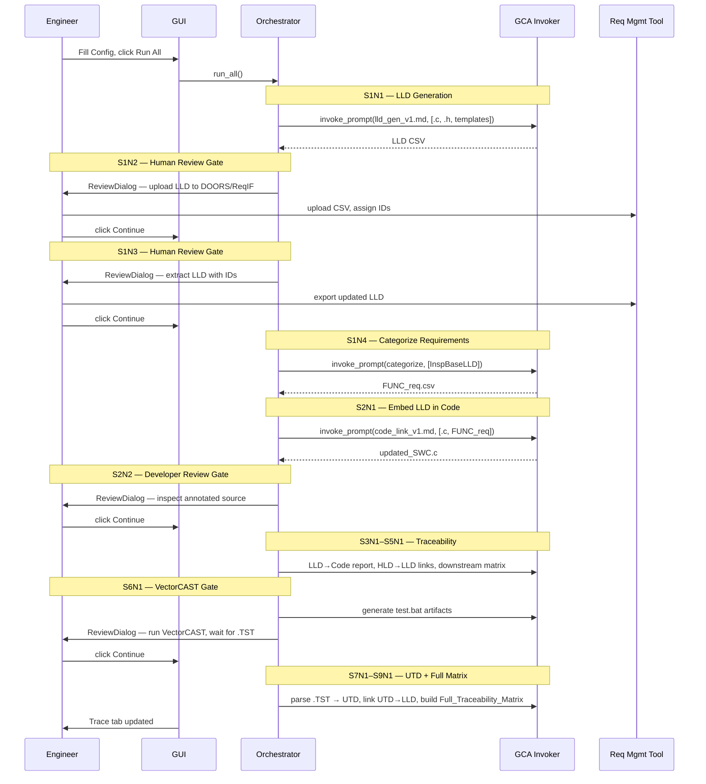

# DevNex Assistant MVP Architecture

## Overview

`devnex-assistant` is a local Python orchestrator with a PyQt6 desktop GUI and Click CLI.
It drives the full V-Cycle AI automation pipeline for embedded SWC development:
LLD generation → Code linking → Traceability → Unit Test documentation → Full matrix.

GCA (Google Code Assist) is invoked for every AI step via isolated VS Code workspaces.
Human review gates pause execution and require explicit user confirmation before proceeding.

## Component Diagram



## V-Cycle Stage Sequence



## Run Artifacts

```
generated_artifacts/
  config.json                         — SWC project file paths
  workflow_state.json                 — node completion states
  runs/<run_id>/
    <SWC>_TEMP_LLD_updated.csv        — S1N1 output
    <SWC>_FUNC_req.csv                — S1N4 output
    updated_<SWC>.c                   — S2N1 output
    LLD_Code_Trace_Report.csv         — S3N1 output
    HLD_LLD_Links.json                — S4N1 output
    HLD_LLD_Code_Trace_Matrix.csv     — S5N1 output
    test.bat                          — S6N1 output
    <SWC>_UTD.md                      — S7N1 output
    UTD_LLD_Links.json                — S8N1 output
    Full_Traceability_Matrix.csv      — S9N1 output
```

## GCA Invocation

Every GCA call uses an isolated temporary workspace:

```python
ws = tempfile.mkdtemp(prefix="devnex_ws_")
# opens VS Code in that workspace
# prevents GeminiController latching to wrong window
```

Fallback chain:
1. Try `ADP.gca_comm_layer.gemini_controller.GeminiController` (if ADP installed).
2. Fall back to `DevNexBridge` HTTP client → `POST http://localhost:37778/prompt`.

## Human Review Threading Model

```
QThread (NodeWorker / FullRunWorker)
  │
  ├─ emit review_needed(node_id, message)   # cross-thread signal
  └─ threading.Event.wait()                 # blocks worker thread only

Main thread (GUI)
  ├─ slot: show ReviewDialog (modal)
  └─ on dialog close: worker.resume(approved)
                      → Event.set()         # unblocks worker thread
```

## State Persistence

| Store | Path | Content |
|---|---|---|
| `ConfigStore` | `generated_artifacts/config.json` | SWC file paths |
| `StateStore` | `~/.devnex/workflow_state.json` | node statuses |
| `SettingsManager` | `~/.devnex/gui_settings.json` | GUI geometry / preferences |
