# CIPHER — Cognitive Intelligent Platform for Holistic Embedded R&D Automation
## High-Level Design: Layered Software Architecture
### Local MVP Edition · Document ID: CIPHER-HLD-001 · Release R1.0 · 10 May 2026

---

> **Document Purpose.** This document describes the layered software architecture of the CIPHER platform for its Local MVP deployment. It is modeled after the AUTOSAR Layered Software Architecture document structure (AUTOSAR_EXP_LayeredSoftwareArchitecture R22-11) and the Agentic OS architectural pattern. It provides a top-down hierarchical view of the platform's software layers, maps every agent and platform component to exactly one layer, and defines the interaction rules between layers. This document is informative and focused on static structural views. Dynamic interface specifications are provided in the individual agent LLD documents.

---

## Document Metadata

| Field | Value |
|---|---|
| Document Title | CIPHER Layered Software Architecture — High-Level Design |
| Document Owner | CIPHER Platform Team |
| Document Status | Release Candidate |
| Part of Standard | CIPHER Platform Specification |
| Release | R1.0 — Local MVP |
| Date | May 2026 |
| Companion Document | CIPHER_Architecture_v3.md (full architectural reference) |
| Reference Standard | AUTOSAR EXP LayeredSoftwareArchitecture R22-11 |
| Reference Pattern | Agentic OS Architecture (datasciencedojo.com) |

---

## Table of Contents

```
1.  Introduction
    1.1  Purpose and Inputs
    1.2  Scope and Extensibility
    1.3  Relationship to AUTOSAR Architecture

2.  Architecture — Overview of Software Layers
    2.1  Top View: The Three Master Layers
    2.2  Coarse View: Expanded Layer Stack
    2.3  Detailed View: Full CIPHER Layer Hierarchy
    2.4  Layer Interaction Matrix

3.  Architecture — Layer Definitions
    3.1  Layer 1 — Hardware & Infrastructure (HW)
    3.2  Layer 2 — Platform Kernel (PKL)
    3.3  Layer 3 — Agent Runtime Environment (ARE)
    3.4  Layer 4 — Tool & Resource Fabric (TRF)
    3.5  Layer 5 — Memory & Knowledge Fabric (MKF)
    3.6  Layer 6 — Governance & Compliance Layer (GCL)
    3.7  Layer 7 — Application / Agent Layer (AAL)

4.  Architecture — Module Type Definitions
    4.1  Driver
    4.2  Interface
    4.3  Handler
    4.4  Manager
    4.5  Library

5.  Architecture — Whole-System HLD
    5.1  System Boundary and External Actors
    5.2  Full Layered Component Diagram
    5.3  Request Lifecycle — Normative Flow

6.  Architecture — Individual Agent HLDs
    6.1  Orchestrator Agent (AGT-000)
    6.2  DevNex Domain Agent (AGT-001)
    6.3  Planning Agent (AGT-002)
    6.4  ASIL Review Agent (AGT-003)
    6.5  Compliance Agent (AGT-004)
    6.6  Research Agent (AGT-005)
    6.7  Garvis Voice/UX Agent (AGT-006)
    6.8  Memory / Context Agent (AGT-007)
    6.9  Tool Broker Agent (AGT-008)

7.  Architecture — Interfaces: General Rules
    7.1  Layer Boundary Rules
    7.2  Upward Interface Rules
    7.3  Downward Interface Rules
    7.4  Lateral Interface Rules (A2A Escapes)

8.  Architecture — Interfaces: Interaction of Layers
    8.1  How the Application Layer communicates with ARE
    8.2  How ARE communicates with TRF and MKF
    8.3  How GCL cross-cuts all layers

9.  Configuration
    9.1  Domain Pack Configuration
    9.2  Agent Scope Configuration
    9.3  LLM Gateway Configuration

10. Integration and Runtime Aspects
    10.1  Startup Sequence (docker-compose)
    10.2  Shutdown and Graceful Drain
    10.3  Checkpoint and Resume
    10.4  Human-in-the-Loop Gate Runtime
```

---

## 1. Introduction

### 1.1 Purpose and Inputs

This document describes the software architecture of CIPHER using a layered approach modeled after the AUTOSAR Classic Platform Layered Software Architecture. Specifically it does three things: it describes in a top-down approach the hierarchical structure of CIPHER software, maps every platform component and agent to one of seven defined software layers, and shows the interaction relationships between those layers.

Just as AUTOSAR separates hardware-dependent code (MCAL) from hardware-independent application code through well-defined vertical layers and strictly controlled cross-layer interfaces, CIPHER separates hardware-and-infrastructure-dependent code (the Platform Kernel) from domain-specific agent logic (the Application/Agent Layer) through seven vertical layers with equally strict interface rules.

This document focuses on static structural views. It does not specify a detailed software design with full dynamic interface descriptions — those are contained in the individual agent LLD documents. Examples given are representative, not exhaustive.

**Inputs.** This document is based on the CIPHER Architecture Reference Document v3.0, the DevNex Assistant HLD and LLD documents (`devnex_assistant/docs/HLD.md` and `LLD.md`), the AUTOSAR EXP LayeredSoftwareArchitecture R22-11, and the Agentic OS Architecture pattern.

### 1.2 Scope and Extensibility

**Application scope.** CIPHER is designed for embedded and automotive software R&D automation. The Local MVP targets a single developer workstation running a Docker Compose stack, with all agents, stores, and tool servers on localhost. The architecture is extensible to cloud-native multi-node deployments without changing agent contracts.

**CIPHER extensibility.** The CIPHER Software Architecture is a generic approach. Standard agents can be extended in functionality while remaining compliant with the Agent Card and A2A task contract. Non-standard domain agents can be integrated as long as they implement the `CIPHERAgent` base interface. Additional domain packs (new regulatory profiles) can be added without modifying the platform kernel layers. New software layers cannot be added — the seven-layer stack is fixed for MVP, mirroring AUTOSAR's constraint that further layers cannot be added.

### 1.3 Relationship to AUTOSAR Architecture

Understanding the mapping between AUTOSAR and CIPHER layers is the fastest way to internalize the CIPHER architecture for engineers already familiar with AUTOSAR. The table below establishes this conceptual bridge.

| AUTOSAR Layer | CIPHER Analog | Rationale |
|---|---|---|
| Microcontroller | Hardware & Infrastructure (HW) | The physical compute, OS, and container runtime — the unchangeable substrate |
| Microcontroller Abstraction Layer (MCAL) | Platform Kernel (PKL) | Direct interaction with the substrate; provides a hardware-independent interface upward |
| ECU Abstraction Layer | Tool & Resource Fabric (TRF) | Abstracts the specific tool (VectorCAST, DOORS, Git) from the agents that use them, just as ECU Abstraction abstracts the specific peripheral |
| Complex Drivers | Memory & Knowledge Fabric (MKF) | Spans from substrate to application layer; provides specialized capabilities that don't fit the normal layered model cleanly |
| Services Layer | Governance & Compliance Layer (GCL) | Highest layer of the "Basic Software" — provides cross-cutting services (policy, audit, identity) to all other layers |
| Runtime Environment (RTE) | Agent Runtime Environment (ARE) | The crucial decoupling layer — above it the architecture style changes from layered to component/agent style |
| Application Layer | Application / Agent Layer (AAL) | Domain-specialized agents that implement actual SDLC work |

The single most important insight from this mapping is the role of the **Agent Runtime Environment (ARE)**, which mirrors AUTOSAR's RTE exactly: above the ARE, the architecture style changes from layered to component style. Above the ARE, agents communicate with each other through typed A2A task contracts and are completely independent of which tool servers, storage backends, or compute substrates are running underneath them.

---

## 2. Architecture — Overview of Software Layers

### 2.1 Top View: The Three Master Layers

At the highest abstraction level, CIPHER distinguishes three master software layers that run on a Host Machine. This is the direct analog of AUTOSAR's three-layer top view (Application / RTE / Basic Software running on Microcontroller).

```
┌─────────────────────────────────────────────────────────────┐
│                   APPLICATION / AGENT LAYER                  │
│           (Domain Agents: DevNex, Planner, Reviewer...)      │
├─────────────────────────────────────────────────────────────┤
│              AGENT RUNTIME ENVIRONMENT (ARE)                 │
│         (A2A Server, Task Contracts, OTel Spans)             │
├─────────────────────────────────────────────────────────────┤
│                    PLATFORM KERNEL (PKL)                     │
│   (Orchestrator, Memory, Tool Broker, Policy, Audit)         │
├─────────────────────────────────────────────────────────────┤
│               HARDWARE & INFRASTRUCTURE (HW)                 │
│        (Host OS, Docker Runtime, Network, Filesytem)         │
└─────────────────────────────────────────────────────────────┘
```

### 2.2 Coarse View: Expanded Layer Stack

The Platform Kernel is further divided into the Governance & Compliance Layer, the Tool & Resource Fabric, the Memory & Knowledge Fabric, and the core Platform Kernel services. This mirrors AUTOSAR's coarse view that divides Basic Software into Services, ECU Abstraction, MCAL, and Complex Drivers.

```
┌─────────────────────────────────────────────────────────────────────────┐
│                       APPLICATION / AGENT LAYER  (AAL)                   │
├─────────────────────────────────────────────────────────────────────────┤
│                    AGENT RUNTIME ENVIRONMENT  (ARE)                      │
├──────────────────────────────────────────────────┬──────────────────────┤
│          GOVERNANCE & COMPLIANCE LAYER  (GCL)    │                      │
├──────────────────────────────────────────────────┤  MEMORY &            │
│            TOOL & RESOURCE FABRIC  (TRF)         │  KNOWLEDGE           │
├──────────────────────────────────────────────────┤  FABRIC  (MKF)       │
│               PLATFORM KERNEL  (PKL)             │                      │
├──────────────────────────────────────────────────┴──────────────────────┤
│                    HARDWARE & INFRASTRUCTURE  (HW)                       │
└─────────────────────────────────────────────────────────────────────────┘
```

The Memory & Knowledge Fabric (MKF) spans vertically from the Hardware layer up to the Agent Layer — just as AUTOSAR's Complex Drivers span from the microcontroller directly up to the RTE. This reflects the fact that agents at every layer (including the Platform Kernel itself) need access to memory services without routing through an intermediate abstraction for every access.

### 2.3 Detailed View: Full CIPHER Layer Hierarchy

The following diagram shows the complete seven-layer stack with its key modules at each level. This is the CIPHER equivalent of AUTOSAR's detailed view showing Communication Services, Memory Services, I/O Hardware Abstraction, MCAL modules, and so on.

```mermaid
flowchart TB
    subgraph AAL["Layer 7 — Application / Agent Layer (AAL)"]
        direction LR
        AGT000["Orchestrator\nAGT-000"]
        AGT001["DevNex\nAGT-001"]
        AGT002["Planning\nAGT-002"]
        AGT003["ASIL Review\nAGT-003"]
        AGT004["Compliance\nAGT-004"]
        AGT005["Research\nAGT-005"]
        AGT006["Garvis Voice\nAGT-006"]
        AGT011["Doc Agent\nAGT-011"]
    end

    subgraph ARE["Layer 6 — Agent Runtime Environment (ARE)"]
        direction LR
        A2ASRV["A2A Server\n(FastAPI)"]
        TASKCTRL["Task Contract\nValidator"]
        OTELSPAN["OTel Span\nEmitter"]
        AGTREG["Agent Registry\n(.well-known)"]
        BUDGET["Budget\nEnforcer"]
    end

    subgraph GCL["Layer 5 — Governance & Compliance Layer (GCL)"]
        direction LR
        OPA["Policy Engine\n(OPA / Rego)"]
        AUDIT["Audit Journal\n(append-only SQLite)"]
        HITL["HITL Gate\nManager"]
        IDENT["Identity\n(JWT / Ed25519)"]
        DOMPACK["Domain Pack\nLoader"]
    end

    subgraph TRF["Layer 4 — Tool & Resource Fabric (TRF)"]
        direction LR
        TOOLAGT["Tool Broker\nAGT-008"]
        MCPSRV["MCP Gateway\n(JSON-RPC)"]
        subgraph MCPTOOLS["MCP Tool Servers"]
            GIT_MCP["Git MCP\n:7211"]
            VC_MCP["VectorCAST MCP\n:7210"]
            DOORS_MCP["DOORS/ReqIF MCP\n:7212"]
            FS_MCP["Filesystem MCP\n:7214"]
            LLM_GW["LLM Gateway\n(LiteLLM / GCA)\n:7215"]
        end
    end

    subgraph MKF["Layer 3 — Memory & Knowledge Fabric (MKF)"]
        direction LR
        MEMAGT["Memory Agent\nAGT-007"]
        KG["Knowledge Graph\n(Memgraph)"]
        VEC["Vector Store\n(Qdrant embedded)"]
        WKMEM["Working Memory\n(Redis)"]
        DOCST["Document Store\n(SQLite)"]
        OBJST["Artifact Store\n(MinIO)"]
    end

    subgraph PKL["Layer 2 — Platform Kernel (PKL)"]
        direction LR
        NATS["Event Bus\n(NATS)"]
        LANGRAPH["Workflow Runtime\n(LangGraph)"]
        CKPT["Checkpoint Store\n(SQLite)"]
        LANGFUSE["Observability\n(Langfuse + OTel)"]
        ADAPTERS["Storage Adapters\ncipher.core.adapters"]
    end

    subgraph HW["Layer 1 — Hardware & Infrastructure (HW)"]
        direction LR
        DOCKERRT["Docker Runtime\n(Container Orchestration)"]
        HOSTNET["Host Network\n(localhost)"]
        HOSTFS["Host Filesystem\n(volumes)"]
        HOSTCPU["Host CPU/GPU\n(compute)"]
    end

    HW --> PKL --> MKF --> TRF --> GCL --> ARE --> AAL
    MKF -. "cross-cuts" .-> AAL
    GCL -. "governs all" .-> TRF
    GCL -. "governs all" .-> ARE
    GCL -. "governs all" .-> AAL
```

### 2.4 Layer Interaction Matrix

This matrix defines which layers are permitted to communicate directly with which other layers. An "X" means direct communication is allowed; a blank means the layer must go through an intermediate layer. This is the CIPHER equivalent of AUTOSAR's Layer Interaction Matrix.

| From ↓  To → | HW | PKL | MKF | TRF | GCL | ARE | AAL |
|---|:---:|:---:|:---:|:---:|:---:|:---:|:---:|
| **HW** | — | X | X | — | — | — | — |
| **PKL** | X | — | X | X | X | — | — |
| **MKF** | X | X | — | X | X | X | X |
| **TRF** | — | X | X | — | X | — | — |
| **GCL** | — | X | X | X | — | X | X |
| **ARE** | — | — | X | X | X | — | X |
| **AAL** | — | — | X | — | X | X | — |

The key rules encoded in this matrix are that no agent (AAL) may communicate directly with the Tool & Resource Fabric (TRF) — all tool calls must be mediated by the Tool Broker (TRF) through the ARE boundary. Agents communicate with memory services (MKF) directly because MKF is a cross-cutting fabric, just as AUTOSAR Complex Drivers span the full stack. The Governance & Compliance Layer (GCL) governs all layers that contain executable actions — this is what makes compliance enforcement architectural rather than optional.

---

## 3. Architecture — Layer Definitions

### 3.1 Layer 1 — Hardware & Infrastructure (HW)

**The Hardware & Infrastructure layer is the lowest software layer of CIPHER.** It is the unchangeable physical substrate — the host machine's operating system, Docker container runtime, host network stack, and host filesystem. CIPHER does not own this layer; it depends on it.

**Task.** Make all higher software layers independent of the specific host machine, operating system, CPU architecture, and container runtime by providing a stable, well-known interface upward through the Platform Kernel's adapter layer.

**Properties.**
- Implementation: host-machine dependent. On a Linux workstation this is the Linux kernel, Docker Engine, and host filesystem. On macOS it is the Darwin kernel, Docker Desktop, and APFS filesystem.
- Upper Interface: exposed to the Platform Kernel (PKL) through Docker socket APIs (`/var/run/docker.sock`), POSIX filesystem calls, and POSIX network sockets.

**Modules at this layer.**

The *Docker Runtime* is the container execution engine that spawns, monitors, and terminates all CIPHER service containers. It provides network namespace isolation between containers, volume mounts for persistent data, and health check integration. The *Host Network* provides the localhost loopback interface on which all CIPHER services communicate in MVP. The *Host Filesystem* provides the persistent volume directories (`./data/memgraph`, `./data/qdrant`, `./data/artifacts`, `./data/audit.db`) that survive container restarts. The *Host CPU/GPU* provides the compute substrate; when Ollama is used for local LLM inference, the GPU is accessed through this layer via CUDA or Metal APIs.

### 3.2 Layer 2 — Platform Kernel (PKL)

**The Platform Kernel is the lowest CIPHER-owned software layer.** It contains the foundational runtime services that every agent and every higher layer depends on — the event bus, the durable workflow runtime, the checkpoint store, and the storage adapter library that abstracts concrete storage technologies from all higher layers.

**Analogy to AUTOSAR MCAL.** Just as AUTOSAR's Microcontroller Abstraction Layer contains the lowest-level drivers that have direct access to the microcontroller but expose a standardized, hardware-independent interface upward, the Platform Kernel has direct access to the host infrastructure (Docker, filesystem, network) but exposes a standardized, infrastructure-independent interface upward through `cipher.core.adapters`.

**Task.** Make all higher software layers independent of the specific infrastructure technology (SQLite vs. PostgreSQL, NATS vs. Kafka, local filesystem vs. S3). Provide the event bus backbone for all asynchronous platform events.

**Properties.**
- Implementation: partially host-dependent. The NATS server is configured with local filesystem journal paths; the LangGraph checkpointer uses SQLite paths from the host volume.
- Upper Interface: standardized and infrastructure-independent. Any higher-layer component that needs to write to the document store calls `cipher.core.adapters.document_store.upsert()` — it does not care whether the backing store is SQLite or Aurora PostgreSQL.

**Modules at this layer.**

The *Event Bus (NATS)* provides the publish/subscribe backbone for all CloudEvents-enveloped platform events (`cipher.task.created`, `cipher.artifact.created`, `cipher.gate.pending`, etc.). In MVP this is a single NATS server running in a Docker container on port 4222. The *Workflow Runtime (LangGraph)* provides the checkpointed state machine execution environment for all agent task graphs. Every agent task is a LangGraph graph whose state is persisted to the Checkpoint Store after every node. The *Checkpoint Store (SQLite)* is the durable persistence layer for LangGraph workflow state. It is an append-only SQLite database mounted from the host volume so checkpoints survive container restarts. The *Observability Backend (Langfuse + OTel Collector)* receives OpenTelemetry OTLP traces from all agents and tool servers and provides the Langfuse web UI for LLM trace inspection. The *Storage Adapters (`cipher.core.adapters`)* are the thin abstraction modules that translate standardized storage API calls into concrete database operations, swappable between MVP and cloud deployments through configuration.

### 3.3 Layer 3 — Memory & Knowledge Fabric (MKF)

**The Memory & Knowledge Fabric is the cross-cutting memory subsystem.** It spans from the Hardware layer up to the Application/Agent layer — just as AUTOSAR's Complex Drivers span from the microcontroller directly up to the RTE — because memory access is needed at every layer without routing through multiple intermediate abstractions.

**Analogy to AUTOSAR Complex Drivers.** AUTOSAR's Complex Drivers exist because some modules (e.g., the Incremental Position Detection driver) have special requirements that don't fit cleanly into the normal MCAL → ECU Abstraction → Services path. They access the hardware directly and provide a result directly to the application. Similarly, the Memory & Knowledge Fabric accesses the storage substrate (Layer 1) directly and provides memory services directly to any layer that needs them.

**Task.** Provide four-tier memory services — working memory, episodic memory, semantic memory, and procedural memory — to all agents and platform components through a single, typed `MemoryAPI` interface. Own the Knowledge Graph schema and enforce the ArtifactRelation data model.

**Properties.**
- Implementation: partially host-dependent (Memgraph requires the host to have sufficient RAM; Qdrant requires sufficient disk for the HNSW index).
- Upper Interface: standardized `MemoryAPI` — completely storage-technology-independent. An agent calling `memory.retrieve()` does not know whether the backing store is Memgraph + Qdrant embedded or Neo4j Aura + Qdrant Cloud.

**Modules at this layer.**

The *Memory Agent (AGT-007)* is the manager module that owns all reads and writes to the memory subsystem. It performs episodic-to-semantic consolidation on a schedule, enforces retention policies, and maintains the temporal validity of Knowledge Graph edges. The *Knowledge Graph (Memgraph Community)* stores the full artifact relation model — every Requirement, Design, Code, Test, Run, Agent, Person, Decision, and ChangeRequest node, connected by typed `ArtifactRelation` edges with `valid_from`, `valid_to`, and `confidence` properties. The *Vector Store (Qdrant embedded)* stores BGE-M3 embeddings for all artifact chunks, organized into four collections: `requirements`, `design_docs`, `source_code`, and `test_cases`. The *Working Memory (Redis)* provides per-agent-per-task key-value storage with TTL, used as the ephemeral task scratchpad. The *Document Store (SQLite)* stores structured metadata — TaskContracts, project configurations, agent registrations, and plan objects. The *Artifact Object Store (MinIO)* stores the actual binary content of artifacts — LLD CSV files, annotated source files, UTD documents, coverage reports — referenced from the Knowledge Graph by URI.

### 3.4 Layer 4 — Tool & Resource Fabric (TRF)

**The Tool & Resource Fabric abstracts every external tool and resource from the agents that use them.** Just as AUTOSAR's ECU Abstraction Layer interfaces the drivers of the MCAL and provides an API for peripheral access regardless of whether a device is on-chip or external, the Tool & Resource Fabric provides a uniform MCP JSON-RPC interface to every tool (VectorCAST, Git, DOORS, JIRA, LLM providers) regardless of whether that tool is a local CLI, a remote REST API, or an external SaaS service.

**Task.** Provide equal mechanisms to access any development tool, build system, requirements management system, test bench, or LLM provider, regardless of its location (local Docker container, remote server, cloud API) and its interface type (CLI, REST, gRPC, proprietary protocol).

**Properties.**
- Implementation: partially host-dependent. The VectorCAST MCP Server requires a VectorCAST installation on the host. The Git MCP Server requires a Git installation. The LLM Gateway can use either local Ollama or remote GCA/Anthropic endpoints.
- Upper Interface: standardized MCP JSON-RPC 2.0. All tool calls from any agent go through the same `POST /mcp/tools/{name}/invoke` interface regardless of the underlying tool.

**Modules at this layer.**

The *Tool Broker Agent (AGT-008)* is the MCP Gateway — the single entry point for all tool calls from all agents. It enforces per-agent scope policies (read from `cipher/governance/agent_scopes.yaml`), injects secrets at call time from the secret store, logs every invocation to the Audit Journal (GCL), and spawns sandboxed execution containers for tools requiring code execution. The *MCP Gateway (JSON-RPC server)* is the HTTP server implementing the MCP protocol that routes validated, policy-checked tool calls to the appropriate MCP tool server. The *Git MCP Server* wraps libgit2 to provide read access to all branches and scoped write access to development branches. The *VectorCAST MCP Server* wraps the VectorCAST CLI in a Docker sandbox to create test environments and parse coverage reports. The *DOORS/ReqIF MCP Server* provides both a read path (ReqIF export file parsing) and a write path (DOORS REST API), with the write path requiring human approval from the HITL Gate Manager (GCL). The *Filesystem MCP Server* enforces directory boundary policies using a Linux seccomp profile, preventing any agent from reading or writing outside its configured project directory. The *LLM Gateway (LiteLLM + GCA bridge)* routes all LLM completion calls to the appropriate provider, implements prompt caching keyed on `(model, messages_hash)`, applies model tiering, and records every token cost against the calling agent's budget.

### 3.5 Layer 5 — Governance & Compliance Layer (GCL)

**The Governance & Compliance Layer provides cross-cutting services to all other layers.** It is the highest layer of the Platform infrastructure. Just as AUTOSAR's Services Layer provides operating system functionality, network management, memory services, and diagnostic services to both the application and lower BSW modules, the Governance & Compliance Layer provides policy enforcement, human approval routing, identity verification, and audit logging to every layer.

**The key architectural property of GCL is that it cross-cuts all layers.** A tool call in TRF, a task submission in ARE, a graph write in MKF, and an agent action in AAL all route through GCL for policy evaluation before execution. This is encoded in the Layer Interaction Matrix — GCL has write access to the audit journal and read access to every layer it governs.

**Task.** Provide policy-as-code enforcement, auditable human approval workflows, cryptographic agent identity, and domain pack management to all platform layers. Ensure that no irreversible action can execute without passing an authorization check and, where required, a human approval gate.

**Properties.**
- Implementation: largely host and technology independent. OPA evaluates Rego policies in memory; the Audit Journal is SQLite in MVP.
- Upper Interface: all layers interact with GCL through two interfaces — the `policy.evaluate(input)` call (synchronous, before any action) and the `audit.record(event)` call (asynchronous, after any action).

**Modules at this layer.**

The *Policy Engine (OPA with Rego)* evaluates every consequential action against the applicable domain pack's policy profile before execution. Every OPA decision is signed with the acting agent's identity and logged. The *Audit Journal (append-only SQLite)* records every platform action — tool invocations, LLM calls, graph writes, human approvals — as an immutable AuditRecord with Ed25519 signature. The *HITL Gate Manager* owns the human-in-the-loop approval workflow: it suspends the calling LangGraph task, emits a `cipher.gate.pending` CloudEvent, delivers the approval request to the web dashboard, and resumes the workflow on receipt of a signed approval. The *Identity Manager (JWT + Ed25519 keypairs)* issues, validates, and rotates agent identities and user JWTs. In MVP, agent keypairs are generated at container startup and stored in the Docker secret mount. The *Domain Pack Loader* reads the active domain pack from `cipher/governance/domain_packs/{pack_id}/` at platform startup and registers its OPA policies, evidence schemas, approval matrices, and evaluation rubrics with the appropriate consumers.

### 3.6 Layer 6 — Agent Runtime Environment (ARE)

**The Agent Runtime Environment is the crucial decoupling layer.** Above the ARE, the architecture style changes from layered to component/agent style — exactly as AUTOSAR specifies for the RTE. Above the ARE, agents communicate with each other through typed A2A task contracts and are completely independent of which specific tool servers, storage backends, or compute substrates are running underneath.

**Analogy to AUTOSAR RTE.** AUTOSAR's Runtime Environment makes Software Components independent from their mapping to a specific ECU. CIPHER's ARE makes agents independent from their mapping to a specific deployment (local laptop vs. cloud cluster, SQLite vs. PostgreSQL, NATS vs. Kafka). An agent that was developed and tested on a local laptop runs without modification in a Kubernetes cluster because the ARE provides the same `tasks/send`, `tasks/get`, and `tasks/stream` interfaces in both environments.

**Task.** Make CIPHER agents independent of their specific deployment environment. Provide the standardized A2A protocol endpoints, task contract validation, OTel span creation, and agent discovery that all agents depend on at their north interface.

**Properties.**
- Implementation: ECU (deployment) and application specific — generated individually for each agent deployment from the `a2a-python SDK` and the agent's Agent Card.
- Upper Interface: completely deployment-independent. Every agent sees the same `tasks/send` method whether it is running locally or in a Kubernetes pod.

**Modules at this layer.**

The *A2A Server (FastAPI)* is the HTTP server implementing the A2A protocol endpoints for each agent: `/.well-known/agent-card.json` for discovery, `POST /a2a` for JSON-RPC task operations, `GET /a2a/tasks/{id}/stream` for SSE streaming. The *Task Contract Validator* schema-validates every incoming TaskContract JSON against the `cipher.taskcontract.v1` JSON Schema before the task is accepted, rejecting malformed tasks with a `400 Bad Request` before they ever reach the agent's plan logic. The *OTel Span Emitter* creates OpenTelemetry root spans for every agent task and child spans for every tool call and LLM call, recording the `trace_id` on every AuditRecord for full correlated observability. The *Agent Registry (`.well-known` server)* maintains the list of registered agents and their Agent Cards, serves the `GET /v1/agents` endpoint, and provides the capability discovery interface that the Orchestrator uses to find which agent has the `vcycle_s3n1` skill for a given task. The *Budget Enforcer* tracks cumulative token spend, wall-clock time, and LLM call count against the `ResourceBudget` declared in the TaskContract's `constraints` field and terminates the agent task with a `BUDGET_EXCEEDED` hard failure if any limit is crossed.

### 3.7 Layer 7 — Application / Agent Layer (AAL)

**The Application / Agent Layer contains all domain-specialized agents.** These agents implement the actual SDLC work — LLD generation, requirement decomposition, code review, static analysis, traceability maintenance, documentation rendering, and voice interaction. They are completely independent of the deployment substrate below the ARE boundary.

**Above the ARE, the architecture style changes from layered to component style** — exactly as AUTOSAR specifies. Agents are opaque components that communicate with each other exclusively through typed A2A task messages. No agent shares Python memory with another. No agent calls another agent's internal methods. Every cross-agent interaction is a network call through the ARE.

**Task.** Implement domain-specific SDLC intelligence as interoperable, independently deployable, opaque agent components. Conform to the `CIPHERAgent` base interface. Declare capabilities through Agent Cards. Accept tasks through the ARE's A2A endpoints. Use the MKF for all memory access. Use the TRF (through the Tool Broker) for all external tool access.

**Properties.**
- Implementation: ECU (deployment) and application specific. DevNex's LLD generation logic is specific to automotive embedded SDLC. The ASIL Review Agent's rubrics are specific to ISO 26262. These implementation specifics are encapsulated and invisible to other agents.
- Upper Interface: the agent's Agent Card and its A2A skills — completely deployment and implementation independent. Any orchestrator can call `vcycle_s3n1` on DevNex without knowing that DevNex is implemented in Python using GCA as its LLM backend.

---

## 4. Architecture — Module Type Definitions

Just as AUTOSAR defines specific module types (Driver, Interface, Handler, Manager, Library) that clarify the role and behavioral contract of every BSW module, CIPHER defines the same five module types. Every component at every layer is one of these types.

### 4.1 Driver

A driver contains the functionality to directly access a specific backend technology or external system. It is the lowest-level module that has direct dependencies on a specific technology. Drivers are located in the Platform Kernel (PKL) or Tool & Resource Fabric (TRF).

Examples in CIPHER: the *SQLite Checkpoint Driver* in PKL directly calls SQLite APIs to read and write LangGraph checkpoint state. The *Memgraph Driver* in MKF directly calls the Memgraph Bolt protocol to execute Cypher queries. The *VectorCAST CLI Driver* in TRF directly spawns the VectorCAST process and parses its stdout output.

### 4.2 Interface

An interface module contains the functionality to abstract from modules placed below it. It provides a generic API to access a specific type of resource, independent of how many instances of that resource exist and independent of the hardware realization. Interfaces do not change the content of the data.

Examples in CIPHER: the *Storage Adapter Interface (`cipher.core.adapters`)* in PKL provides `document_store.upsert()`, `document_store.query()` — the same API whether the backing store is SQLite or Aurora PostgreSQL. The *Memory API Interface (`cipher.core.memory.MemoryAPI`)* in MKF provides `retrieve()`, `upsert_node()`, `upsert_edge()` — the same API whether the backing graph is Memgraph or Neo4j Aura.

### 4.3 Handler

A handler is a specific interface that controls concurrent, multiple, and asynchronous access of one or multiple clients to one or more drivers. It performs buffering, queuing, arbitration, and multiplexing. The handler does not change the content of the data.

Examples in CIPHER: the *MCP Gateway (Tool Broker)* in TRF is a handler — it accepts concurrent tool call requests from multiple agents, queues them against per-agent rate limits, arbitrates scope conflicts, and routes them to the appropriate MCP tool server. The *NATS Event Bus* in PKL is a handler — it accepts concurrent `publish()` calls from all agents, queues messages, and delivers them to all subscribed consumers.

### 4.4 Manager

A manager offers specific services for multiple clients. Unlike a handler, a manager can evaluate and change or adapt the content of the data. Managers are generally located in the Services/Governance layers.

Examples in CIPHER: the *Memory Agent (AGT-007)* in MKF is a manager — it doesn't just route memory requests, it evaluates which episodic records to consolidate into semantic memory, prunes expired working memory, and assigns confidence scores to newly created ArtifactRelation edges. The *Policy Engine (OPA)* in GCL is a manager — it evaluates and adapts authorization decisions based on runtime input context, trust tier, and domain pack policy profile. The *HITL Gate Manager* in GCL is a manager — it evaluates whether a pending action is genuinely irreversible and routes the approval request to the correct human reviewer based on the ASIL level and the active domain pack's approval matrix.

### 4.5 Library

Libraries are collections of functions for related purposes. They run in the context of the caller, are re-entrant, have no internal state, require no initialization, and are synchronous.

Examples in CIPHER: the *`cipher.core.schemas` library* provides schema validation functions (validate TaskContract, validate ArtifactRelation, validate Agent Card) that run in any caller's context with no side effects. The *`cipher.core.otel` library* provides the `@traced()` decorator and span helper functions used by all agents. The *`cipher.core.cloudevents` library* provides envelope construction and parsing for CloudEvents 1.0 messages.

---

## 5. Architecture — Whole-System HLD

### 5.1 System Boundary and External Actors

The system boundary for the CIPHER Local MVP encompasses all software running inside the Docker Compose stack. External actors are the human users (Developer, Technical Lead, QA Engineer), the CI/CD pipeline (GitHub Actions / GitLab CI), and the external tool services (IBM DOORS/DOORS Next, Git remote, VectorCAST license server, LLM API providers).

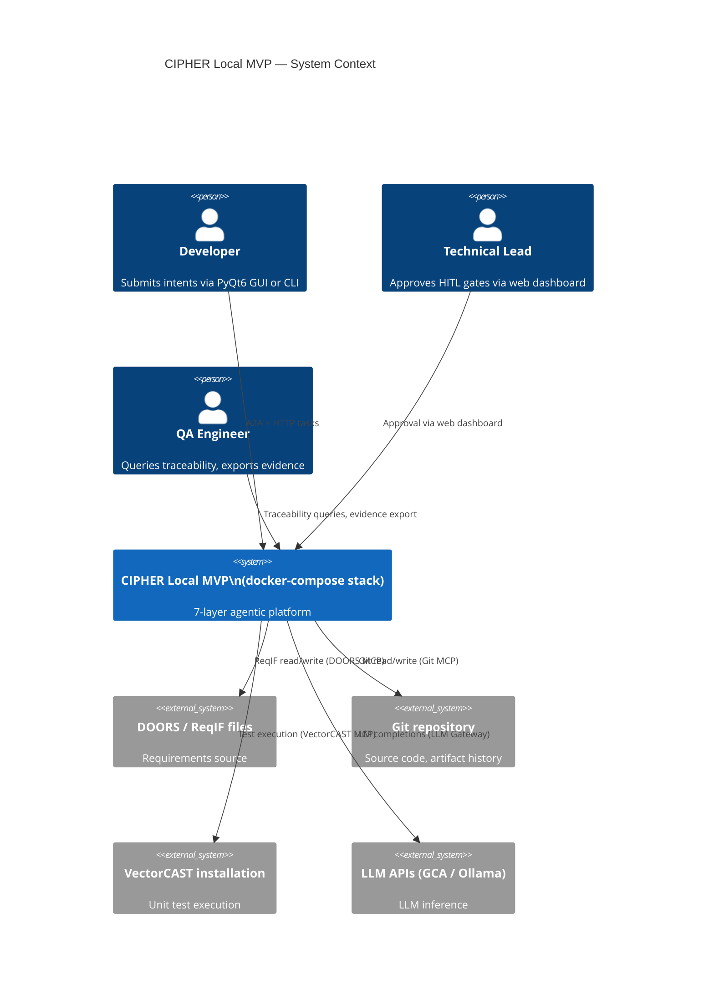

### 5.2 Full Layered Component Diagram

The component diagram below maps every concrete component to its layer and shows the inter-layer communication paths for the MVP deployment. Port numbers are the actual localhost ports used in the Docker Compose stack.

```mermaid
flowchart TB
    subgraph EXT["External Systems"]
        DEV_GUI["PyQt6 GUI\n(DevNex)"]
        DEV_CLI["Click CLI\n(DevNex)"]
        WEB_DB["Web Dashboard\n(HITL / Compliance)"]
        DOORS_EXT["DOORS / ReqIF\n(external)"]
        GIT_EXT["Git Remote\n(external)"]
        LLM_EXT["GCA / Ollama\n(external or local)"]
    end

    subgraph L7_AAL["Layer 7 — Application / Agent Layer"]
        ORCH["Orchestrator\nAGT-000 :8000"]
        DEVNEX["DevNex\nAGT-001 :7001"]
        PLANNER["Planning\nAGT-002 :7002"]
        REVIEWER["ASIL Review\nAGT-003 :7003"]
        COMPLIANCE["Compliance\nAGT-004 :7004"]
        RESEARCH["Research\nAGT-005 :7005"]
        GARVIS["Garvis\nAGT-006 :7006"]
    end

    subgraph L6_ARE["Layer 6 — Agent Runtime Environment"]
        A2A_GW["A2A Gateway\n(FastAPI, per agent)"]
        TASK_VAL["Task Contract\nValidator"]
        OTEL_EM["OTel Span Emitter\n(OTLP → :4317)"]
        REG["Agent Registry\n(.well-known)"]
    end

    subgraph L5_GCL["Layer 5 — Governance & Compliance Layer"]
        OPA_S["OPA Sidecar\n:8181"]
        AUDIT_S["Audit Journal\nSQLite append-only"]
        HITL_MGR["HITL Gate Manager\n(suspends LangGraph)"]
        DOMPACK_L["Domain Pack Loader\n(iso26262-asil-b)"]
        ID_MGR["Identity Manager\n(JWT + Ed25519)"]
    end

    subgraph L4_TRF["Layer 4 — Tool & Resource Fabric"]
        TOOLBROKER["Tool Broker\nAGT-008 :7200"]
        MCP_GW["MCP Gateway\n(JSON-RPC server)"]
        GIT_MCP_S["Git MCP\n:7211 (Docker)"]
        VC_MCP_S["VectorCAST MCP\n:7210 (Docker)"]
        DOORS_MCP_S["DOORS/ReqIF MCP\n:7212 (Docker)"]
        FS_MCP_S["FS MCP\n:7214 (Docker)"]
        LLM_GW_S["LLM Gateway\n:7215 (LiteLLM)"]
    end

    subgraph L3_MKF["Layer 3 — Memory & Knowledge Fabric"]
        MEM_AGT["Memory Agent\nAGT-007 :7100"]
        MEMGRAPH_S["Memgraph\n:7687 (Bolt)"]
        QDRANT_S["Qdrant embedded\n:6333"]
        REDIS_S["Redis\n:6379"]
        SQLITE_DOC["SQLite\n(document store)"]
        MINIO_S["MinIO\n:9000"]
    end

    subgraph L2_PKL["Layer 2 — Platform Kernel"]
        NATS_S["NATS\n:4222"]
        LANGGRAPH_RT["LangGraph\n(in-process)"]
        CKPT_DB["Checkpoint SQLite\n(./data/checkpoints)"]
        LANGFUSE_S["Langfuse\n:3000"]
        ADAPTERS_LIB["cipher.core.adapters\n(storage abstraction)"]
    end

    subgraph L1_HW["Layer 1 — Hardware & Infrastructure"]
        DOCKER_RT["Docker Engine\n(container runtime)"]
        HOST_NET["Host Network\n(localhost bridge)"]
        HOST_FS["Host Filesystem\n(./data/ volumes)"]
    end

    %% External → ARE (entry point)
    DEV_GUI & DEV_CLI -->|"HTTP / A2A"| A2A_GW
    WEB_DB -->|"HTTP"| HITL_MGR

    %% ARE → AAL
    A2A_GW --> TASK_VAL --> ORCH
    A2A_GW --> DEVNEX
    A2A_GW --> PLANNER & REVIEWER & COMPLIANCE & RESEARCH & GARVIS

    %% AAL ↔ AAL (lateral A2A)
    ORCH <-->|"A2A"| DEVNEX
    ORCH <-->|"A2A"| PLANNER & REVIEWER & RESEARCH
    DEVNEX <-->|"A2A lateral"| REVIEWER
    REVIEWER <-->|"A2A lateral"| COMPLIANCE

    %% AAL → GCL
    ORCH & DEVNEX & REVIEWER -->|"policy.evaluate()"| OPA_S
    ORCH & DEVNEX -->|"audit.record()"| AUDIT_S

    %% AAL → MKF (direct — cross-cutting)
    ORCH & DEVNEX & REVIEWER & COMPLIANCE --> MEM_AGT

    %% AAL → TRF (via Tool Broker only)
    DEVNEX & COMPLIANCE & RESEARCH -->|"MCP tasks/call"| TOOLBROKER

    %% TRF internals
    TOOLBROKER --> MCP_GW
    MCP_GW --> GIT_MCP_S & VC_MCP_S & DOORS_MCP_S & FS_MCP_S & LLM_GW_S
    GIT_MCP_S --> GIT_EXT
    VC_MCP_S --> LLM_EXT
    DOORS_MCP_S --> DOORS_EXT
    LLM_GW_S --> LLM_EXT

    %% GCL cross-cuts TRF
    OPA_S -.->|"governs"| TOOLBROKER
    HITL_MGR -.->|"suspends"| LANGGRAPH_RT

    %% MKF → PKL
    MEM_AGT --> MEMGRAPH_S & QDRANT_S & REDIS_S & SQLITE_DOC & MINIO_S
    MEMGRAPH_S & QDRANT_S & REDIS_S & SQLITE_DOC & MINIO_S --> ADAPTERS_LIB

    %% PKL internals
    ADAPTERS_LIB --> CKPT_DB
    LANGGRAPH_RT --> CKPT_DB
    OTEL_EM -->|"OTLP"| LANGFUSE_S
    NATS_S -->|"CloudEvents"| MEM_AGT & ORCH

    %% PKL → HW
    ADAPTERS_LIB --> HOST_FS
    NATS_S --> HOST_FS
    DOCKER_RT --> HOST_FS & HOST_NET
```

### 5.3 Request Lifecycle — Normative Flow

The following sequence diagram defines the normative platform behavior for any V-cycle task execution, showing exactly which layer handles which step. The layer name appears in brackets before each action.

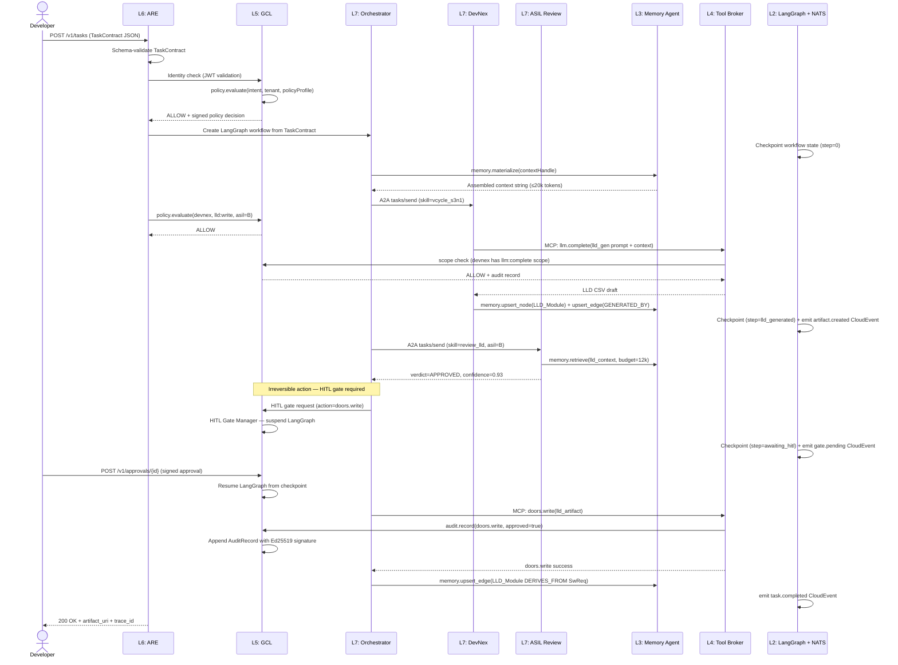

---

## 6. Architecture — Individual Agent HLDs

This section follows the AUTOSAR pattern of defining each individual module's layer position, task, properties, upper interface, lower interface, and internal structure. Each agent HLD is one "page" in the AUTOSAR sense — a self-contained architectural definition.

---

### 6.1 Orchestrator Agent (AGT-000)

**Layer.** Application / Agent Layer (AAL) — Trust Tier T0 (System).

**Purpose.** The Orchestrator is the Supervisor agent that decomposes user intent into an execution plan, assigns tasks to specialist agents, enforces the sequential/parallel/iterative/recursive execution patterns, maintains the overall task lifecycle state, and routes human approval gates. It is the "OS scheduler" of the CIPHER agentic system.

**Task.** Decompose every incoming TaskContract into an ordered ExecutionPlan, spawn child tasks on specialist agents through the ARE's A2A interface, monitor child task completion and failures, invoke the HITL Gate Manager (GCL) for irreversible actions, and persist full audit trails to GCL for every state transition.

**Properties.**
- Implementation: deployment-independent. The Orchestrator is backed by a LangGraph Supervisor graph with SQLite checkpointing (MVP). No agent-specific SDLC domain knowledge is encoded in the Orchestrator — it depends on Agent Cards and the Planning Agent for domain knowledge.
- Upper Interface: `POST /v1/tasks` (REST, north-south) and `POST /orchestration/v1/intents` for intent submission. Exposes `GET /orchestration/v1/plans/{id}` for plan inspection.
- Lower Interface: calls the ARE's `A2A tasks/send` method to delegate to specialist agents. Calls GCL for policy evaluation and HITL gating. Calls MKF's `memory.materialize()` to assemble context before delegation.

**Internal Structure.**

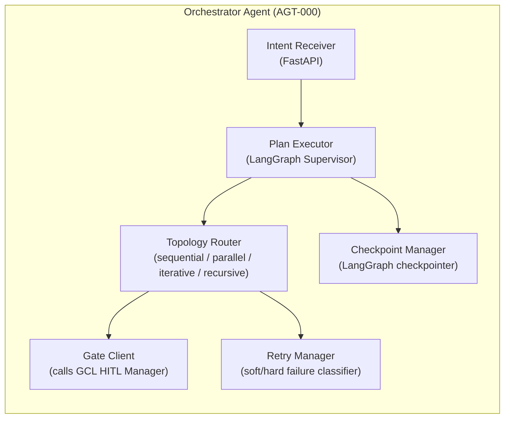

**Interaction Diagram.**

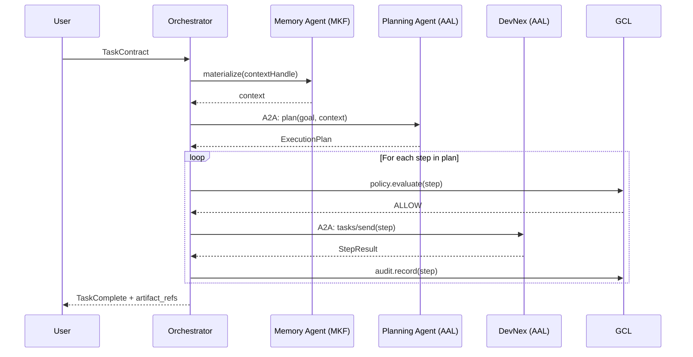

---

### 6.2 DevNex Domain Agent (AGT-001)

**Layer.** Application / Agent Layer (AAL) — Trust Tier T2 (Gated).

**Purpose.** DevNex is the V-cycle domain execution agent. It is the reference implementation of a CIPHER domain agent and the seed agent for the MVP. It encapsulates thirteen V-cycle workflow nodes (S1N1 through S9N1) as individually callable A2A skills and has no knowledge of the agents that call it or the platform layers beneath the ARE.

**Task.** Given an A2A task with a specific skill ID (e.g., `vcycle_s3n1` for LLD generation), load the relevant project context from MKF, construct a domain-specific LLM prompt, call the LLM Gateway through the Tool Broker (TRF), process the result, persist the output artifact to MKF with full ArtifactRelation provenance edges, and return the artifact reference to the calling orchestrator.

**Properties.**
- Implementation: specific to automotive embedded SDLC. The LLD generation prompts (`lld_gen_v1.md`), code annotation prompts (`code_link_v1.md`), and traceability prompts (`full_trace_v1.md`) are AUTOSAR/MISRA-C-aware and stored in the Procedural Memory tier (MKF). The LLM backend is GCA (Google Code Assist) accessed through the LLM Gateway.
- Upper Interface: thirteen A2A skills declared in the Agent Card. Input is a TaskContract with `inputArtifacts` referencing graph URIs. Output is a `StepResult` with `outputArtifacts` as graph URIs + MinIO object URIs.
- Lower Interface: calls Tool Broker (TRF) for all LLM completions, file reads, Git operations, and VectorCAST runs. Calls Memory Agent (MKF) for context materialization and artifact persistence. Never calls the Platform Kernel or Hardware layers directly.

**The Adapter Pattern (wrapping existing DevNex code without modification).**

```python
# cipher/agents/devnex/adapter.py
# This adapter wraps the existing DevNex package at its I/O boundary.
# The DevNex package internals (S1N1..S9N1 node logic, prompt templates,
# GCA invocation) are completely unchanged.

class DevNexAdapter:
    """
    Intercepts DevNex's I/O calls at startup by monkey-patching
    the three boundary points: LLM calls, file reads/writes, and
    VectorCAST invocations. All three are redirected to the
    CIPHER Tool Broker (TRF) so they are audited, scoped, and
    sandboxed by the GCL policy engine.
    """
    def __init__(self, tool_client: ToolClient, memory_client: MemoryClient):
        # Redirect LLM calls through the audited LLM Gateway
        devnex.llm.complete = lambda prompt, **kw: tool_client.call(
            "llm.complete", {"prompt": prompt, **kw}
        )
        # Redirect file I/O through the sandboxed Filesystem MCP
        devnex.io.read_file  = lambda p: tool_client.call("fs.read",  {"path": p})
        devnex.io.write_file = lambda p, c: tool_client.call("fs.write", {"path": p, "content": c})
        # Redirect VectorCAST through the scoped VectorCAST MCP
        devnex.tools.run_vectorcast = lambda env: tool_client.call(
            "vectorcast.run_unit_tests", {"env_path": env, "coverage": "mcdc"}
        )
```

**Internal Structure.**

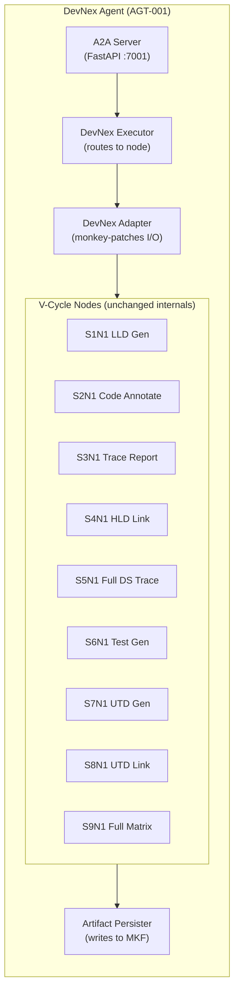

**V-Cycle Node to A2A Skill Mapping.**

| Node | A2A Skill ID | ASPICE Process | Output Artifact |
|---|---|---|---|
| S1N1 | `vcycle_s1n1` | SWE.3 | `LLD_Module` nodes in graph + CSV in MinIO |
| S1N2 | `vcycle_s1n2` | SWE.3 (HITL) | Human approval record |
| S1N3 | `vcycle_s1n3` | SWE.3 (HITL) | Human approval record |
| S1N4 | `vcycle_s1n4` | SWE.3 | `LLD_Functional_Req` CSV |
| S2N1 | `vcycle_s2n1` | SWE.4 | Annotated `SourceFile` nodes + `.c` in MinIO |
| S2N2 | `vcycle_s2n2` | SWE.4 (HITL) | Human approval record |
| S3N1 | `vcycle_s3n1` | SWE.5 | `ArtifactRelation(IMPLEMENTS)` edges |
| S4N1 | `vcycle_s4n1` | SWE.3 | `ArtifactRelation(DERIVES_FROM)` edges |
| S5N1 | `vcycle_s5n1` | SWE.5 | Full downstream trace subgraph |
| S6N1 | `vcycle_s6n1` | SWE.4 (HITL) | `UnitTest` nodes + `test.bat` in MinIO |
| S7N1 | `vcycle_s7n1` | SWE.4 | `UTD` document in MinIO |
| S8N1 | `vcycle_s8n1` | SWE.5 | `ArtifactRelation(VERIFIES)` edges |
| S9N1 | `vcycle_s9n1` | SWE.6 | Full traceability matrix + CSV in MinIO |

---

### 6.3 Planning Agent (AGT-002)

**Layer.** Application / Agent Layer (AAL) — Trust Tier T1 (Advisory).

**Purpose.** The Planning Agent receives a high-level goal from the Orchestrator and decomposes it into a concrete ExecutionPlan — a typed data structure listing the ordered sequence of sub-tasks, the skills and agents needed for each, the estimated token budgets, and the dependency graph between sub-tasks.

**Task.** Given a goal string and a context handle, use the ReAct (Reason + Act) loop to query the Agent Registry for available skills, load the active domain pack's workflow templates (from Procedural Memory in MKF), and produce a well-formed ExecutionPlan with a workflow type (sequential / parallel / iterative / recursive), assigned agent for each step, estimated cost, and ASPICE process mapping.

**Properties.**
- Implementation: uses a medium-capability LLM (Claude Sonnet or GCA standard) for complex planning reasoning. ASPICE workflow templates stored in Procedural Memory (MKF) constrain the plans it generates.
- Upper Interface: single A2A skill `plan_goal`. Returns a structured `ExecutionPlan` JSON.
- Lower Interface: queries the Agent Registry (ARE) for available agent skills. Reads ASPICE workflow templates from MKF procedural memory. Reads project context from MKF semantic memory.

**Internal Structure.**

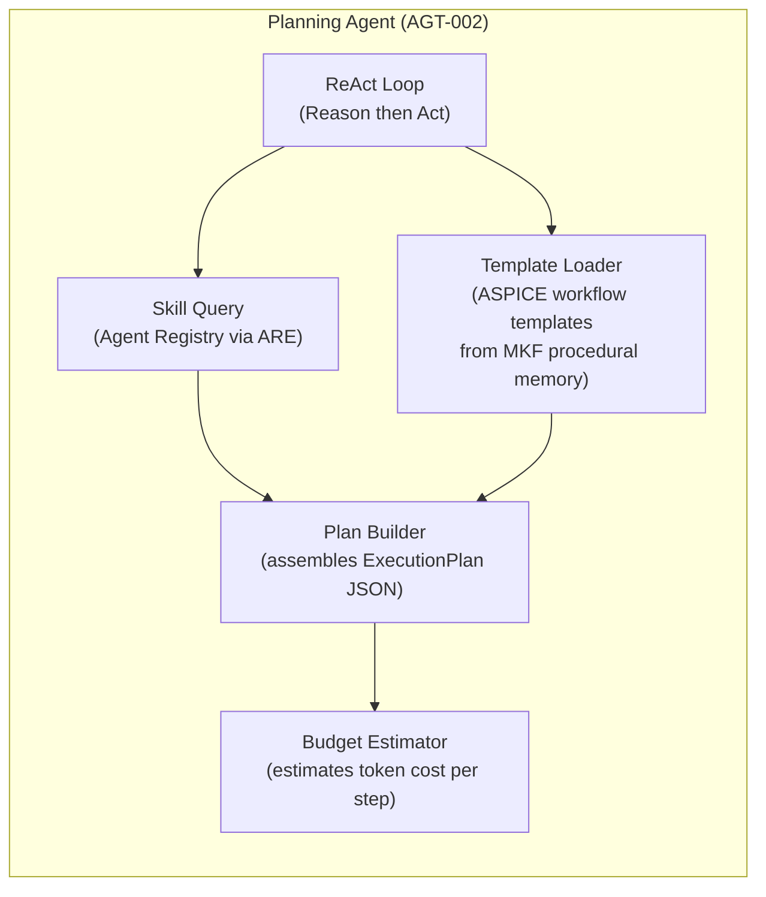

---

### 6.4 ASIL Review Agent (AGT-003)

**Layer.** Application / Agent Layer (AAL) — Trust Tier T2 (Gated).

**Purpose.** The ASIL Review Agent evaluates any CIPHER artifact against the ASIL-level-specific rubric defined in the active domain pack. It applies ISO 26262-6 clauses to design artifacts, checks coverage requirements for code artifacts, and verifies test completeness for verification artifacts. It produces a structured verdict (APPROVED / PASS WITH DEVIATIONS / FAIL) with per-finding severity, location, and remediation suggestion.

**Task.** Given an artifact reference (graph URI) and an ASIL level, retrieve the artifact content and its traceability context from MKF, load the applicable ISO 26262 rubric from Procedural Memory, evaluate each rubric criterion against the artifact, and return a structured `ReviewVerdict` with overall recommendation and a finding list.

**Properties.**
- Implementation: uses a constitutional AI rubric-based evaluation pattern. The rubric files in `cipher/governance/domain_packs/iso26262-asil-b/rubrics/` define each ISO 26262-6 clause as a checkable criterion with a mandatory/advisory classification. A MISRA Required violation always produces FAIL regardless of overall rubric score.
- Upper Interface: A2A skill `review_artifact`. Accepts artifact URI + ASIL level. Returns `ReviewVerdict` JSON.
- Lower Interface: calls MKF for artifact retrieval and rubric loading. May call Compliance Agent (TRF → cppcheck) through a lateral A2A escape when code artifacts require static analysis evidence.

**Internal Structure.**

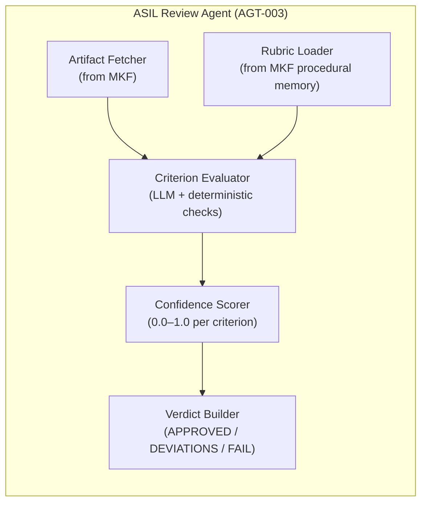

**ReviewVerdict Schema.**

```json
{
  "artifactId": "lld-IndicatorLamp-v3",
  "asilLevel": "B",
  "recommendation": "PASS_WITH_DEVIATIONS",
  "overallConfidence": 0.87,
  "findings": [
    {
      "findingId": "RVW-001",
      "severity": "MAJOR",
      "clause": "ISO26262-6:8.4.4",
      "description": "Timing budget missing for IndicatorLamp_MainFunction",
      "location": "LLD_Module:IndicatorLamp:timing_constraints",
      "remediation": "Add worst-case execution time estimate and jitter bound",
      "blocked": false
    }
  ],
  "evidenceRefs": ["run:rev-0042"],
  "reviewedBy": "AGT-003",
  "timestamp": "2026-05-09T15:30:00Z"
}
```

---

### 6.5 Compliance Agent (AGT-004)

**Layer.** Application / Agent Layer (AAL) — Trust Tier T0 (System).

**Purpose.** The Compliance Agent is the deterministic static analysis gate. It wraps PC-lint Plus, cppcheck, and Polyspace as MCP tools and evaluates source code artifacts against MISRA-C:2025 rules, AUTOSAR coding guidelines, and ASPICE BP/GP coverage requirements. Unlike the ASIL Review Agent (which uses LLM-based rubric evaluation), the Compliance Agent relies primarily on deterministic rule engines — its findings are reproducible and can be used as formal compliance evidence.

**Task.** Given a source file reference (graph URI), retrieve the file content from MKF, call the appropriate static analysis tools through TRF, parse the tool results, create `ArtifactRelation(VIOLATES)` edges in MKF for any violations found, and return a structured `ComplianceReport` with violation count by severity and rule category.

**Properties.**
- Implementation: hybrid LLM + deterministic rule engine. MISRA Required violations are always detected deterministically by cppcheck/PC-lint. MISRA Advisory violations may use LLM-based heuristics when the static analyzer is unavailable (fallback mode, labeled as non-deterministic in the audit trail).
- Upper Interface: A2A skill `compliance_check`. Returns `ComplianceReport` JSON.
- Lower Interface: calls TRF for `cppcheck.run`, `pclint.run`. Calls MKF for file content retrieval and violation edge persistence.

**Internal Structure.**

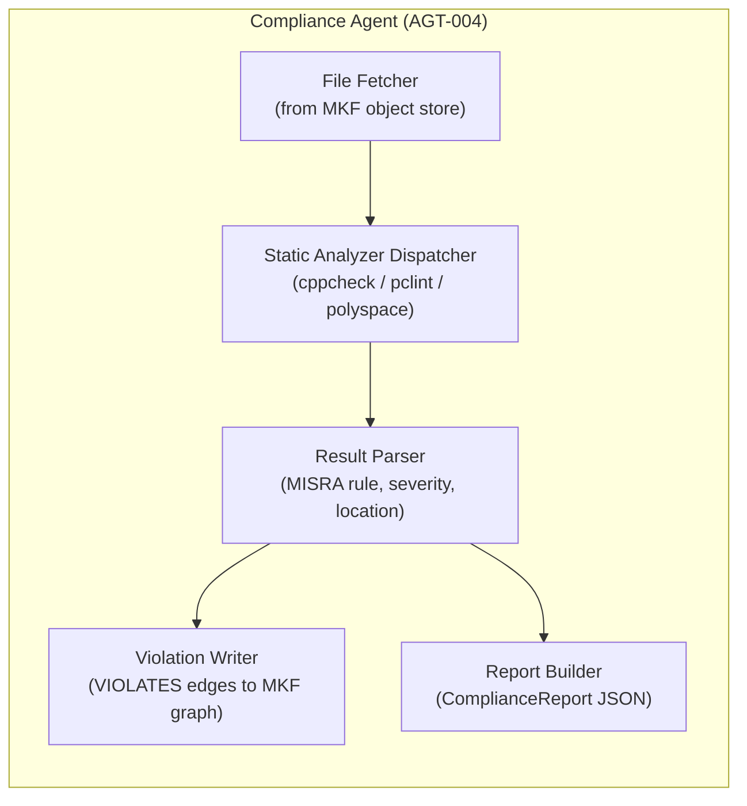

---

### 6.6 Research Agent (AGT-005)

**Layer.** Application / Agent Layer (AAL) — Trust Tier T1 (Advisory).

**Purpose.** The Research Agent retrieves external and internal context that other agents need but do not have in their immediate working memory. It indexes and retrieves from internal wikis, AUTOSAR specification documents, datasheets, prior project artifacts, and internet sources (when permitted by policy). It is the RAG specialist of the CIPHER system.

**Task.** Given a research query and a context handle, perform a hybrid retrieval operation (vector search + graph expansion + rerank) through MKF, assemble the retrieved chunks into a structured context pack sized to the caller's token budget, and return the pack as a context handle that the caller can materialize on demand.

**Properties.**
- Implementation: uses Qdrant vector search + Memgraph PageRank expansion + bge-reranker-large cross-encoder. Document corpus is indexed at project setup time from the team's wiki and AUTOSAR specification PDFs.
- Upper Interface: A2A skill `research_query`. Returns a `ContextHandle` pointing to the assembled retrieval result.
- Lower Interface: calls MKF `memory.retrieve()` for hybrid retrieval. May call TRF LLM Gateway for query expansion and reranking.

---

### 6.7 Garvis Voice/UX Agent (AGT-006)

**Layer.** Application / Agent Layer (AAL) — Trust Tier T1 (Advisory).

**Purpose.** Garvis is the voice and natural-language interaction front-end for CIPHER. It translates engineer voice commands into structured CIPHER task intents that the Orchestrator can act on, and reads out status updates, gate notifications, and brief artifact summaries in natural language.

**Task.** Listen for the wake word, convert the engineer's spoken command to text using Whisper, classify the intent using a small local LLM (7B GGUF model), construct a TaskContract from the classified intent, submit it to the Orchestrator through the ARE, and read out the response using Piper TTS.

**Properties.**
- Implementation: latency-critical path. Wake-word detection (Porcupine or openWakeWord) runs on-device continuously. STT (Whisper-large-v3 via faster-whisper) processes the command locally. Intent classification uses Llama-3.1-8B-Instruct GGUF via llama.cpp — this avoids LLM Gateway latency for simple intents. Only complex intents that require full Orchestrator planning are forwarded through the normal A2A path.
- Upper Interface: LiveKit room endpoint for audio streaming. HTTP REST endpoint for text-only interaction from the web dashboard.
- Lower Interface: calls the Orchestrator (AAL via A2A) to submit task intents. Reads task status updates from the event bus (PKL NATS subscription to `cipher.task.completed`).

**Internal Structure.**

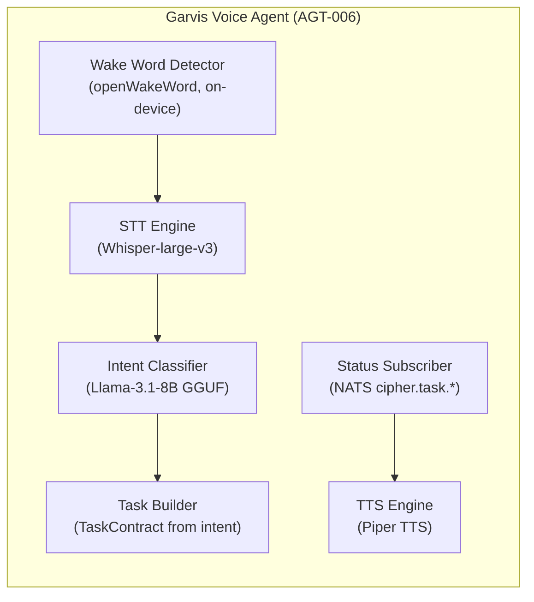

---

### 6.8 Memory / Context Agent (AGT-007)

**Layer.** Memory & Knowledge Fabric (MKF) — Trust Tier T0 (System).

**Purpose.** The Memory Agent is the manager module that owns all reads and writes to the CIPHER memory subsystem. No other agent writes directly to Memgraph, Qdrant, Redis, or MinIO — all memory operations go through the Memory Agent's API. It performs episodic-to-semantic consolidation on a schedule, enforces retention policies, and maintains the temporal validity of Knowledge Graph edges.

**Task.** Expose the full `MemoryAPI` interface to all agents. On `upsert_node()` and `upsert_edge()` calls, enforce the ArtifactRelation schema and set `valid_from` timestamps. On `consolidate()` calls, move approved episodic records to the semantic tier by creating permanent graph nodes from ephemeral run records. On `retrieve()` calls, execute the four-stage hybrid retrieval pipeline (vector search → graph expansion → rerank → context assembly).

**Properties.**
- Implementation: the Memory Agent is the only component with direct driver-level access to Memgraph (Bolt protocol), Qdrant (gRPC), Redis (RESP protocol), SQLite, and MinIO (S3 API). All other agents access these through the Memory Agent's abstraction.
- Upper Interface: `MemoryAPI` (REST at `/memory/v1/`) — `search`, `cypher`, `upsert_node`, `upsert_edge`, `assert_relation`, `retrieve`, `materialize`, `create_handle`, `get_prompt`, `get_rubric`, `consolidate`.
- Lower Interface: direct driver calls to Memgraph, Qdrant, Redis, SQLite, and MinIO through `cipher.core.adapters`.

**Internal Structure.**

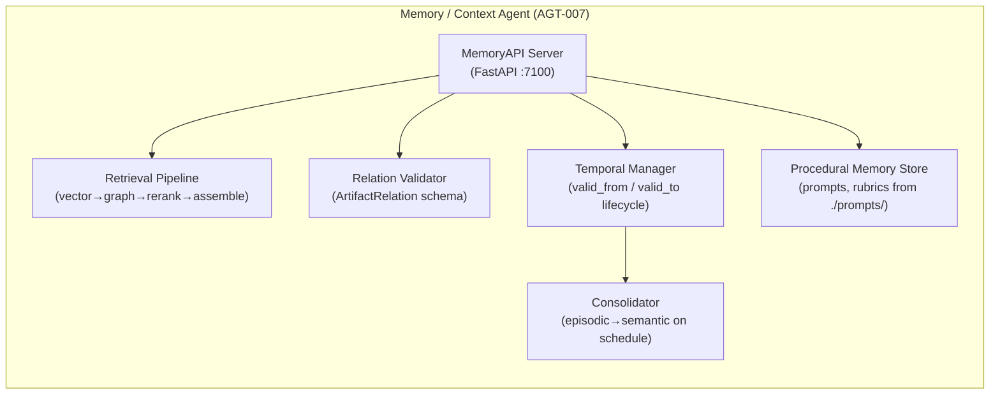

---

### 6.9 Tool Broker Agent (AGT-008)

**Layer.** Tool & Resource Fabric (TRF) — Trust Tier T0 (System).

**Purpose.** The Tool Broker is the façade between all agents in the AAL and all MCP tool servers in the TRF. It is the single chokepoint through which every external tool call must pass. Its architectural role is identical to AUTOSAR's ECU Abstraction Layer: it abstracts the specific tool implementation (VectorCAST 2025 vs. 2026 API change, DOORS REST API version) from the agents that use the tools.

**Task.** Receive all incoming MCP `tools/call` requests from AAL agents. Validate the calling agent's JWT and scope. Evaluate the call against OPA policy. Inject the appropriate secret credentials. Log the invocation to the Audit Journal. Route the call to the appropriate MCP tool server. Return the normalized result to the calling agent.

**Properties.**
- Implementation: the Tool Broker is a stateless routing and policy enforcement layer. It spawns Docker containers for execution-capable tools (cppcheck, VectorCAST) on demand and destroys them after result collection. It never stores tool state between calls.
- Upper Interface: `POST /mcp/tools/{name}/invoke` — standardized for all tools. Every response includes `x-cipher-audit-ref` header with the AuditRecord ID.
- Lower Interface: HTTP JSON-RPC calls to individual MCP tool server containers on their assigned ports.

**Internal Structure.**

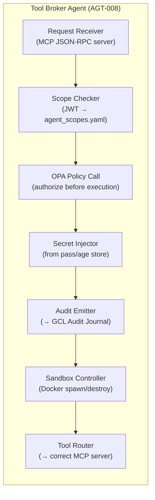

---

## 7. Architecture — Interfaces: General Rules

### 7.1 Layer Boundary Rules

These rules are derived from the AUTOSAR interface rules and adapted to the CIPHER context. Every CIPHER engineer must know them.

**Rule 1 — Upward only through defined interfaces.** No layer may call a layer above it directly. The Hardware layer cannot call the Platform Kernel's public API — information flows upward only when the PKL explicitly initiates it (e.g., by polling the filesystem). The PKL cannot call agents in the AAL — information flows upward when agents are invoked through the ARE.

**Rule 2 — Skip-layer calls are forbidden except for MKF.** A component in the Application/Agent Layer (AAL) may not call the Platform Kernel (PKL) directly, bypassing ARE, GCL, and TRF. The sole exception is the Memory & Knowledge Fabric (MKF), which is explicitly designated as a cross-cutting layer that AAL agents may call directly.

**Rule 3 — The ARE boundary is the key decoupling point.** Above the ARE, all communication is component-style (typed A2A messages between opaque agents). Below the ARE, all communication is layered (typed API calls through defined interfaces). This boundary is the CIPHER equivalent of the AUTOSAR RTE boundary — the most important architectural constraint in the entire system.

**Rule 4 — GCL is a cross-cutting governance layer, not a sequential layer.** The Governance & Compliance Layer does not sit in the sequential call stack — it is invoked by all layers as a side channel for authorization checks (`policy.evaluate()`) and audit recording (`audit.record()`). A tool call in TRF invokes GCL; an agent task submission in ARE invokes GCL; an artifact write in MKF invokes GCL. GCL is never the primary execution path.

**Rule 5 — No agent shares memory with another agent.** Two agents in the AAL may not share a Python object, a global variable, or a direct function call. All inter-agent communication goes through typed A2A task messages through the ARE. This rule is what makes every agent independently deployable and what gives the audit trail its completeness — there are no "side channel" communications.

### 7.2 Upward Interface Rules

A layer's *upward interface* is the API it exposes to the layer above it. Upward interfaces in CIPHER follow three rules borrowed from AUTOSAR: they are standardized (defined by a published schema, not by the implementing module), they are technology-independent (they do not expose implementation details), and they are versioned (a version number appears in every API path or message schema ID).

The most important upward interfaces in the MVP are: the Platform Kernel's `cipher.core.adapters` upward interface (standardized storage API, technology-independent, version in the adapter class name); the MKF's `MemoryAPI` upward interface (standardized, technology-independent — the same API against Memgraph and Neo4j); the TRF's MCP `/tools/{name}/invoke` upward interface (standardized MCP protocol, technology-independent); and the ARE's A2A `/a2a` upward interface (standardized A2A protocol, deployment-independent).

### 7.3 Downward Interface Rules

A layer's *downward interface* is how it accesses the layer below it. Downward interfaces in CIPHER are always less stable than upward interfaces — the MKF's downward calls to Memgraph's Bolt protocol are more likely to change (e.g., when migrating to Neo4j in production) than the MKF's upward MemoryAPI. For this reason, all downward calls from any layer to the layer below it are encapsulated in the `cipher.core.adapters` abstraction, making the downward interface a private implementation detail rather than a published contract.

### 7.4 Lateral Interface Rules (A2A Escapes)

Lateral A2A escapes are direct agent-to-agent communications that bypass the Orchestrator hub. They are permitted only when all of the following conditions hold: both agents are in the same layer (both in AAL); the Orchestrator has explicitly authorized the lateral connection as part of a plan step; the communication is still through the ARE's A2A endpoints (not through shared Python memory); and the lateral communication is recorded in the audit trail with a `parent_task_id` linking it to the orchestrator's task that authorized it.

Permitted lateral pairs in the MVP are: DevNex (AGT-001) ↔ ASIL Review (AGT-003), and ASIL Review (AGT-003) ↔ Compliance (AGT-004). No other lateral pairs are permitted without an explicit domain pack configuration entry authorizing them.

---

## 8. Architecture — Interfaces: Interaction of Layers

### 8.1 How the Application Layer communicates with ARE

Every agent in the AAL is also an A2A server — it exposes the same A2A endpoints that it uses to receive tasks. When the Orchestrator (AAL) delegates a subtask to DevNex (AAL), it does so by calling DevNex's ARE endpoint (`POST /a2a`, `method: tasks/send`), not by calling DevNex's Python methods directly. This means the Orchestrator's A2A client goes through its own ARE boundary outbound (task submission through its own A2A client library) and DevNex's ARE boundary inbound (task validation, OTel span creation, budget enforcement).

The round-trip of a delegated subtask therefore touches the ARE twice — once when the Orchestrator submits it, and once when DevNex receives it. Both touches create OTel spans and both touches invoke GCL for authorization. This is what makes the inter-agent interaction fully observable and auditable.

### 8.2 How ARE communicates with TRF and MKF

Agents in the AAL do not call TRF or MKF directly from within their LangGraph nodes. Instead, they call `self.tools.call("llm.complete", ...)` (TRF, through the ToolClient library) and `self.memory.retrieve(query, ...)` (MKF, through the MemoryClient library). These client libraries are thin wrappers that add the calling agent's JWT and trace ID to every request, ensuring every tool and memory call is traceable to the specific agent task that initiated it.

The ToolClient and MemoryClient are ARE-layer libraries — they are provided by the ARE, they understand A2A task context, and they are injected into the agent at construction time by the ARE framework. Agents never instantiate storage connections themselves.

### 8.3 How GCL Cross-Cuts All Layers

The Governance & Compliance Layer does not sit in the sequential call path — it is invoked as a side channel from every layer at two specific points: before any consequential action (`policy.evaluate()`), and after any completed action (`audit.record()`). The following diagram shows these cross-cutting invocations for a single tool call.

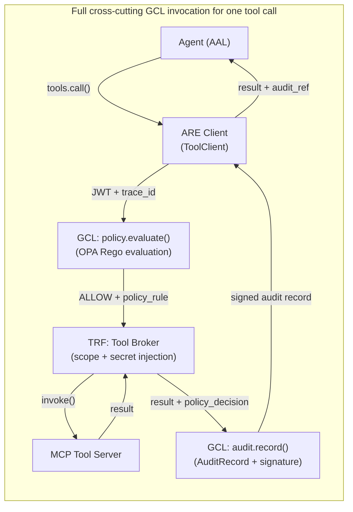

---

## 9. Configuration

### 9.1 Domain Pack Configuration

Domain packs are loaded at platform startup by the Domain Pack Loader (GCL). The active pack is set in `deploy/local/.env`:

```bash
# deploy/local/.env
CIPHER_DOMAIN_PACK=iso26262-asil-b
CIPHER_TENANT_ID=devteam-local
CIPHER_PROJECT_ID=BC-ECU-Sprint01
```

The domain pack directory structure mirrors the AUTOSAR configuration approach — all regulatory behavior is data, not code:

```
cipher/governance/domain_packs/
└── iso26262-asil-b/
    ├── pack.yaml               # Pack ID, version, base standard
    ├── policies/
    │   ├── hitl_gates.rego     # Which actions require human approval
    │   ├── asil_thresholds.rego # Minimum confidence for ASIL-B approval
    │   └── tool_access.rego    # Tool scope rules for this ASIL level
    ├── evidence_schema.yaml    # Required artifact types for ASPICE SWE
    ├── approval_matrix.yaml    # Who can approve what (role → ASIL level)
    └── rubrics/
        ├── lld_review.yaml     # ISO 26262-6 LLD review criteria
        ├── code_review.yaml    # Coding standard + MISRA severity mapping
        └── test_coverage.yaml  # MC/DC and branch coverage thresholds
```

### 9.2 Agent Scope Configuration

Per-agent tool access permissions are defined in a single YAML file that is version-controlled alongside the codebase:

```yaml
# cipher/governance/agent_scopes.yaml
DevNex:
  read:  [git:project/**, doors:read, vectorcast:read, fs:project/**]
  write: [fs:project/src/**, fs:project/tests/**, vectorcast:env/**]
  exec:  [vectorcast:run, gcc:compile]
  deny:  [git:push:main, git:push:release/**, jira:delete, doors:write]

ASIL_Reviewer:
  read:  [fs:project/**, kg:read, doors:read]
  write: [kg:write:review_node]
  deny:  [fs:write, git:write, doors:write, vectorcast:write]

Compliance_Agent:
  read:  [fs:project/src/**, fs:project/tests/**, kg:read]
  write: [kg:write:violation_node]
  exec:  [pclint:run, cppcheck:run]
  deny:  [fs:write:project/src/**, git:write, doors:write]
```

### 9.3 LLM Gateway Configuration

The LLM Gateway (LiteLLM) is configured through `cipher/tools/llm_gateway/config.yaml`, which defines the model tiering strategy:

```yaml
# Model tiering — determines which model handles which task class
model_routing:
  triage:        "gca-flash"     # Orchestrator routing, intent classification
  planning:      "gca-standard"  # Planning Agent, context assembly
  generation:    "gca-standard"  # DevNex LLD / code generation
  review:        "gca-standard"  # ASIL Review Agent rubric evaluation
  compliance:    "gca-flash"     # Compliance Agent (mostly deterministic)
  voice_local:   "llama-3.1-8b" # Garvis intent classification (on-device)

# Prompt caching — avoid re-billing identical prompts within TTL
cache:
  enabled: true
  ttl_hours: 24
  key_fields: [model, messages_hash]

# Cost limits — hard cap per task class
cost_limits:
  per_task_usd: 5.00
  per_agent_per_hour_usd: 50.00
```

---

## 10. Integration and Runtime Aspects

### 10.1 Startup Sequence (docker-compose)

The MVP platform starts with `docker compose up` from `deploy/local/`. The startup order is enforced by Docker Compose `depends_on` health checks to ensure each layer's services are ready before the layer above starts.

```
Phase 1 — Hardware & Infrastructure (HW):
  Docker Engine: already running (host)
  Host volumes mounted: ./data/memgraph, ./data/qdrant, ./data/audit.db,
                        ./data/checkpoints, ./data/artifacts

Phase 2 — Platform Kernel (PKL) services start:
  1. NATS server (:4222) — health: TCP connect
  2. Redis (:6379) — health: PING
  3. Langfuse (:3000) — health: HTTP GET /health
  → All PKL services healthy before MKF starts

Phase 3 — Memory & Knowledge Fabric (MKF) services start:
  4. Memgraph (:7687) — health: Bolt connect
  5. Qdrant embedded (:6333) — health: HTTP GET /health
  6. MinIO (:9000) — health: HTTP GET /minio/health/live
  7. Memory Agent (:7100) — health: HTTP GET /health
  → All MKF services healthy before TRF starts

Phase 4 — Tool & Resource Fabric (TRF) and GCL services start:
  8. OPA sidecar (:8181) — health: HTTP GET /health
  9. Tool Broker / MCP Gateway (:7200) — health: HTTP GET /mcp/tools
  → TRF and GCL services healthy before ARE / AAL starts

Phase 5 — Agent Runtime Environment (ARE) and Agents (AAL) start:
  10. Orchestrator (:8000) — health: HTTP GET /health
  11. DevNex Agent (:7001) — health: GET /.well-known/agent-card.json
  12. Planning Agent (:7002) — health: GET /.well-known/agent-card.json
  13. ASIL Review Agent (:7003) — health: GET /.well-known/agent-card.json
  14. Compliance Agent (:7004) — health: GET /.well-known/agent-card.json
  15. Research Agent (:7005) — health: GET /.well-known/agent-card.json
  16. Garvis Voice Agent (:7006) — health: HTTP GET /health
  → Platform fully operational
```

### 10.2 Shutdown and Graceful Drain

On `docker compose stop`, a `SIGTERM` is sent to each container. Each agent's FastAPI server catches `SIGTERM`, stops accepting new task submissions through the ARE, allows currently executing LangGraph nodes to complete, checkpoints any in-flight workflow state to the PKL Checkpoint Store, and then exits. The Memory Agent is the last to stop because all other agents may need to write final ArtifactRelation edges during their shutdown sequence. The Platform Kernel services (NATS, Redis, Langfuse) stop after all agents have exited.

### 10.3 Checkpoint and Resume

Every LangGraph workflow state is checkpointed to the PKL Checkpoint Store after each completed node. If any agent container is killed unexpectedly (OOM kill, host restart), the workflow state survives in the Checkpoint Store. On next platform startup, the Orchestrator queries the Checkpoint Store for any workflows in `RUNNING` or `WAITING` state and resumes them from their last committed checkpoint. This is what makes the MVP resilient to the most common failure modes on a developer workstation.

The resume mechanism works because CIPHER enforces the **stateless execution + durable external state** principle: no agent holds meaningful state in Python memory. All state is either in the LangGraph checkpoint, the Knowledge Graph, or the Working Memory store. Any agent container can resume any workflow because it reconstructs all necessary context from these external stores, not from its own in-memory state.

### 10.4 Human-in-the-Loop Gate Runtime

When an agent reaches a step that requires human approval (e.g., writing to DOORS, pushing an artifact to a release branch), the following runtime sequence occurs at the LangGraph level:

The LangGraph workflow hits an `interrupt()` node — a special LangGraph construct that suspends the workflow at that exact point without terminating it. The HITL Gate Manager (GCL) serializes the approval request (the action to be approved, the artifact URI, the ASIL level, and the domain pack's approval matrix) as a CloudEvent and emits it on the NATS bus as `cipher.gate.pending`. The web dashboard subscribes to this topic and displays the pending approval with all relevant artifact context. The human reviewer inspects the artifact using the traceability graph view and approves or rejects through `POST /v1/approvals/{id}`. The HITL Gate Manager receives the signed approval, verifies the reviewer's JWT and ASIL authorization level, records the `APPROVED_BY` ArtifactRelation edge in MKF, and calls LangGraph's `resume()` to continue the workflow from the exact interrupted state.

This mechanism means that a workflow can be approved hours or days after it was initiated — the LangGraph checkpoint persists indefinitely in the PKL Checkpoint Store.

---

## Appendix A: Module Inventory

This table provides a complete inventory of all software modules in the CIPHER Local MVP, their layer assignment, their module type (Driver/Interface/Handler/Manager/Library), and their implementation reference.

| Module | Layer | Type | Implementation | Port |
|---|---|---|---|---|
| Docker Engine | HW | Driver | Host Docker Engine | — |
| Host Filesystem | HW | Driver | POSIX / Host OS | — |
| NATS Server | PKL | Handler | `nats-server:2.10` | :4222 |
| LangGraph Runtime | PKL | Manager | `langgraph>=0.4` (in-process) | — |
| Checkpoint SQLite | PKL | Driver | `sqlite3` (stdlib) | — |
| Langfuse | PKL | Manager | `langfuse/langfuse:latest` | :3000 |
| `cipher.core.adapters` | PKL | Interface | Python module | — |
| Memory Agent (AGT-007) | MKF | Manager | `cipher/agents/memory/` | :7100 |
| Memgraph | MKF | Driver | `memgraph/memgraph:2.x` | :7687 |
| Qdrant (embedded) | MKF | Driver | `qdrant-client>=1.9` | :6333 |
| Redis | MKF | Handler | `redis:7-alpine` | :6379 |
| Document Store SQLite | MKF | Driver | `sqlite3` (stdlib) | — |
| MinIO | MKF | Driver | `minio/minio:RELEASE.*` | :9000 |
| Tool Broker (AGT-008) | TRF | Handler | `cipher/agents/tool_broker/` | :7200 |
| MCP Gateway | TRF | Interface | `mcp-python` + FastAPI | :7200 |
| Git MCP Server | TRF | Driver | `cipher/tools/git_mcp/` | :7211 |
| VectorCAST MCP Server | TRF | Driver | `cipher/tools/vectorcast_mcp/` | :7210 |
| DOORS/ReqIF MCP Server | TRF | Driver | `cipher/tools/doors_mcp/` | :7212 |
| Filesystem MCP Server | TRF | Driver | `cipher/tools/fs_mcp/` | :7214 |
| LLM Gateway (LiteLLM) | TRF | Handler | `litellm>=1.40` | :7215 |
| OPA Sidecar | GCL | Manager | `openpolicyagent/opa:latest` | :8181 |
| Audit Journal SQLite | GCL | Driver | `sqlite3` append-only | — |
| HITL Gate Manager | GCL | Manager | `cipher/governance/hitl/` | — |
| Domain Pack Loader | GCL | Manager | `cipher/governance/domain_packs/` | — |
| Identity Manager | GCL | Manager | `cipher/governance/identity/` | — |
| A2A Server | ARE | Interface | `a2a-python SDK` + FastAPI | per agent |
| Task Contract Validator | ARE | Interface | `cipher.core.schemas` | — |
| OTel Span Emitter | ARE | Library | `opentelemetry-sdk` | :4317 |
| Agent Registry | ARE | Manager | `cipher/orchestrator/registry/` | — |
| Budget Enforcer | ARE | Manager | `cipher.core.budget` | — |
| Orchestrator (AGT-000) | AAL | Manager | `cipher/agents/orchestrator/` | :8000 |
| DevNex Agent (AGT-001) | AAL | Manager | `cipher/agents/devnex/` | :7001 |
| Planning Agent (AGT-002) | AAL | Manager | `cipher/agents/planner/` | :7002 |
| ASIL Review Agent (AGT-003) | AAL | Manager | `cipher/agents/asil_reviewer/` | :7003 |
| Compliance Agent (AGT-004) | AAL | Manager | `cipher/agents/compliance/` | :7004 |
| Research Agent (AGT-005) | AAL | Manager | `cipher/agents/research/` | :7005 |
| Garvis Voice Agent (AGT-006) | AAL | Manager | `cipher/agents/garvis/` | :7006 |
| `cipher.core.schemas` | ARE | Library | Python module | — |
| `cipher.core.otel` | ARE | Library | Python module | — |
| `cipher.core.cloudevents` | ARE | Library | Python module | — |

---

## Appendix B: Layer Dependency Rules Summary

This summary table defines what each layer is allowed to depend on directly. It is the CIPHER equivalent of the AUTOSAR Layer Interaction Matrix distilled into plain-language dependency rules.

| Layer | May depend on | May NOT depend on |
|---|---|---|
| **HW** (Layer 1) | Host OS only | Nothing in CIPHER |
| **PKL** (Layer 2) | HW, MKF (storage only) | TRF, GCL, ARE, AAL |
| **MKF** (Layer 3) | HW (storage drivers), PKL (adapters) | TRF, GCL, ARE, AAL |
| **TRF** (Layer 4) | PKL, MKF, GCL | HW directly, ARE, AAL |
| **GCL** (Layer 5) | PKL, MKF (audit writes) | TRF internals, ARE, AAL |
| **ARE** (Layer 6) | PKL (event bus), MKF, TRF, GCL | HW directly |
| **AAL** (Layer 7) | ARE (A2A), MKF (direct memory), GCL (policy/audit) | PKL directly, TRF directly, HW directly |

---

*This document describes the static structural architecture of the CIPHER Local MVP. For dynamic interface specifications, see individual agent LLD documents. For deployment configuration, see `deploy/local/docker-compose.yml`. For the full architectural reference including cloud production deployment, see `CIPHER_Architecture_v3.md`.*
