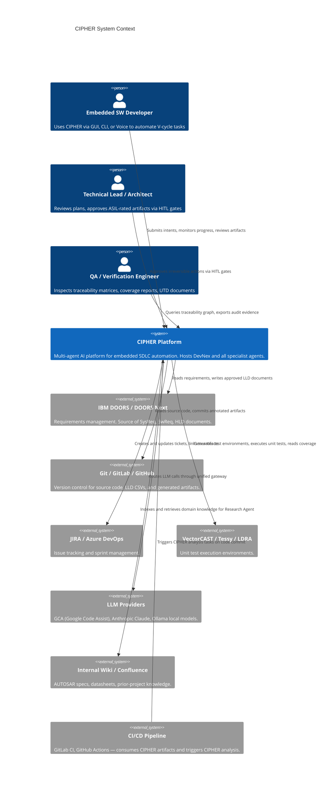
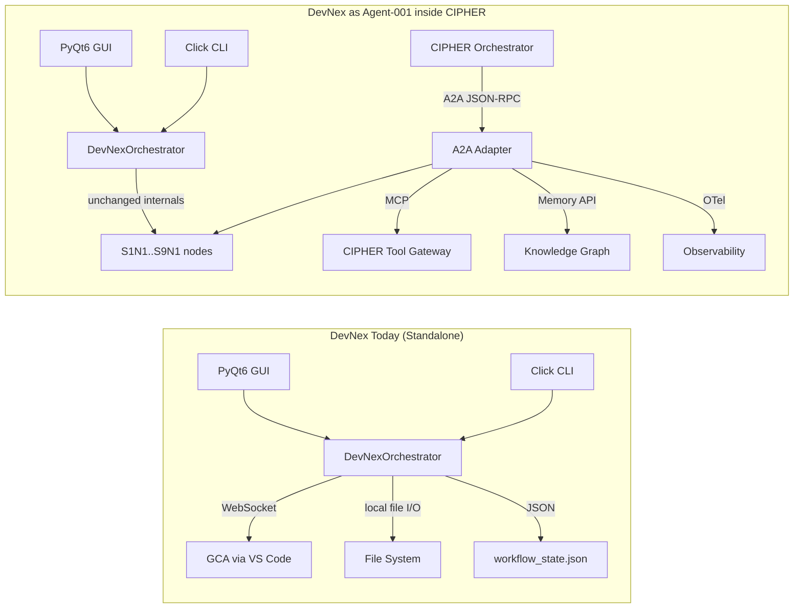
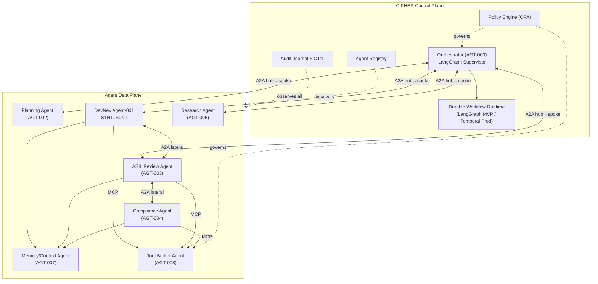
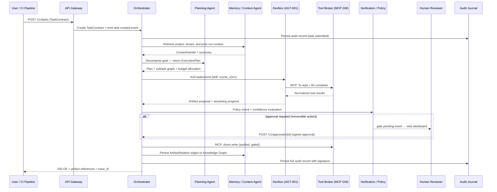
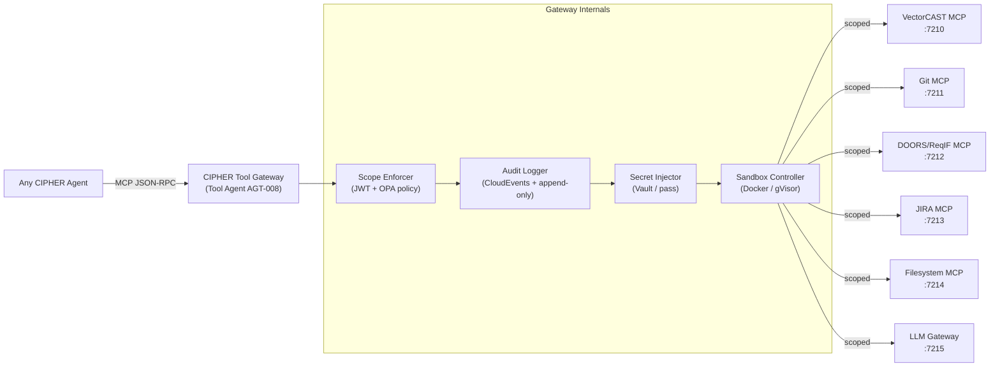
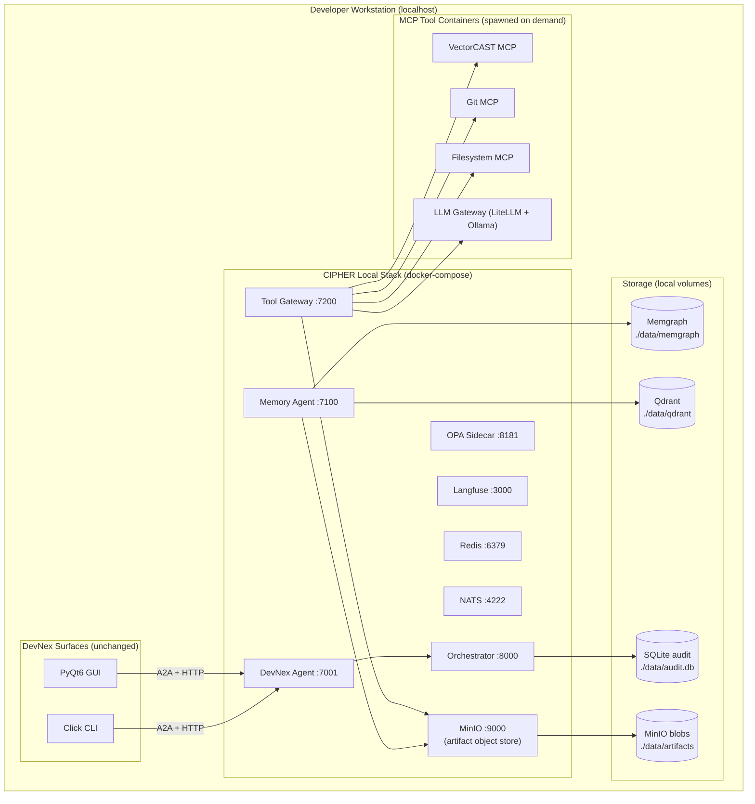
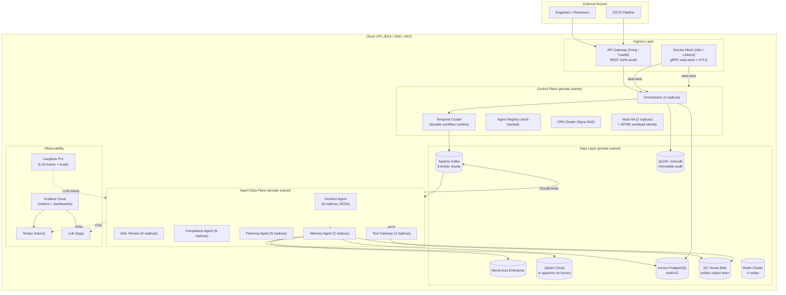

# CIPHER — Cognitive Intelligent Platform for Holistic Embedded R&D Automation
## Architectural Reference Document · v2.0 · 09 May 2026

> **Document Purpose.** This is an implementation-grade architectural specification targeting technical leads, engineers, and developers who want to build, extend, or deeply understand a production-quality multi-agent system for SDLC automation in the embedded and automotive software domain. It supersedes v2.0 with additions from cross-platform research synthesis, including Temporal durable workflows, CloudEvents/AsyncAPI event contracts, a four-tier memory model, domain packs, SLSA supply-chain integrity, NIST AI RMF/SSDF framing, and formal TaskContract and ArtifactRelation schemas.
>
> **Companion Codebase.** DevNex Assistant (`devnex_assistant/`) is the living reference implementation of Agent-001. All pseudocode and interface contracts in this document are consistent with that codebase.

---

## Table of Contents

1. [Executive Summary](#1-executive-summary)
2. [System Context & Scope](#2-system-context--scope)
3. [Core Architectural Principles](#3-core-architectural-principles)
4. [Agent Framework Architecture](#4-agent-framework-architecture)
5. [Multi-Agent Orchestration Layer](#5-multi-agent-orchestration-layer)
6. [Knowledge & Context Management](#6-knowledge--context-management)
7. [Tool Integration & Execution Environment](#7-tool-integration--execution-environment)
8. [Data Architecture](#8-data-architecture)
9. [API Gateway & Interface Layer](#9-api-gateway--interface-layer)
10. [Security & Compliance Framework](#10-security--compliance-framework)
11. [Deployment Architecture](#11-deployment-architecture)
12. [Extensibility & Plugin Architecture](#12-extensibility--plugin-architecture)
13. [Performance & Scalability Considerations](#13-performance--scalability-considerations)
14. [Implementation Roadmap](#14-implementation-roadmap)

---

## 1. Executive Summary

### Vision

CIPHER — *Cognitive Intelligent Platform for Holistic Embedded R&D Automation* — is an enterprise-grade, multi-agent AI platform designed to automate, audit, and continuously improve every phase of the automotive and embedded software development life cycle (SDLC). It is not a single AI assistant, not a code-completion tool, and not a chat interface bolted onto a CI/CD pipeline. CIPHER is an **agentic operating fabric**: a platform that treats specialized AI agents as first-class processes, gives them a shared memory and tool substrate, orchestrates them under compliance gates, and produces a cryptographically traceable audit trail from stakeholder need to verified code.

### Mission

To eliminate the manual, error-prone, and under-documented gap that exists between design artifacts, implementation, and verification in safety-critical embedded software projects — the gap that causes ISO 26262 audit failures, ASPICE re-work cycles, and late-project regression spirals. CIPHER automates that gap away without sacrificing human oversight or compliance.

### CIPHER as Platform, DevNex as Agent

Understanding the distinction between CIPHER and DevNex is the first architectural insight this document conveys.

**DevNex** is a working Python tool (CLI + PyQt6 GUI) that automates a specific, well-understood slice of the embedded SDLC: the V-cycle from High-Level Design through Low-Level Design, code annotation, VectorCAST test generation, and traceability matrix construction. It has 13 workflow nodes (S1N1 through S9N1), a GCA (Google Code Assist) backend routed through VS Code, and a JSON-based persistence layer. It is a *specialized domain execution agent* — excellent at what it does, confined to its domain.

**CIPHER** is the platform that hosts DevNex as **Agent-001**, alongside a growing ecosystem of specialized agents: a Planning Agent that decomposes requirements into ASPICE-aligned work packages, an ASIL Review Agent that applies ISO 26262-6 rubrics to design artifacts, a Research Agent that performs RAG over internal wikis and AUTOSAR specifications, a Compliance Agent that wraps PC-lint Plus and cppcheck, a Traceability Agent that maintains the bidirectional graph, a Voice Agent (Garvis) for hands-free engineering, and a Doc Agent that renders ASPICE work products from the graph. CIPHER gives all these agents a common identity, communication fabric, shared memory, tool gateway, governance layer, and observability stack.

Think of CIPHER as the operating system for agents, and DevNex as one of the applications running on it. This framing determines every architectural decision that follows.

### Interpreting "Holistic Embedded R&D Automation"

"Holistic" is not marketing language — it is an architectural constraint. It means CIPHER must support *closed-loop automation across the entire embedded software lifecycle*, not isolated point assistance. In practice, the platform must be able to ingest customer requirements, coordinate their decomposition into architecture and design, support code generation and annotation, invoke test frameworks and build systems, analyze results, generate formal documentation, and keep the resulting evidence graph queryable and auditable across sessions, teams, and tool domains. This interpretation is consistent with NIST AI Risk Management Framework (AI RMF) guidance, which emphasizes lifecycle-wide governance, documentation, human oversight, and management of third-party and supply-chain risk.

### What Makes CIPHER Different from Existing Frameworks

Frameworks like LangGraph, CrewAI, and AutoGen provide agent coordination primitives. CIPHER is a *domain-specific platform* built on top of those primitives that adds four things those frameworks do not provide: a domain agent taxonomy specialized for automotive/embedded SDLC; a compliance-by-construction governance layer enforcing ISO 26262, MISRA-C, and ASPICE at runtime; a temporal knowledge graph providing forensic-grade traceability from requirement to verified artifact; and a deployment model explicitly designed for safety-critical engineering organizations that need data sovereignty, offline operation, and audit evidence.

A fifth differentiator, emphasized by cross-platform research synthesis, is that CIPHER encodes regulatory behavior as **domain packs** — configurable profiles of approval thresholds, evidence schemas, coding standard severity mappings, and release gates — rather than baking automotive-specific rules into the platform kernel. This means the same CIPHER kernel can run an ISO 26262 automotive profile, a DO-178C avionics profile, or an IEC 62304 medical device profile by swapping configuration, not rewriting code.

---

## 2. System Context & Scope

### 2.1 System Boundary Diagram



### 2.2 CIPHER's Six Platform Responsibilities

CIPHER's boundary should be drawn around six platform responsibilities: intent intake and planning; governed task execution; knowledge and traceability management; tool mediation; compliance evidence production; and operations across both local and cloud topologies. The following table maps each responsibility to its architectural implication — it is a design synthesis based on the project context and the lifecycle-centric guidance in NIST AI RMF and NIST SSDF.

| Functional area | What CIPHER must do | Architectural implication |
|---|---|---|
| Intent and planning | Convert user requests or CI/CD events into structured tasks, plans, and sub-plans | Planner, orchestrator, typed TaskContract, durable workflow runtime |
| Domain execution | Generate or update requirements, design artifacts, code, tests, reports, and evidence | Specialized domain execution agents with tool access and validation gates |
| Verification | Evaluate outputs against policies, rubrics, test results, and compliance profiles | Verification agents, policy engine, evaluator services |
| Traceability | Maintain Requirement → Design → Code → Test → Result links | Artifact graph, immutable artifact IDs, ArtifactRelation model |
| Knowledge management | Retrieve relevant project and domain knowledge and execution history | Four-tier memory: working, episodic, semantic, procedural |
| Tool mediation | Safely access IDEs, repos, compilers, CI, test benches, ALM/PLM, hardware or simulators | MCP broker, sandbox execution, scoped credentials |
| Governance | Enforce approvals, segregation of duties, tenancy, access control, auditability | Policy-as-code, workload identity, approval engine, immutable audit journal |
| Operations | Run locally for POC, scale to distributed production without contract changes | Contract-stable local/cloud topology, externalized state, durable workflows |

### 2.3 Scope Definition

CIPHER's scope covers everything from the point where a stakeholder requirement enters the system to the point where a verified, traced artifact exits it. This explicitly does *not* include owning the Requirements Management tool (DOORS is external, accessed via ReqIF export or REST API), the version control system (Git is a tool), test execution environments (VectorCAST is a tool), or the LLM inference infrastructure (accessed through the LLM Gateway MCP server).

### 2.4 CIPHER–DevNex Relationship

DevNex today is a monolithic orchestrator that runs 13 sequential workflow nodes, each calling GCA via a VS Code WebSocket connection and writing artifacts to a local file system. It has no inter-agent communication, no shared knowledge graph, no compliance enforcement layer, and no cloud path.

When DevNex is integrated into CIPHER as Agent-001, its internals are not rewritten. Instead, a thin adapter wraps each of its 13 nodes as A2A-callable *skills*, redirects its GCA calls through the CIPHER LLM Gateway MCP server, redirects its file I/O through the sandboxed Filesystem MCP server, and persists its output artifacts as nodes in the CIPHER Knowledge Graph.



The critical design principle is that **no DevNex source code changes are required**. The adapter monkey-patches DevNex's I/O and LLM call sites at startup, replacing them with calls to the CIPHER Tool Gateway.

---

## 3. Core Architectural Principles

### 3.1 Agents Are Processes, Not Functions

The foundational design decision in CIPHER is that agents are modeled as *processes* in the operating-systems sense. Each agent has a unique stable identity (a UUID, an Ed25519 keypair, and an A2A Agent Card), a well-defined lifecycle (`SPAWNED → READY → RUNNING → WAITING → SUSPENDED → TERMINATED`), a bounded resource budget (token cap, CPU budget, wall-clock limit), a dedicated inbox and outbox, and a serializable checkpoint state that allows any killed agent to resume from its last successful step.

This design is motivated by CIPHER's compliance requirements. An ISO 26262 Part 8 audit asks "what produced this artifact, when, with what inputs, and under what authority?" A process model provides clean answers. A function-call model does not.

### 3.2 Communication Is Explicit, Typed, and Audited

No two agents share Python memory. All inter-agent communication flows through explicitly typed message envelopes — **A2A** for agent-to-agent collaboration and **MCP** for agent-to-tool interaction. Every message carries a `trace_id`, `parent_task_id`, `agent_id`, and `timestamp`. Every message is persisted in the audit journal before the action it authorizes is executed.

Beyond binary protocols, **event envelopes follow the CloudEvents 1.0 specification**, and all asynchronous topic contracts are documented in **AsyncAPI 3.0**. This means every important state transition can be carried consistently across runtimes and tooling — from a local in-process NATS server in MVP to a distributed Kafka cluster in production — without changing the contract.

### 3.3 Memory Is a First-Class, Four-Tier Subsystem

Most agentic frameworks treat memory as an afterthought. CIPHER treats memory as a primary architectural subsystem with four distinct tiers, each with a different time horizon and storage characteristic. *Working memory* holds the current task scratchpad — ephemeral and task-scoped. *Episodic memory* records what happened and when, organized as a temporal knowledge graph. *Semantic memory* holds the permanent, distilled knowledge of the system: requirements, design decisions, verified code, and test results. *Procedural memory* holds prompts, agent instructions, evaluation rubrics, workflow templates, and policy profiles — stored as versioned code artifacts alongside the codebase, tested like software, and subject to semantic versioning.

The procedural memory tier is an architectural necessity, not a convenience. If prompts and evaluation rubrics are baked into agent source code rather than stored and versioned externally, changing a review rubric requires a code deployment. Storing them as data means a rubric update is a configuration change — auditable, reversible, and testable without touching running agents.

The practical trade-off between these tiers is well understood: the more history you stuff into a live model context, the more you risk context dilution; the more aggressively you summarize and externalize, the more you depend on retrieval quality. CIPHER therefore defaults to **thin runtime context + typed retrieval + durable external state** as its governing context engineering principle.

### 3.4 Workflows Are Durable, Resumable Processes

Long-running SDLC tasks — generating an LLD that requires multiple rounds of human review, running a VectorCAST campaign that takes 45 minutes, waiting for a CI pipeline to complete — cannot be modeled as simple function calls. CIPHER uses a **durable workflow runtime** (LangGraph checkpointer for MVP, Temporal for production) that persists workflow history as an immutable event log and supports deterministic replay from any checkpoint. A workflow interrupted by a server restart, a network failure, or a human approval delay resumes from its last committed state, not from scratch.

This is qualitatively different from retry logic. Retry logic re-executes a failed step. Durable workflow execution replays the *history* to reconstruct state and then continues forward — the same model that powers financial transaction systems and that Temporal has proven at production scale across thousands of companies.

### 3.5 Regulatory Behavior Is Domain-Pack Configuration, Not Platform Code

CIPHER's platform kernel must remain stable across regulatory environments. The behavior that changes between projects — ASIL thresholds, required evidence artifacts, coding standard severity handling, approval matrices, retention periods, release gate definitions — is encoded as **domain packs**: versioned, configurable profiles that the platform loads at startup.

This separates concerns cleanly. The platform engineers own the kernel (orchestration, memory, tool gateway, identity, observability). Domain experts own the packs (ISO 26262 profile, ASPICE SWE process template, MISRA-C:2025 severity mapping). Teams switch between regulatory profiles without rewriting core orchestration code. New standards — ISO 21434 cybersecurity, DO-178C avionics, IEC 62304 medical — are added as new domain packs without touching the platform.

### 3.6 Humans Are Gates, Not Exceptions

CIPHER's HITL model distinguishes between reversible and irreversible actions. Reversible actions auto-execute with audit trail. Irreversible actions (writing to DOORS, committing to a release branch, closing a JIRA ticket, publishing an ASPICE work product) require an explicit human approval before execution, enforced as a policy rule in OPA — not as conditional logic in individual agents.

### 3.7 Compliance Is a Runtime Constraint, Not a Checklist

ISO 26262 ASIL classifications, MISRA-C:2025 rules, and ASPICE process artifact requirements are encoded as OPA policies evaluated at runtime before any artifact is accepted as complete. An artifact that violates a MISRA Required rule or lacks a traceable parent requirement cannot be committed to the knowledge graph with `APPROVED` status. This is "compliance by construction."

### 3.8 Supply-Chain Integrity Is Explicitly Managed

Agent packages, domain packs, and platform releases are subject to **SLSA (Supply-chain Levels for Software Artifacts)** provenance requirements. Every CIPHER release should include a provenance attestation describing which source commit, build system, and build environment produced it. This is not an academic concern: a compromised agent package that is silently substituted in a production deployment could generate plausible-looking but subtly incorrect LLD artifacts that pass compliance checks and introduce defects into safety-critical code. SLSA Level 2 (hosted build with provenance) is the minimum target for any CIPHER release entering production use.

### 3.9 Local ≡ Cloud at the Contract Layer

Every API, message schema, agent card, MCP tool definition, and OTel span is identical between the local MVP deployment and the cloud production deployment. Only the transport mechanism, storage backend, and compute runtime change between deployments — swapped through a thin adapter layer in `cipher.core.adapters`, never through changes to agent code.

---

## 4. Agent Framework Architecture

### 4.1 Agent Taxonomy

Every agent in CIPHER is classified along two axes: role (what it does in the SDLC) and trust tier (how autonomous it is allowed to be). The full taxonomy below synthesizes the platform-specific classification from v2 with the more generalized role taxonomy from cross-platform research, ensuring that the framework can accommodate agents beyond the automotive domain without structural changes.

| Agent class | Core responsibility | Trust tier | Backing pattern |
|---|---|---|---|
| **Orchestrator (AGT-000)** | Goal decomposition, lifecycle state, retries, approvals, fan-out/fan-in | T0 (system) | LangGraph Supervisor |
| **Planning Agent (AGT-002)** | Produce work breakdown, decide strategy, estimate needed agents and tools | T1 (advisory) | ReAct + reflection loop |
| **Research Agent (AGT-005)** | Gather external or internal evidence and structure context | T1 (advisory) | Agentic RAG, hybrid retrieval |
| **Context/Memory Agent (AGT-007)** | Assemble context for each invocation, consolidate episodic to semantic | T0 (system) | CraniMem-style gated scheduler |
| **DevNex Domain Agent (AGT-001)** | V-cycle SDLC execution: HLD→LLD→Code→Test→Traceability | T2 (gated) | Sequential graph with checkpoint nodes |
| **Coding Agent** | Implement or refactor source changes at the function level | T2 (gated) | Tool-augmented loop + code sandbox |
| **Verification Agent / ASIL Reviewer (AGT-003)** | Test, critique, score, or formally review outputs against ISO 26262 rubrics | T2 (gated) | Constitutional / rubric-based critic |
| **Compliance Agent (AGT-004)** | Evaluate policy, coding standard, safety configuration, evidence completeness | T0 (system) | Hybrid LLM + deterministic rule engine |
| **Traceability Agent (AGT-010)** | Create and maintain cross-artifact relations, run impact analysis | T1 (advisory) | Graph algorithms over Memgraph/Neo4j |
| **Tool Broker / Tool Agent (AGT-008)** | Mediate tool calls, sandboxing, retries, scope enforcement | T0 (system) | MCP gateway pattern |
| **Human Review Agent** | Present decisions needing approval, capture rationale and signature | Human-mediated | Web dashboard / HITL gate |
| **Garvis Voice/UX Agent (AGT-006)** | Wake-word, STT→intent→TTS, hands-free engineering assistance | T1 (advisory) | LiveKit + Whisper + on-device LLM |
| **Doc Agent (AGT-011)** | Render ASPICE/ISO 26262 work products from the knowledge graph | T1 (advisory) | Template-driven generation |

### 4.2 Trust Tiers

**T0 (System)** agents form the platform infrastructure. They run always-on with elevated but narrowly scoped permissions and cannot be paused by users. **T1 (Advisory)** agents produce proposals only — their outputs are read-only until explicitly promoted by a human or by a T2 agent acting within policy. **T2 (Gated)** agents may mutate project artifacts but only after passing the policy engine, and for irreversible actions, after explicit human approval.

### 4.3 Generic Agent Anatomy

Every CIPHER agent — whether DevNex, the Planning Agent, or a future AUTOSAR Adaptive specialist — conforms to a shared anatomy. At the network boundary, the agent exposes an A2A-compatible endpoint (`/.well-known/agent-card.json` for discovery, `POST /a2a` for task submission). Internally, the agent runs a LangGraph state machine (or AutoGen group chat for conversational review loops) that processes one task at a time, with each node in the graph being a typed, checkpointable step.

```python
# cipher/core/agent_base.py — the base class every CIPHER agent inherits

from dataclasses import dataclass, field
from enum import Enum
from uuid import UUID, uuid4
from typing import Optional

class AgentState(Enum):
    SPAWNED     = "spawned"
    READY       = "ready"
    RUNNING     = "running"
    WAITING     = "waiting"       # blocked on tool call or human gate
    SUSPENDED   = "suspended"     # checkpointed, resumable
    TERMINATED  = "terminated"
    FAILED      = "failed"

@dataclass
class AgentIdentity:
    agent_id:     UUID  = field(default_factory=uuid4)
    name:         str   = ""
    trust_tier:   str   = "T1"           # T0 | T1 | T2
    signing_key:  bytes = field(default_factory=bytes)   # Ed25519 private key
    card_url:     str   = ""             # /.well-known/agent-card.json

@dataclass
class ResourceBudget:
    max_tokens:    int   = 100_000
    max_seconds:   int   = 3_600
    max_llm_calls: int   = 50
    max_cost_usd:  float = 5.0           # hard spend cap per task
    used_tokens:   int   = 0
    used_seconds:  float = 0.0

class CIPHERAgent:
    """
    Abstract base class for all CIPHER agents.
    The framework handles: A2A server setup, OTel tracing, budget enforcement,
    checkpoint save/restore, and HITL gate injection.
    Concrete agents implement plan(), execute_step(), checkpoint(), restore().
    """
    identity: AgentIdentity
    budget:   ResourceBudget
    state:    AgentState = AgentState.SPAWNED

    def plan(self, task: "TaskContract") -> "ExecutionPlan":
        """Decompose the incoming TaskContract into an ordered list of steps."""
        raise NotImplementedError

    def execute_step(self, step: "PlanStep", context: "AgentContext") -> "StepResult":
        """Execute one step from the plan. Called repeatedly by the framework loop."""
        raise NotImplementedError

    def checkpoint(self) -> bytes:
        """Serialize current state for durable persistence. Called before WAITING."""
        raise NotImplementedError

    def restore(self, snapshot: bytes) -> None:
        """Restore from a checkpoint. Called on resume after restart or crash."""
        raise NotImplementedError
```

### 4.4 The Agent Card and Capability Discovery

Agent discovery follows the A2A protocol's `/.well-known/agent-card.json` standard. Each card declares the agent's name, version, endpoint URL, supported input/output modes, streaming capabilities, security requirements, and *skills*. Skills are the unit of agent capability — each skill has a unique ID, human-readable description, example invocations, input/output mode declarations, and CIPHER-specific extensions for ASIL relevance and ASPICE process mapping.

```json
{
  "name": "DevNex",
  "description": "V-cycle automation agent for automotive embedded SW (HLD→LLD→Code→Test→Traceability).",
  "version": "1.0.0",
  "url": "http://cipher.local:7001/a2a",
  "capabilities": { "streaming": true, "pushNotifications": true, "extended_agent_card": true },
  "skills": [
    {
      "id": "vcycle_s1n1",
      "name": "Intake & LLD Generation",
      "description": "Parses SWC source, header, HLD, and template files to produce a structured LLD CSV with requirement IDs.",
      "tags": ["lld", "aspice-swe.3", "iso26262"],
      "input_modes": ["application/json"],
      "output_modes": ["text/csv", "application/json"],
      "examples": ["Generate LLD for SWC BodyControl from HLD doc doors://BC/HLD/v3"],
      "security_requirements": [{"scheme": "bearer", "scopes": ["devnex:lld:write"]}]
    }
  ],
  "extensions": [
    {"uri": "cipher.compliance.asil", "values": ["A","B","C","D"]},
    {"uri": "cipher.vcycle.nodes",    "values": ["S1N1","S2N1","S3N1","S4N1","S5N1","S6N1","S7N1","S8N1","S9N1"]}
  ]
}
```

### 4.5 Inter-Agent Communication Protocols

CIPHER stacks communication protocols in a deliberate layering that maps to different communication concerns.

**REST** handles external north-south APIs — the interface between human users, CI/CD systems, and the CIPHER platform. **gRPC** handles east-west internal service calls — the low-latency, type-safe communication between control plane services (Orchestrator, Policy Engine, Agent Registry) that would otherwise suffer from JSON serialization overhead. **A2A (Agent-to-Agent Protocol)** handles peer collaboration between agents using JSON-RPC 2.0 with SSE for streaming. **MCP (Model Context Protocol)** handles the agent-to-tool boundary. The **Event Bus** (NATS in MVP, Kafka in production) handles asynchronous platform events using **CloudEvents 1.0** as the canonical event envelope — ensuring every task and artifact lifecycle event carries standardized `id`, `source`, `specversion`, `type`, `subject`, and `time` fields regardless of which runtime is carrying it.

All asynchronous topic and queue contracts are documented in **AsyncAPI 3.0** files checked into the repository alongside the handler code. This means every production topic worth depending on has a machine-readable, protocol-agnostic contract that can be validated, mocked, and tested.

| Protocol / standard | Primary purpose in CIPHER | Scope |
|---|---|---|
| REST | External platform APIs, UIs, CI/CD integration | North-south APIs |
| gRPC | Efficient internal service-to-service calls | East-west control plane |
| CloudEvents 1.0 | Canonical event envelope for task and artifact lifecycle | All async event payloads |
| AsyncAPI 3.0 | Documentation and validation of async contracts | Checked-in topic contracts |
| A2A | Peer agent discovery, task routing, streaming, async task updates | Inter-agent collaboration |
| MCP | Tool, resource, prompt, and capability access from agents | Agent-to-tool boundary |

---

## 5. Multi-Agent Orchestration Layer

### 5.1 Orchestration Topology: Hybrid Hierarchical Mesh

CIPHER uses a **hierarchical hub-and-spoke topology with lateral A2A escape paths**. The Orchestrator is the hub for top-level task decomposition, but tightly coupled specialist pairs — DevNex and the ASIL Review Agent, or the Review Agent and the Compliance Agent — may communicate directly over A2A within a bounded sub-graph defined by the Orchestrator. This hybrid avoids the O(N²) communication overhead of pure mesh topologies while preserving the audit trail clarity of pure hub-and-spoke.

The topology choice is grounded in practical research: pure hierarchical topologies are easier to audit but create bottlenecks; pure mesh topologies are faster but produce untraceable state. The recommended default for enterprise platforms is a hybrid that keeps central governance while allowing selective peer collaboration.

| Pattern | Strengths | Weaknesses | Best fit inside CIPHER |
|---|---|---|---|
| Hierarchical | Clear control, easy approvals, strong policy insertion | Central bottleneck if overused | Safety-significant flows, tenant governance, release decisions |
| Hub-and-spoke | Good separation of concerns, predictable operations | Specialists depend on central broker | Routine SDLC execution, domain-agent invocation |
| Mesh | Flexible peer collaboration, good for federated specialists | Harder to govern and audit | Cross-team A2A federation only where genuinely needed |
| Hybrid | Central governance with selective decentralization | More architecture to maintain | **Recommended enterprise default** |



### 5.2 The Four Workflow Execution Patterns

The Orchestrator supports four execution sub-patterns selected dynamically based on the current task's characteristics. Understanding all four is essential for designing new agents that interact correctly with the platform.

**Sequential execution** is the default for V-cycle pipelines where each step depends on the previous step's output. This maps directly to LangGraph's DAG with checkpointing: DevNex's thirteen nodes (S1N1 → S9N1) run sequentially because each node's input is the previous node's artifact.

**Parallel fan-out / fan-in** applies when multiple independent agents can process the same artifact simultaneously. When DevNex produces an LLD draft, the Orchestrator fans out to the ASIL Review Agent, the Compliance Agent, and the Research Agent in parallel using LangGraph's `Send()` primitives, then fans in on their results before deciding whether to gate on human approval.

**Iterative loops** model the generate-critique-revise cycle. DevNex generates an artifact, the Review Agent critiques it, DevNex revises it, up to a configurable maximum of iterations. The loop terminates when the Review Agent's confidence score exceeds a threshold or the maximum iterations are reached. Without a hard iteration cap, reflection loops are the primary source of unbounded LLM cost in multi-agent systems.

**Recursive decomposition** handles large requests that require subplans, child workflows, and budget inheritance. When a user asks CIPHER to "generate all LLDs for ECU BrakeControl across all 12 SWCs," the Planning Agent does not return a flat list of 12 × 9 = 108 sequential steps. Instead, it generates a top-level plan with 12 child workflow references, each inheriting a proportional token and time budget from the parent. Each child workflow is itself a full sequential V-cycle pipeline for one SWC. This is the pattern that makes CIPHER tractable at project scale rather than just module scale.

| Workflow pattern | Use in CIPHER | Required platform support |
|---|---|---|
| Sequential | Requirements → design → code → test → evidence packaging | Deterministic state transitions, explicit dependencies |
| Parallel | Concurrent review, batch verification, competing solution branches | Fan-out/fan-in orchestration, aggregated completion conditions |
| Iterative | Draft → critique → revise, compile/test/fix loops | Checkpoints, retry budgets, evaluator hooks, iteration cap |
| Recursive | Work breakdown across subsystems, budget inheritance | Child workflows, hierarchical task IDs, proportional budget delegation |

### 5.3 The Durable Workflow Runtime

The choice of workflow runtime is one of the most consequential architectural decisions in CIPHER, and it is worth explaining at length because it is often underestimated.

In MVP, CIPHER uses **LangGraph's checkpointer** backed by SQLite. LangGraph stores workflow state as a serialized graph snapshot after each node, which means a killed Orchestrator can resume any in-flight V-cycle task from the last committed node. This is sufficient for single-developer use and for POC demonstrations.

In production, CIPHER upgrades to **Temporal** as the durable workflow runtime. Temporal is architecturally different from LangGraph checkpointing in one critical way: it stores workflow progress as an **immutable event history** and reconstructs current state by deterministically replaying that history on startup. This means that even if every Temporal worker crashes simultaneously, the workflow history is preserved in the Temporal cluster's database, and any new worker can replay the history and continue forward.

This property matters for CIPHER's ASPICE compliance story. When an auditor asks "can you prove that this LLD was generated in a specific task context and not manually edited afterward?", the answer is the Temporal workflow history — a cryptographic event log that is structurally impossible to falsify. LangGraph checkpoints are also audit-relevant, but Temporal's event sourcing model is stronger evidence because it records every state transition, not just snapshots.

The practical implication for engineers building new agents is straightforward: never store long-lived state inside the agent process. Every piece of meaningful state should be written to the Knowledge Graph, the document store, or the working memory service before the agent yields control back to the Orchestrator. This is what makes Temporal-backed workflows safely resumable — stateless execution nodes + durable external state.

### 5.4 The Canonical TaskContract

The primary data structure flowing between users, the Orchestrator, and specialist agents is the **TaskContract**. This is not a simple string prompt — it is a typed, schema-validated JSON object that carries everything needed to execute, trace, audit, and replay a task. The schema is intentionally generic so that the same contract works whether a task is executed locally in MVP or in a distributed cloud runtime.

```json
{
  "$id": "cipher.taskcontract.v1",
  "type": "object",
  "required": ["taskId", "tenantId", "projectId", "goal", "requestedBy", "policyProfile", "createdAt"],
  "properties": {
    "taskId":       { "type": "string", "description": "Globally unique task identifier" },
    "parentTaskId": { "type": "string", "description": "Parent task ID for recursive workflows" },
    "tenantId":     { "type": "string", "description": "Tenant namespace for multi-tenancy isolation" },
    "projectId":    { "type": "string", "description": "Project scope (e.g. BC-ECU-Sprint14)" },
    "workflowType": { "type": "string", "enum": ["sequential","parallel","iterative","recursive"] },
    "goal":         { "type": "string", "description": "Human-readable task description" },
    "requestedBy": {
      "type": "object",
      "required": ["principalId", "principalType"],
      "properties": {
        "principalId":   { "type": "string" },
        "principalType": { "type": "string", "enum": ["user", "service", "agent", "ci_pipeline"] }
      }
    },
    "priority": { "type": "string", "enum": ["low", "normal", "high", "urgent"] },
    "inputArtifacts": {
      "type": "array",
      "items": {
        "type": "object",
        "required": ["artifactId", "kind", "version"],
        "properties": {
          "artifactId": { "type": "string" },
          "kind":       { "type": "string", "description": "e.g. hld, lld, source_file, test_env" },
          "version":    { "type": "string" }
        }
      }
    },
    "contextRefs": {
      "type": "array",
      "items": {
        "type": "object",
        "required": ["sourceType", "ref"],
        "properties": {
          "sourceType": { "type": "string", "enum": ["memory_handle", "graph_uri", "doors_id"] },
          "ref":        { "type": "string" },
          "scope":      { "type": "string" }
        }
      }
    },
    "constraints": {
      "type": "object",
      "properties": {
        "maxCostUsd":         { "type": "number" },
        "maxLatencySec":      { "type": "integer" },
        "requireHumanApproval": { "type": "boolean" },
        "allowedAgents":      { "type": "array", "items": { "type": "string" } },
        "allowedTools":       { "type": "array", "items": { "type": "string" } },
        "maxIterations":      { "type": "integer", "default": 3, "description": "Iteration cap for iterative workflows" }
      }
    },
    "policyProfile": { "type": "string", "description": "Domain pack ID e.g. iso26262-asil-b, do178c-dal-c" },
    "createdAt":    { "type": "string", "format": "date-time" },
    "traceId":      { "type": "string", "description": "OpenTelemetry trace ID for full observability" }
  }
}
```

### 5.5 The Canonical ArtifactRelation Schema

Traceability in CIPHER is first-class, not a reporting afterthought. Every relationship between artifacts — a design element deriving from a requirement, a test verifying a code function, a new version superseding an old one — is stored as a typed `ArtifactRelation` record. This schema makes traceability queryable, auditable, and replayable.

```yaml
# cipher/core/schemas/artifact_relation.v1.yaml
$id: cipher.artifactrelation.v1
type: object
required: [relationId, fromArtifactId, toArtifactId, relationType, assertedBy, createdAt]
properties:
  relationId:     { type: string }
  fromArtifactId: { type: string }
  toArtifactId:   { type: string }
  relationType:
    type: string
    enum:
      - derives_from       # design element derives from requirement
      - refines            # more detailed version of same concept
      - implements         # code implements design
      - tests              # test case exercises code
      - verifies           # test verifies requirement satisfaction
      - supersedes         # new version replaces old
      - depends_on         # runtime dependency
      - referenced_by      # informational reference
      - violates           # artifact violates a rule or standard
      - generated_by       # artifact produced by an agent run
      - approved_by        # artifact approved by a person
  confidence:
    type: number
    minimum: 0
    maximum: 1
    description: "Assigned by the asserting agent; 1.0 for human assertions"
  evidence:
    type: array
    items:
      type: object
      properties:
        kind: { type: string, enum: [test_result, static_analysis, human_review, llm_inference] }
        ref:  { type: string }
        note: { type: string }
  assertedBy:
    type: object
    properties:
      principalId:   { type: string }
      principalType: { type: string, enum: [user, agent, ci_pipeline] }
  validFrom:  { type: string, format: date-time }
  validTo:    { type: string, format: date-time, description: "Null if relation is still active" }
  createdAt:  { type: string, format: date-time }
```

### 5.6 The CloudEvents Envelope

Every important CIPHER state transition is emitted as a CloudEvents 1.0 envelope. This standardization ensures that the same event can be consumed by a local NATS subscriber in MVP, a Kafka consumer in production, a Grafana dashboard, a compliance monitoring webhook, or an external audit system — without any receiver needing to know which runtime is carrying the event.

```json
{
  "specversion": "1.0",
  "id": "evt-01JVK7YJ5Q4J8N9X2R3D",
  "source": "urn:cipher:tenant/acme/project/brake_ecu/orchestrator",
  "type": "com.cipher.task.subtask.completed.v1",
  "subject": "task/task-9f2c",
  "time": "2026-05-09T11:42:21Z",
  "datacontenttype": "application/json",
  "dataschema": "urn:cipher:schema:task-event:v1",
  "data": {
    "taskId":      "task-9f2c",
    "agentId":     "devnex",
    "phase":       "design.lld_generation",
    "status":      "completed",
    "outputArtifacts": [
      { "artifactId": "lld-IndicatorLamp-v3", "kind": "lld", "version": "3" }
    ]
  }
}
```

**Standard CIPHER CloudEvents topics** (NATS subjects in MVP, Kafka topics in production):

| Topic | `type` field | Description |
|---|---|---|
| `cipher.task.created` | `com.cipher.task.created.v1` | New top-level task submitted |
| `cipher.task.completed` | `com.cipher.task.completed.v1` | Task completed successfully |
| `cipher.task.failed` | `com.cipher.task.failed.v1` | Task failed — includes error class |
| `cipher.artifact.created` | `com.cipher.artifact.created.v1` | New artifact persisted to graph |
| `cipher.gate.pending` | `com.cipher.gate.pending.v1` | HITL approval required |
| `cipher.gate.resolved` | `com.cipher.gate.resolved.v1` | HITL gate approved or rejected |
| `cipher.compliance.violation` | `com.cipher.compliance.violation.v1` | MISRA or ASIL rule breached |
| `cipher.memory.consolidate` | `com.cipher.memory.consolidate.v1` | Memory Agent triggered episodic→semantic |

### 5.7 The Request Lifecycle (Normative Sequence)

The sequence below defines the normative platform behavior for any task execution in CIPHER. This same logical contract applies whether the runtime is a local Docker Compose stack or a distributed Kubernetes cluster.



### 5.8 Conflict Resolution

When two agents produce conflicting assessments — for example, the ASIL Review Agent approves an LLD while the Compliance Agent flags a MISRA Rule 15.5 violation — the Orchestrator applies a conflict resolution policy encoded in OPA. For safety-critical conflicts (MISRA Required, ASIL violations), the more conservative assessment always wins and escalates to a human gate. For advisory conflicts (style recommendations, non-required guideline deviations), the conflict is recorded in the Knowledge Graph as a `CONFLICT` edge between the two assessment nodes, and the human reviewer is presented with both assessments during the next approval gate.

### 5.9 Failure Semantics

CIPHER distinguishes three failure classes with different recovery strategies. *Soft failures* (LLM returns malformed JSON, tool timeout, transient network error) trigger an exponential backoff retry — up to three attempts — after which the failure is promoted to the *escalate* class. *Hard failures* (policy violation, agent exceeds resource budget, unauthorized scope access) immediately terminate the task with `FAILED` status, preserve the full trace, and notify the human reviewer. *Checkpoint failures* (the agent's state cannot be serialized or restored) promote to hard failure, because partial state can compromise artifact integrity in ways that are difficult to detect.

In durable workflow mode (Temporal), soft failures are handled through Temporal's built-in retry policies with exponential backoff and dead-letter queues. This means the failure recovery logic lives in the workflow definition, not scattered across agent code — a significant maintainability win at scale.

---

## 6. Knowledge & Context Management

### 6.1 The Four-Tier Memory Architecture

CIPHER's memory subsystem has four tiers corresponding to different time horizons, storage characteristics, and ownership models.

**Working Memory** is task-scoped and ephemeral. Each agent gets a Redis namespace keyed by `{agent_id}:{task_id}`. This is where an agent stores its current reasoning scratchpad, intermediate tool call results, and draft artifacts during a single task execution. Working memory is automatically garbage-collected when the task completes or fails.

**Episodic Memory** records the history of what happened and when. It is implemented as a temporal knowledge graph where every node and edge carries `valid_from`, `valid_to`, and `confidence` fields. When an LLD module is created, a node is added; when it is revised, its `valid_to` is set and a new node is added with a `SUPERSEDES` edge. This temporal model enables queries like "what was the state of the LLD for module X at the time of the ASPICE audit in Q3?" — a capability that flat document stores cannot provide.

**Semantic Memory** holds the distilled, permanent knowledge of the system: requirement nodes, design nodes, code nodes, test nodes, and coverage nodes, with their full network of traceability relationships. Together, these form CIPHER's bidirectional traceability graph — the structure that generates the audit evidence package.

**Procedural Memory** holds prompts, agent instructions, evaluation rubrics, workflow templates, and domain pack configurations. These are stored as versioned text files in the `cipher/prompts/`, `cipher/agents/*/instructions/`, and `cipher/governance/domain_packs/` directories — treated as first-class code artifacts, subject to semantic versioning, regression testing, and code review. A new LLD generation prompt is a pull request, not an ad-hoc edit to a running agent's prompt string. This versioning discipline is what makes CIPHER's behavior reproducible and auditable across software releases.

### 6.2 The Knowledge Graph Schema

The Knowledge Graph schema represents every artifact type in the automotive embedded SDLC and every relationship between them that matters for traceability, impact analysis, and compliance.

Node types cover the full V-cycle: `Stakeholder`, `SystemReq` (from CRS/SRS), `SwReq` (from HLD), `HLD_Module`, `LLD_Module`, `LLD_Requirement`, `Function`, `SourceFile`, `UnitTest`, `IntegrationTest`, `CoverageResult`, `Defect`, `ChangeRequest`, `Person`, `Agent`, `Decision`, and `Run` (a single pipeline execution).

Edge types are the ArtifactRelation types from Section 5.5, all carrying `valid_from`, `valid_to`, and `confidence`. The `confidence` property is particularly important for AI-generated content: when the LLM generates an LLD requirement with 94% confidence, that score is stored on the `GENERATED_BY` edge and used by the Review Agent's confidence threshold gate.

```cypher
-- Full V-cycle trace from a system requirement to its latest verification status
MATCH path = (s:SystemReq {id: "SR-042"})
    <-[:DERIVES_FROM*1..3]-(sw:SwReq)
    <-[:IMPLEMENTS]-(func:Function)
    <-[:VERIFIES]-(test:UnitTest)
    -[:HAS_RESULT]->(run:Run)
WHERE run.valid_to IS NULL          -- only the latest run
RETURN
    s.id           AS system_req,
    sw.id          AS sw_req,
    func.name      AS function_name,
    test.id        AS test_case,
    run.verdict    AS verdict,
    run.coverage   AS coverage_pct
ORDER BY system_req, sw_req
```

This single Cypher query — executed against the CIPHER Knowledge Graph — produces the bidirectional traceability matrix that previously required weeks of manual effort in a spreadsheet.

### 6.3 RAG + GraphRAG Hybrid Retrieval

When an agent needs to retrieve context, CIPHER uses a four-stage hybrid retrieval pipeline. First, a vector search over Qdrant finds the top-k semantically similar chunks. Second, a graph-augmented expansion step seeds a Personalized PageRank walk from the vector hits, traversing `DERIVES_FROM`, `IMPLEMENTS`, and `VERIFIES` edges to pull in structurally related artifacts. Third, a cross-encoder re-ranker (Cohere Rerank or local `bge-reranker-large`) scores all candidate chunks against the original query. Fourth, a context assembler with ACE-style incremental updates assembles the final context string within the agent's token budget, prioritizing the most recently updated artifacts.

The motivation for combining vector and graph retrieval is well-established: vector search excels at semantic similarity but misses cross-document relationships; graph traversal excels at structural navigation but misses semantic similarity. SDLC traceability questions — "what tests are at risk if I change function X?" — inherently require both, because the answer depends on semantic understanding of what the function does *and* structural traversal of the `IMPLEMENTS → VERIFIES` chain.

### 6.4 Cross-Agent Context Passing

Agents pass lightweight `ContextHandle` objects rather than serialized text. A ContextHandle contains a graph URI, a short summary, and budget metadata. The receiving agent calls `memory.materialize(handle, budget_tokens=20000)` to expand it into a context string sized to its budget. This prevents the "context collapse" failure mode where long multi-agent conversations gradually lose coherence as context windows fill with redundant information.

### 6.5 The "Thin Context" Design Principle

CIPHER's governing context engineering principle is: **thin runtime context + typed retrieval + durable external state**. This means agents should request only the context they need for the current step (thin), retrieve it through typed schema-validated queries rather than raw text injection (typed), and write every meaningful output to durable external stores before yielding control (durable). This principle is the practical consequence of finite context windows, token cost constraints, and the auditability requirement — an agent that writes its outputs to external state before completing each step produces a complete, replayable audit trail as a side effect of normal operation.

---

## 7. Tool Integration & Execution Environment

### 7.1 The MCP Gateway Architecture

Every external capability that an agent might invoke is exposed as an MCP tool server. CIPHER's Tool Agent sits in front of all MCP servers as a gateway that enforces per-agent access scopes, logs every invocation to the audit trail, injects secrets at call time, and applies sandboxing policies to execution-capable tools.



### 7.2 Per-Agent Tool Scopes

Each agent's scope configuration follows the principle of least privilege. Scopes are declared in a YAML file that is itself version-controlled and audited.

```yaml
# cipher/governance/agent_scopes.yaml

DevNex:  # AGT-001 — V-cycle automation
  read:  [git:project/**, doors:read, vectorcast:read, fs:project/**]
  write: [fs:project/src/**, fs:project/tests/**, vectorcast:env/**]
  exec:  [vectorcast:run, gcc:compile]
  deny:  [git:push:main, git:push:release/**, jira:delete, doors:write]

ASIL_Reviewer:  # AGT-003 — review only, no mutations to source
  read:  [fs:project/**, kg:read, doors:read]
  write: [kg:write:review_node]
  deny:  [fs:write, git:write, doors:write, vectorcast:write]

Compliance_Agent:  # AGT-004 — static analysis, graph writes for violations
  read:  [fs:project/src/**, fs:project/tests/**, kg:read]
  write: [kg:write:violation_node]
  exec:  [pclint:run, cppcheck:run, polyspace:run]
  deny:  [fs:write:project/src/**, git:write, doors:write]
```

### 7.3 Domain-Specific MCP Tool Servers

CIPHER ships four embedded MCP server implementations for the most common embedded development tools. The **VectorCAST MCP Server** wraps the VectorCAST CLI to create test environments, execute unit tests, and parse coverage reports, running in a Docker container with read-only access to the project source directory. The **Git MCP Server** wraps libgit2 with push to `main` or `release/**` always denied regardless of agent scope. The **DOORS/ReqIF MCP Server** provides both a pull path (ReqIF export parsing) and a push path (DOORS REST API or ReqIF import), with the push path requiring human approval at the gateway level. The **Filesystem MCP Server** enforces directory boundary policies using a Linux kernel seccomp profile.

Each MCP tool definition carries an `x-cipher` extension block that records ASIL relevance, audit requirements, and approval requirements:

```json
{
  "name": "vectorcast.run_unit_tests",
  "description": "Execute a VectorCAST environment and return coverage + verdicts.",
  "inputSchema": {
    "type": "object",
    "required": ["env_path"],
    "properties": {
      "env_path":    { "type": "string", "description": "Absolute path to .vce file" },
      "coverage":    { "type": "string", "enum": ["statement","branch","mcdc"] },
      "test_filter": { "type": "string" },
      "timeout_sec": { "type": "integer", "default": 600 }
    }
  },
  "outputSchema": {
    "type": "object",
    "properties": {
      "verdicts":     { "type": "array" },
      "coverage_pct": { "type": "number" },
      "report_path":  { "type": "string" },
      "trace_id":     { "type": "string" }
    }
  },
  "x-cipher": {
    "asil_relevant": true,
    "audit": "always",
    "approval_required": false,
    "cost_class": "medium"
  }
}
```

### 7.4 The LLM Gateway

All LLM calls from all agents route through a single LLM Gateway MCP server implemented with LiteLLM. It provides: unified cost tracking per agent, per task, and per project; model tiering (fast/cheap models for triage, high-capability models for complex generation); prompt caching keyed on `(model, messages_hash)` for audit reproducibility; and vendor failover for provider unavailability. In MVP, the LLM Gateway preserves DevNex's existing GCA integration — GCA remains the backend, but all calls are now audited and cost-tracked.

### 7.5 Tool Sandboxing

Execution-capable tools run in isolated containers. In MVP, this uses Docker with a `seccomp` profile that blocks all syscalls not required for the tool's legitimate operation. In production, this escalates to gVisor (a user-space kernel intercepting all syscalls) or Firecracker microVMs (for tools requiring a full kernel). Every container is ephemeral — created per invocation and destroyed after result collection — with no network access except to explicitly allow-listed endpoints.

---

## 8. Data Architecture

### 8.1 Data Store Overview by Deployment Model

CIPHER's data architecture follows the "identical contracts, different backends" principle. Every data access from agent code goes through a `cipher.core.storage` adapter layer. The following table maps all six data domains across all three deployment stages.

| Data domain | MVP (Local) | Team (On-Prem) | Production (Cloud) |
|---|---|---|---|
| Working memory (task scratchpad) | In-proc dict + SQLite | Redis 7 (single) | Redis Cluster |
| Episodic/Semantic (knowledge graph) | Memgraph Community (embedded) | Memgraph HA or Neo4j Community | Neo4j Aura Enterprise |
| Vector embeddings | Qdrant embedded mode | Qdrant single-node | Qdrant Cloud or pgvector on Aurora |
| Document store (configs, states, plans, TaskContracts) | SQLite + SQLAlchemy | PostgreSQL single | Aurora PostgreSQL (multi-AZ) |
| **Artifact object store** (binary blobs: LLD CSVs, annotated source, UTD docs) | **Local filesystem** | **MinIO (S3-compatible)** | **S3 / Azure Blob / GCS** |
| Audit journal | Append-only SQLite | PostgreSQL + pgaudit | QLDB or immudb |
| Secrets | `pass` / `age` encrypted files | HashiCorp Vault (dev mode) | Vault HA or AWS Secrets Manager |

The **artifact object store** deserves explicit attention because it is the tier that v2 underspecified. While the Knowledge Graph stores artifact *metadata and relations*, the actual artifact *content* (binary files, large CSVs, compiled test reports) is stored in an S3-compatible object store. The Knowledge Graph node for an LLD module contains the object store URI as a property, ensuring that agents never need to parse the graph to find the binary content, and binary content changes do not require graph rewrites.

### 8.2 The Temporal Knowledge Graph in Detail

The Knowledge Graph is CIPHER's most complex data structure. Every node has at minimum: a stable URI, a `created_at` timestamp, a `created_by` agent reference, and a `valid_from` timestamp. When an artifact is revised, CIPHER does not overwrite the existing node — it creates a new node and adds a `SUPERSEDES` edge from the new node to the old one, setting `valid_to` on the old node's outgoing edges. This temporal model means the graph contains the full history of every artifact's evolution, and any point in time can be queried by filtering on `valid_from <= t AND (valid_to IS NULL OR valid_to > t)`.

```python
# cipher/core/knowledge_graph.py — key write pattern with full provenance

async def record_lld_generation(
    kg: KnowledgeGraphClient,
    lld_module: LLDModule,
    agent_id: str,
    task_id: str,
    prompt_hash: str,
    model_name: str,
    confidence: float
) -> str:
    # 1. Create the LLD_Module node
    node_uri = await kg.upsert_node(
        label="LLD_Module",
        props={
            "id":         lld_module.req_id,
            "swc":        lld_module.swc_name,
            "object_uri": f"s3://cipher-artifacts/{task_id}/{lld_module.req_id}.csv",
            "asil":       lld_module.asil_level,
            "valid_from": utcnow(),
        }
    )
    # 2. Record provenance — who made it, how, with what confidence
    await kg.upsert_edge(
        src=node_uri,
        edge_type="GENERATED_BY",
        dst=f"agent:{agent_id}",
        props={
            "task_id":     task_id,
            "model":       model_name,
            "prompt_hash": prompt_hash,
            "confidence":  confidence,
            "timestamp":   utcnow(),
        }
    )
    # 3. Link to parent HLD requirement for traceability
    if lld_module.hld_parent_id:
        await kg.upsert_edge(
            src=node_uri,
            edge_type="DERIVES_FROM",
            dst=f"hld:{lld_module.hld_parent_id}",
            props={"confidence": confidence, "valid_from": utcnow()}
        )
    return node_uri
```

### 8.3 Vector Embeddings Strategy

CIPHER uses **BGE-M3** as its primary embedding model because it supports hybrid dense and sparse retrieval in a single model pass, relevant for technical documents where both semantic similarity and keyword matching (specific function names, MISRA rule IDs) matter. Embeddings are organized in Qdrant collections by artifact type: `requirements`, `design_docs`, `source_code`, and `test_cases`. Each collection uses named vectors so dense and sparse searches can be combined in a single query.

### 8.4 Audit Journal Architecture

The audit journal is designed to be cryptographically immutable for ISO 26262 Part 8 evidence. Every agent action generates a record with this schema:

```python
@dataclass
class AuditRecord:
    record_id:       str    # UUID, primary key
    timestamp:       str    # ISO 8601 UTC
    actor_agent_id:  str    # e.g., "AGT-001"
    actor_user_id:   str    # human actor if applicable
    action:          str    # e.g., "doors.write", "llm.complete", "hitl.approve"
    target_uri:      str    # the resource being acted upon
    task_id:         str    # the orchestration task this action belongs to
    trace_id:        str    # OTel trace ID for full span correlation
    inputs_hash:     str    # SHA-256 of the action's inputs
    outputs_hash:    str    # SHA-256 of the action's outputs
    policy_decision: str    # "allow" | "deny" — from OPA evaluation
    policy_rule:     str    # the specific OPA rule that matched
    model_name:      str    # LLM model used (if any)
    prompt_hash:     str    # SHA-256 of the prompt (if any)
    signature:       str    # Ed25519 signature over all fields
```

In MVP, records are written to an append-only SQLite database. In production, they are written to QLDB or immudb, both of which provide cryptographic proof-of-immutability through hash-chained ledger structures.

---

## 9. API Gateway & Interface Layer

### 9.1 API Surface: North-South vs. East-West

CIPHER's API surface is divided by communication direction. *North-south* APIs are the external-facing interfaces consumed by human users, CI/CD systems, and third-party integrations. These are REST, versioned under `/v1/`, and defined in OpenAPI 3.1. They are stable, typed, and artifact-centric — external callers never need to know agent internals. *East-west* APIs are the internal service-to-service interfaces between the Orchestrator, Agent Registry, Policy Engine, and Memory Agent. These are gRPC with Protocol Buffer schemas, chosen for low latency, type safety, and bidirectional streaming without JSON serialization overhead.

### 9.2 North-South REST API (External)

```
# Task lifecycle
POST   /v1/tasks                      → Submit a TaskContract; returns { taskId, status: "submitted" }
GET    /v1/tasks/{taskId}             → Task status, current phase, assigned agent, outputs
GET    /v1/tasks/{taskId}/events      → SSE stream of CloudEvents-enveloped task lifecycle events

# Artifact access
GET    /v1/artifacts/{artifactId}     → Artifact metadata + object store content link
GET    /v1/artifacts/{artifactId}/relations → All ArtifactRelation records for this artifact
POST   /v1/artifacts/{artifactId}/relations → Assert a new ArtifactRelation (human-asserted)

# Agent registry
GET    /v1/agents                     → List registered agents with cards and health status
POST   /v1/agents/register            → Register a new agent card
DELETE /v1/agents/{agentId}           → Gracefully deregister (drains in-flight tasks first)

# Human approval gates
GET    /v1/approvals                  → List pending approvals for the authenticated user
POST   /v1/approvals/{approvalId}     → Submit approval or rejection with signed rationale

# Evaluations and compliance
GET    /v1/evaluations/{evalId}       → Verification findings, policy violations, confidence scores

# Audit retrieval
GET    /v1/audit                      → Filter by trace_id, task_id, agent_id, time range
```

### 9.3 Agent API (A2A-Compatible, per agent)

```
GET    /.well-known/agent-card.json   → Discovery
POST   /a2a                           → JSON-RPC: tasks/send, tasks/get, tasks/cancel, tasks/sendSubscribe
GET    /a2a/tasks/{taskId}/stream     → SSE streaming
POST   /a2a/tasks/{taskId}/push       → Webhook for async completion
```

### 9.4 Tool API (MCP-Compatible)

```
GET    /mcp/tools                     → List tool definitions with x-cipher extensions
POST   /mcp/tools/{toolName}/invoke   → Invoke (gateway adds scope check, audit, secret injection)
POST   /mcp                           → Raw JSON-RPC: tools/list, tools/call, resources/read
```

Every tool response includes an `x-cipher-audit-ref` header with the audit record ID for that invocation.

### 9.5 Memory API

```python
class MemoryAPI:
    """All agent memory access goes through this API — never direct DB access."""

    # Working memory (task-scoped, ephemeral)
    def kv_get(scope: str, key: str) -> Any: ...
    def kv_set(scope: str, key: str, value: Any, ttl_seconds: int = 3600) -> None: ...

    # Vector search
    def search(query: str, collection: str, k: int = 10, filters: dict = {}) -> list[Chunk]: ...

    # Knowledge graph
    def cypher(query: str, params: dict, read_only: bool = True) -> list[Record]: ...
    def upsert_node(label: str, props: dict) -> str: ...      # Returns URI
    def upsert_edge(src_uri: str, edge_type: str, dst_uri: str, props: dict) -> None: ...
    def assert_relation(relation: ArtifactRelation) -> None: ...   # Typed relation upsert

    # Hybrid retrieval (RAG + GraphRAG + rerank)
    def retrieve(query: str, graph_hops: int = 2, budget_tokens: int = 4000,
                 strategy: str = "hybrid") -> Context: ...

    # Context handles (cross-agent passing)
    def materialize(handle: ContextHandle, budget_tokens: int) -> str: ...
    def create_handle(root_node_uris: list[str], summary: str) -> ContextHandle: ...

    # Procedural memory (versioned prompts and rubrics)
    def get_prompt(name: str, version: str = "latest") -> str: ...
    def get_rubric(name: str, domain_pack: str) -> dict: ...

    # Consolidation (Memory Agent internal)
    def consolidate(session_id: str) -> None: ...
```

REST mirror at `/memory/v1/{search,cypher,nodes,edges,relations,retrieve,materialize,handles,prompts,rubrics}`.

### 9.6 UI Connectivity

The PyQt6 GUI and Click CLI connect to CIPHER through a local HTTP bridge, maintaining backward compatibility. A web dashboard provides the human approval gate UI, compliance dashboards, and V-cycle progress views. A VS Code extension exposes Language Model Tools API integration for triggering CIPHER tasks from the editor. The Garvis Voice Agent exposes a LiveKit room endpoint for hands-free interaction.

---

## 10. Security & Compliance Framework

### 10.1 Identity Architecture: Workload-Based Identity

Every entity in CIPHER has a cryptographic identity. Agents are provisioned with an Ed25519 keypair at registration time; the public key is published in their Agent Card and used to verify A2A message signatures. Human users authenticate via JWT (local tenant in MVP, Keycloak or Okta in production).

In cloud production deployments, service-to-service communication uses **SPIFFE/SPIRE**-issued SVIDs (SPIFFE Verifiable Identity Documents) — short-lived X.509 certificates that automatically rotate without human intervention. SPIRE operationalizes SPIFFE through node and workload attestation, which means each agent container proves its identity through verifiable platform properties (container image hash, Kubernetes namespace, service account) rather than static shared secrets. This eliminates the long-lived credential class of vulnerabilities entirely.

### 10.2 Authorization: Policy-as-Code with OPA

Authorization is enforced by **Open Policy Agent (OPA)** with Rego policies evaluated at every consequential action. Every OPA decision is logged with its full input context and the specific rule that matched — creating an auditable authorization record. The policy hierarchy has three levels: platform policies set by operators (cannot be overridden); project policies set by technical leads per project; and task policies computed dynamically from the ASIL level of the current artifact.

```rego
# cipher/governance/policies/tool_access.rego
package cipher.authz

import future.keywords.in

default allow := false

# Allow the assigned agent to call tools it's scoped for
allow if {
    input.principal.type == "agent"
    input.principal.id == input.task.assignedAgent
    input.tool.name in data.agent_scopes[input.principal.id].exec
    input.tenant == input.task.tenantId
    not requires_human_review
}

# Any destructive hint on a tool annotation requires human approval
requires_human_review if {
    input.tool.annotations.destructiveHint == true
}

# git.push to any release branch always requires human approval in regulated profiles
requires_human_review if {
    input.tool.name == "git.push"
    input.task.policyProfile in {"iso26262-asil-b", "iso26262-asil-c", "iso26262-asil-d"}
}

deny[msg] if {
    requires_human_review
    not input.approval.granted
    msg := "human approval required before destructive or regulated action"
}
```

### 10.3 Supply-Chain Integrity: SLSA Provenance

CIPHER adopts **SLSA (Supply-chain Levels for Software Artifacts)** provenance requirements for agent packages, domain packs, and platform releases. Every CIPHER release includes a provenance attestation describing which source commit, build system, and build environment produced it. SLSA Level 2 (hosted build with provenance) is the minimum target for production releases; SLSA Level 3 (hardened build with non-forgeable provenance) is the target for any domain pack that is used in ASIL-D-rated projects.

The rationale is direct: a compromised agent package that substitutes plausible-looking but subtly incorrect LLD generation logic could pass all compliance checks while silently introducing defects into safety-critical code. SLSA provenance gives engineers the ability to verify that the agent binary they are running is the one that was built from the source commit they reviewed — the same guarantee that the firmware supply-chain community has required for years.

### 10.4 NIST AI RMF and SSDF Alignment

CIPHER's security and governance framework is explicitly aligned with two NIST frameworks that safety-critical organizations are increasingly required to demonstrate compliance with.

The **NIST AI Risk Management Framework (AI RMF)** emphasizes governance, clear roles, documentation, human oversight, feedback integration, lifecycle management, and third-party risk. For CIPHER, this translates into the tenant isolation, workload identity, OPA authorization boundaries, policy-as-code, auditable approvals, evidence retention, tool input validation, and provenance requirements described in this section.

The **NIST Secure Software Development Framework (SSDF)** and its AI-specific profile provide lifecycle practices for secure software development and now specifically covers generative AI and dual-use foundation models. For CIPHER, SSDF alignment means: agents and domain packs are treated as software components with versioned releases; LLM model versions and prompt templates are tracked as supply-chain dependencies; evaluation rubrics and red-team cases are maintained alongside the codebase; and agent decommissioning procedures are defined before any agent enters production.

### 10.5 Compliance Gates for ISO 26262 and ASPICE

CIPHER's compliance enforcement operates at four levels. *Static gates* are OPA policies evaluated without running the LLM: "no artifact with ASIL-D classification can be approved without two human sign-offs." *Dynamic gates* are confidence-based: if an agent's confidence falls below a configurable threshold, the task is automatically escalated to human review. *Standard-specific checkers* are MCP tools (PC-lint Plus, Polyspace, cppcheck) that deterministically evaluate artifacts against MISRA-C:2025 rules. *ASPICE coverage trackers* run as background graph queries that continuously check whether all required ASPICE SWE process artifacts exist for the current sprint.

### 10.6 Prompt Injection Defense

All content retrieved from external sources (DOORS exports, web research, Git diffs) passes through a guardrail agent that strips injection payloads before being assembled into a prompt. The LLM Gateway runs an inference-time classifier on all outbound prompts. MCP tool descriptions and return values are treated as untrusted input at all times, consistent with OWASP LLM01:2025 guidance.

### 10.7 Security Control Summary

| Control area | Mechanism | Purpose |
|---|---|---|
| Workload identity | SPIFFE IDs issued by SPIRE | Strong agent identity without static shared secrets |
| Authorization | OPA sidecar or central PDP with signed inputs | Uniform policy across APIs, tools, workflows, and approvals |
| Tool access | MCP scopes, trusted servers, input/output validation, confirmation prompts | Safe use of external systems |
| Human oversight | Explicit approval workflow for destructive, regulated, or irreversible actions | Risk reduction and accountability |
| Auditability | Immutable task journal + CloudEvents stream + artifact lineage | Replay, forensics, and evidence production |
| Supply-chain integrity | SLSA-aligned provenance and signed builds | Trust in delivered platform and agent packages |
| SDLC security | SSDF and AI-specific SSDF profile | Secure development and release discipline |
| Prompt injection defense | Guardrail agent + LLM Gateway classifier | Prevent malicious tool output from hijacking agent instructions |

---

## 11. Deployment Architecture

### 11.1 Local On-Premises Deployment (MVP / POC)

The local deployment runs on a single developer workstation with zero cloud dependencies. The entire CIPHER platform starts with one `docker compose up` from `deploy/local/`. The compose stack starts nine services: the Orchestrator (LangGraph supervisor + FastAPI), the DevNex Agent-001 (A2A server wrapping the existing DevNex package), the Memory Agent (FastAPI + Memgraph + Qdrant embedded), the Tool Gateway (FastAPI + per-tool MCP servers in Docker children), OPA sidecar, Langfuse self-hosted, Redis, in-process NATS, and — new in v3 — a **MinIO** instance providing S3-compatible object storage for artifact blobs (LLD CSVs, annotated source files, UTD documents).



**Hardware requirements (MVP).** 16 GB RAM minimum (Memgraph is in-memory; more RAM enables larger projects); 8-core CPU; 50 GB free disk for project artifacts, Qdrant indexes, and MinIO. GPU with 8+ GB VRAM is strongly recommended when using Ollama for local LLM inference.

### 11.2 Cloud-Native Microservices Deployment (Production)

The cloud deployment serves teams of 10–100+ engineers with multiple concurrent V-cycle projects and enterprise SSO integration.



**Temporal as the Production Workflow Runtime.** In cloud deployments, the LangGraph checkpointer is replaced by a Temporal cluster. Temporal workers (one per agent type) poll Temporal task queues and execute workflow activities. Long-running workflows — a VectorCAST campaign, a multi-round HITL review, a full 12-SWC LLD generation — survive worker crashes and restarts through Temporal's event history replay. The Temporal Web UI provides a visual workflow execution timeline that serves as an additional observability layer alongside Grafana and Langfuse.

**KEDA Event-Driven Autoscaling.** Each agent type runs as a Kubernetes Deployment. KEDA scales replicas based on Kafka topic lag — when `cipher.task.devnex.requested` has unprocessed messages, KEDA adds DevNex replicas; when the queue drains, it scales back to zero. Combined with Temporal's stateless worker model (all state is in Temporal + external stores), any replica can resume any task from any checkpoint.

---

## 12. Extensibility & Plugin Architecture

### 12.1 Domain Packs: The Primary Extension Point

The most important extension mechanism in CIPHER is the **domain pack** — a versioned configuration bundle that encodes all regulatory and process-specific behavior for a given engineering standard. A domain pack contains: a compliance policy profile (OPA Rego policies specific to the standard), an evidence schema (which artifact types are required for a compliant evidence package), approval matrices (who can approve what at which ASIL/DAL level), coding standard severity mappings (which MISRA rules are errors vs. warnings in this context), evaluation rubrics for the Review Agent (the specific ISO 26262-6 clauses it must check), and workflow templates (the required V-cycle steps and their sequencing).

Domain packs live in `cipher/governance/domain_packs/` and are loaded at platform startup. Switching a project from an ISO 26262 ASIL-B profile to an ASIL-D profile is a single configuration line change. Adding support for DO-178C is a new directory under `domain_packs/`, not a platform code change.

```
cipher/governance/domain_packs/
├── iso26262-asil-a/
│   ├── pack.yaml               # Pack metadata and version
│   ├── policies/               # OPA Rego policies
│   ├── evidence_schema.yaml    # Required artifact types
│   ├── approval_matrix.yaml    # Who approves what
│   └── rubrics/                # Review Agent rubric files
├── iso26262-asil-b/
├── iso26262-asil-d/
├── aspice-swe-cl2/
├── do178c-dal-c/               # Future pack
└── iec62304-class-b/           # Future pack
```

### 12.2 Adding a New Domain Agent

A new specialized agent is added without changing any existing platform component. The minimum implementation is four artifacts: the Agent Card JSON file (defining capabilities and skills), a `CIPHERAgent` subclass (implementing `plan()` and `execute_step()`), a scope configuration entry in `cipher/governance/agent_scopes.yaml`, and a Docker image. The CIPHER SDK provides scaffolding:

```bash
# Scaffold a new agent — generates all required boilerplate
cipher scaffold agent \
    --name "AUTOSAR_Adaptive_Specialist" \
    --trust-tier T2 \
    --skills "arxml_parse,component_design,port_mapping" \
    --asil "A,B,C" \
    --output cipher/agents/autosar_adaptive/
```

### 12.3 Adding a New MCP Tool Server

New tools are integrated as MCP servers by implementing the MCP JSON-RPC protocol (tools/list, tools/call), adding `x-cipher` extensions to tool definitions, and registering in `cipher/tools/registry.yaml`. The Tool Gateway handles authentication injection, audit logging, and sandboxing automatically — the tool developer only implements the tool's actual functionality.

### 12.4 Adding New Compliance Rules

New compliance rules are added at three levels without modifying agent code: as deterministic checker configurations (PC-lint Plus rule file additions, cppcheck config), as LLM-based advisory rubric files in `cipher/agents/compliance/rubrics/`, or as Cypher consistency check queries in `cipher/governance/consistency_checks/` run on a schedule by the Memory Agent.

### 12.5 Plugin Isolation and Version Management

New agents run in their own Docker images. Agent upgrades are performed by registering the new version as a separate agent (e.g., `DevNex@1.1.0`) alongside the existing version and gradually migrating projects through configuration — not by hot-swapping the running agent. This rolling upgrade strategy ensures that ASIL-D projects with an ongoing V-cycle run are not disrupted by a platform upgrade.

---

## 13. Performance & Scalability Considerations

### 13.1 The Five Scalability Principles

Cross-platform research synthesis identifies five principles that should govern CIPHER's scalability design, all of which are consistent with proven patterns from Temporal, Kubernetes, and LangGraph.

**First: externalize all state.** Temporal's workflow history model is the clearest proof point — reliable long-running execution depends on event history in external storage, not hidden in-process memory. Every agent must write meaningful outputs to external stores before yielding control.

**Second: use durable workflows for long-running work.** Human approvals, test bench waiting, CI callbacks, and multi-step design/code/test loops are all better modeled as resumable Temporal workflows than as ad-hoc retries or cron jobs. Temporal can continue a workflow after a server crash by replaying the event history to reconstruct state.

**Third: scale workers horizontally against real workload signals.** Kubernetes KEDA provides event-driven autoscaling and scale-to-zero, which are essential for bursty workloads like review tasks, background indexing, and VectorCAST execution batches.

**Fourth: partition by tenant, project, and workflow class.** Safety-significant and regulated flows should not share the same queuing and rate-limit budgets as opportunistic research or background indexing work. This isolation is an architectural requirement for multi-tenant systems that need predictable service quality for ASIL-D projects.

**Fifth: favor idempotent handlers and replay-safe actions.** Every tool call handler should be designed so that calling it twice with the same inputs produces the same outputs without side effects. Combined with Temporal's durable execution model, this makes safe retries and compensating actions tractable.

### 13.2 Latency Targets

CIPHER operates in a domain where tasks are measured in minutes to hours. Intent-to-plan latency (user submits intent → Orchestrator returns a plan with estimated task durations) should be under 5 seconds. Single V-cycle node execution (e.g., LLD generation for one SWC) should complete in under 10 minutes for a module of typical size. Full V-cycle pipeline (S1N1 through S9N1) for one SWC should complete in under 2 hours. Garvis voice interaction has a stricter target: end-to-end wake-word-to-first-TTS-syllable latency should be under 2 seconds, requiring intent classification on a small local model.

### 13.3 Token Budget Management

Token budget management is the primary operational cost concern in production deployments. The Orchestrator enforces budgets at three levels: per-task (maximum tokens across all LLM calls for one task), per-agent-per-hour (soft rate limit triggering cost alerts), and per-project (configurable budget that the Planning Agent uses to decide whether to run tasks in parallel or sequentially). The LLM Gateway implements prompt caching keyed on `(model, messages_hash)` — when the same model and message hash are submitted within the cache TTL (24 hours), the Gateway returns the cached result without billing a new LLM call.

### 13.4 The Metrics That Actually Matter

Operational metrics for CIPHER should reflect its mission — governed artifact production — not just infrastructure health. The most meaningful metrics are: *traceability completeness* (what percentage of artifacts in the current sprint have full Requirement → Design → Code → Test chain); *task success rate* (percentage of tasks completing without hard failure per agent per week); *approval turnaround time* (median and 95th percentile time from `gate.pending` event to human resolution); *mean recovery time* (median time for a failed workflow to resume from checkpoint after its failure cause is resolved); *policy violation rate* (MISRA Required violations per thousand lines of agent-generated code); *tool-call recovery rate* (percentage of soft-failed tool calls that recover within the retry budget); and *evidence bundle completeness* (percentage of project milestones for which a complete ISO 26262 / ASPICE evidence package can be automatically generated). These metrics align much better with governance and lifecycle quality than simple Prometheus infrastructure metrics.

### 13.5 Multi-Tenancy and Project Isolation

In production deployments, project-level isolation is enforced through namespace segregation at every storage layer: label prefix in the Knowledge Graph (`:ProjectBC:SystemReq` vs. `:ProjectADAS:SystemReq`), key prefix in Redis (`{project_id}:{agent_id}:{key}`), topic prefix in Kafka (`cipher.{project_id}.task.created`), and collection name prefix in Qdrant. ASIL-D projects can be additionally pinned to dedicated Kubernetes node pools with taint/toleration rules — an important isolation guarantee for organizations where ASIL-D certification scope requires separation of development environments.

---

## 14. Implementation Roadmap

The roadmap deliberately moves from *traceable deterministic automation* to *governed multi-agent autonomy*, rather than trying to start with a fully autonomous multi-agent mesh. This sequencing matches the best available guidance from Anthropic (start simple, add complexity only where needed), AutoGen (avoid teams until a single agent cannot solve the task), and CIPHER's own requirement to support a local on-premises MVP before a distributed production rollout.

### Phase 1 — Foundation: "DevNex Inside CIPHER" (Months 0–3)

**Goal.** Prove the CIPHER contract layer using DevNex as the only mutating agent, with a thin Orchestrator and stub agents for the rest. At the end of Phase 1, every artifact that DevNex produces today will have a graph identity, a CloudEvents audit trail, an OTel trace, and the ability to survive an Orchestrator restart via LangGraph checkpointing.

The deliverables are the `cipher.core` package (A2A SDK, MCP SDK, Agent Card schema, TaskContract schema, ArtifactRelation schema, CloudEvents envelope, OTel span definitions); the DevNex Agent-001 wrapper (13 A2A skills, PyQt6 GUI and CLI unchanged); the Orchestrator as a LangGraph supervisor with SQLite checkpointing; the Memory Agent v1 (SQLite + Memgraph + Qdrant embedded + MinIO for artifact objects); the Tool Gateway v1 with MCP servers for Git, sandboxed filesystem, DOORS/ReqIF, VectorCAST CLI, and the GCA LLM Gateway; a Compliance Agent v1 wrapping cppcheck; an append-only SQLite audit journal; the ISO 26262 ASIL-B domain pack v1; and a `docker-compose.yml` that starts the entire stack with one command.

**Exit criterion.** From a DOORS-exported requirement, CIPHER produces an LLD CSV, annotates source code with requirement IDs, generates VectorCAST test stubs, executes a coverage run, and produces a full traceability matrix — with every step recorded as a CloudEvent in the audit journal, observable in Langfuse, and reconstructable from the LangGraph checkpoint. The evidence bundle can be exported as a structured ZIP for an ASPICE assessor.

### Phase 2 — Traceable Automation: Multi-Agent Platform (Months 3–8)

**Goal.** Add the specialist agents that make CIPHER more than a DevNex wrapper, and migrate the transport to NATS with CloudEvents envelopes.

The deliverables include the Planning Agent (ReAct + ASPICE WBS awareness), the ASIL Review Agent (ISO 26262-6 rubric-based, ASIL-A through ASIL-D matrices), the Research Agent (hybrid RAG over internal wiki, AUTOSAR specifications, datasheets), the Garvis Voice Agent (LiveKit + Whisper-large-v3 + Piper TTS + local LLM), a web-based HITL dashboard with signed approvals, NATS event bus with AsyncAPI 3.0 contracts for all topics, Docker Compose team stack, full hybrid retrieval (vector + GraphRAG + cross-encoder rerank), ACE-style evolving context playbooks, and the Procedural Memory tier (versioned prompts and rubrics checked into the repo).

**Exit criterion.** Three or more engineers concurrently running multi-agent V-cycle pipelines on a shared CIPHER instance, with the review loop catching at least 80% of MISRA violations before the human approval gate. Traceability completeness ≥ 95% across all artifacts in the sprint.

### Phase 3 — Governed Agentic Execution: Cloud Production (Months 8–14)

**Goal.** Move to Kubernetes with Temporal, enterprise identity (SPIFFE/SPIRE), immutable audit logs, SLSA provenance, and the compliance artifact package for ASPICE and ISO 26262 assessments.

The deliverables include Helm charts and Kubernetes manifests with KEDA autoscaling; the **Temporal cluster** replacing LangGraph checkpointer as the durable workflow runtime; Apache Kafka with AsyncAPI-documented topics; Neo4j Aura Enterprise for the Knowledge Graph; S3/Azure Blob for the artifact object store; mTLS between all services via SPIFFE/SPIRE; HashiCorp Vault HA for secrets; QLDB or immudb for the immutable audit journal; a production-grade MCP Gateway with triple-gate policy enforcement; an LLM Gateway with multi-vendor routing and cost tiering; a compliance dashboard showing ASIL coverage gaps and MISRA violations by rule; gVisor or Firecracker sandbox hardening; **SLSA Level 2 provenance** for all CIPHER releases; and penetration testing against the MCP attack surface.

**Exit criterion.** ASPICE CL2 dry-run pass on a pilot ECU project. ISO 26262-6 Part 8 evidence package generated automatically from the CIPHER Knowledge Graph. All five scalability principles from Section 13.1 are operationally verified.

### Phase 4 — Regulated Domain Packs and Continuous Evolution (Month 14+)

**Goal.** Extend CIPHER's regulatory coverage and platform intelligence without touching the kernel.

Near-term additions include an AUTOSAR Adaptive specialist agent (handling `.arxml` SWC design and RTE port configuration), a Cybersecurity Agent aligned with ISO 21434 (threat analysis, attack feasibility rating, cybersecurity goal derivation), a SOTIF Agent aligned with ISO 21448 (behavioral safety specification review), and domain packs for DO-178C (avionics) and IEC 62304 (medical devices).

Medium-term capabilities include fine-tuned domain models (Qwen3-Coder or DeepSeek-Coder distilled on internal codebases and deployed on-premise to protect IP), self-organizing agent teams that can propose new agent compositions for novel feature types, federated Knowledge Graph instances for geographically distributed teams, and **SLSA Level 3** provenance for ASIL-D domain packs.

Long-term vision includes CIPHER acting as the ASPICE process execution engine itself — not just generating and tracing artifacts, but actively managing the process that produces them, flagging skipped steps, identifying bottlenecks, and proposing process improvements based on historical data accumulated in semantic memory.

---

## Appendix A: DevNex-to-CIPHER Concept Mapping

| DevNex Today | CIPHER Agent-001 |
|---|---|
| 13 sequential workflow nodes (S1N1–S9N1) | 13 A2A skills on one Agent Card, composable with other agents |
| Direct GCA calls via VS Code WebSocket | LLM Gateway MCP (GCA remains backend, now audited and cost-tracked) |
| Local file I/O (`devnex.io.read_file`, `write_file`) | Sandboxed Filesystem MCP server + MinIO object store for large blobs |
| LLD CSV written to `~/.devnex/runs/{run_id}/` | `LLD_Module` nodes in Knowledge Graph + binary in MinIO/S3; `DERIVES_FROM` edge to `SwReq` |
| Annotated `.c` files on disk | `Function` + `SourceFile` nodes with `IMPLEMENTS` edges to `LLD_Requirement` |
| Traceability matrix as `Full_Traceability_Matrix.csv` | ArtifactRelation records queryable in Cypher; regenerable on demand |
| UTD docx written to run artifacts directory | Doc Agent renders from graph on request; always reflects latest approved state |
| PyQt6 GUI — direct orchestrator calls | Unchanged; now also emits TaskContracts to the CIPHER Orchestrator |
| Click CLI — direct orchestrator calls | Unchanged; now emits TaskContracts with CloudEvents-compatible trace IDs |
| One-shot sequential script | Resumable durable workflow (LangGraph MVP, Temporal production) |
| `workflow_state.json` for node status | `Run` nodes in Knowledge Graph with CloudEvents-enveloped step history |
| `config.json` for SWC file paths | CIPHER project configuration in document store; shared across all agents |
| No regulatory profile | Domain pack (e.g., `iso26262-asil-b`) loaded from `governance/domain_packs/` |

## Appendix B: Technology Stack Quick Reference

| Architecture concern | MVP (Local) | Production (Cloud) | Notes |
|---|---|---|---|
| Agent workflow composition | LangGraph 0.4+ | LangGraph (for simple flows) + Temporal (for durable) | Temporal is the production-grade durable runtime |
| Agent protocol | a2a-python SDK + FastAPI | a2a-python SDK + gRPC gateway | REST north-south; gRPC east-west |
| Tool protocol | mcp-python (Anthropic) | mcp-python + ContextForge MCP Gateway | MCP is the de-facto 2026 standard |
| Event bus | NATS (in-proc queue) | Apache Kafka 4.1+ | CloudEvents envelopes in both |
| Async contracts | AsyncAPI 3.0 files in repo | Same, validated in CI | Protocol-agnostic, checked alongside code |
| Working memory | In-proc dict + SQLite | Redis Cluster | |
| Knowledge graph | Memgraph Community (embedded) | Neo4j Aura Enterprise | |
| Vector store | Qdrant embedded | Qdrant Cloud or pgvector on Aurora | BGE-M3 embeddings |
| Document store | SQLite + SQLAlchemy | Aurora PostgreSQL (multi-AZ) | TaskContracts, plans, project configs |
| Artifact object store | Local filesystem + MinIO | S3 / Azure Blob / GCS | Binary blobs: CSVs, annotated source, test reports |
| Audit journal | Append-only SQLite | QLDB or immudb | Cryptographic immutability |
| Observability | Langfuse self-hosted + Jaeger | Grafana Cloud + Tempo + Loki + Langfuse Pro | OTel GenAI semantic conventions |
| LLM gateway | LiteLLM + Ollama fallback | LiteLLM or Portkey (multi-vendor) | GCA remains primary backend |
| Identity | Local JWT | SPIFFE/SPIRE SVIDs + Vault HA | Workload-based, auto-rotating |
| Authorization | OPA sidecar (dev mode) | OPA cluster (Styra DAS) or AWS Cedar | Policy-as-code, version-controlled |
| Tool sandboxing | Docker + seccomp | gVisor or Firecracker microVMs | Higher assurance for production |
| Supply-chain | No provenance (dev) | SLSA Level 2 minimum (Level 3 for ASIL-D packs) | Provenance attestations in CI |
| SSO / IdP | Local JWT, single tenant | Keycloak / Okta / Azure AD | |

## Appendix C: Caveats and Open Questions

**Protocol churn.** A2A was donated to the Linux Foundation in 2025 and MCP was introduced in late 2024; both are evolving rapidly. CIPHER pins A2A v1.x and MCP 2025-06 at MVP. The `cipher.core.adapters` package absorbs future breaking changes. Expect protocol-level migrations annually for the next two to three years.

**MCP security maturity.** CVE-2025-6514 (CVSS 9.6 in `mcp-remote`) and CVE-2025-49596 (CVSS 9.4 in MCP Inspector) demonstrate the real attack surface. CIPHER's Tool Gateway with OPA, Docker sandboxing, and explicit scopes is non-negotiable even for MVP. Never expose raw MCP servers directly to agents.

**AI-generated code under MISRA C:2025 and ISO 26262.** MISRA C:2025 explicitly states that AI-generated code must comply identically to handwritten code. Organizational acceptance of AI-generated artifacts in ASIL-rated projects is ahead of formal certification body guidance. Tool qualification (ISO 26262-8) for agent outputs is an open industry question.

**LLM non-determinism.** Even with `temperature=0`, multi-turn agent runs produce different outputs across vendor model updates. CIPHER caches `(task_id, inputs_hash) → outputs` for audit replay, but bit-exact reproducibility five years later requires pinning model versions.

**Temporal operational complexity.** Temporal is significantly more complex to operate than LangGraph checkpointing. A dedicated Temporal cluster requires a PostgreSQL or Cassandra backing store, a Temporal server cluster, worker pools per agent type, and operational expertise in Temporal's workflow versioning model. For teams with fewer than five engineers, the LangGraph checkpointer in MVP is the right choice; Temporal should be introduced when the team is committed to production operation.

**CloudEvents / AsyncAPI adoption overhead.** Standardizing on CloudEvents envelopes and AsyncAPI contracts adds initial boilerplate compared to bare Kafka messages. The payoff is machine-readable contracts that can be validated in CI, mocked for testing, and consumed by downstream systems without coordination. The overhead is proportional to team size — large teams benefit earlier.

**Configurable decisions.** Several architectural decisions should remain explicitly configurable rather than fixed: the regulatory and safety profile (which domain pack is active, what thresholds apply), the model portfolio (the platform contracts do not depend on a single model vendor), the tool adapter strategy (MCP where practical, native adapters for legacy tools where migration adds cost without governance value), and the isolation level for code execution (Docker for most cases, microVM for untrusted content or ASIL-D automation).

---

*This document is the implementation contract for CIPHER v3.0. Engineers can begin with Phase 1 today: stand up the Docker Compose stack from `deploy/local/`, wrap DevNex with the A2A server stub from Section 4, load the `iso26262-asil-b` domain pack, and the rest of the platform grows around the contract — exactly as designed.*
