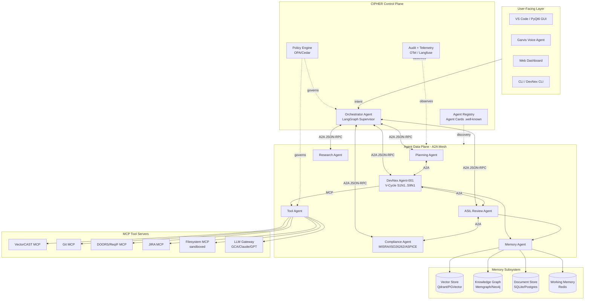
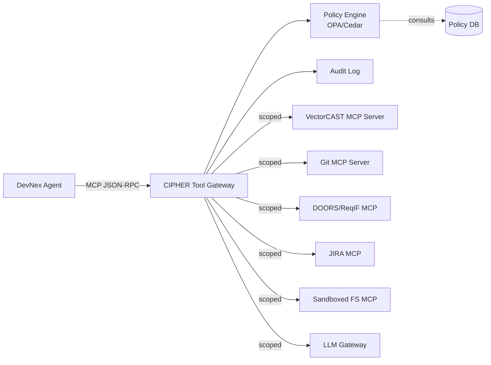
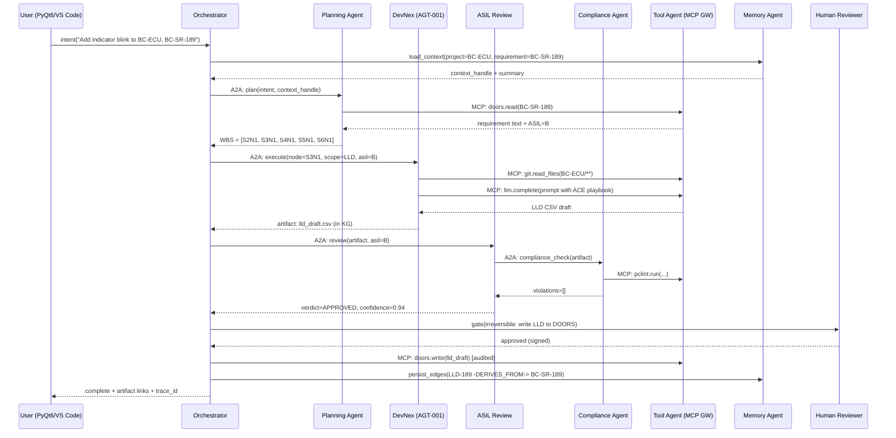
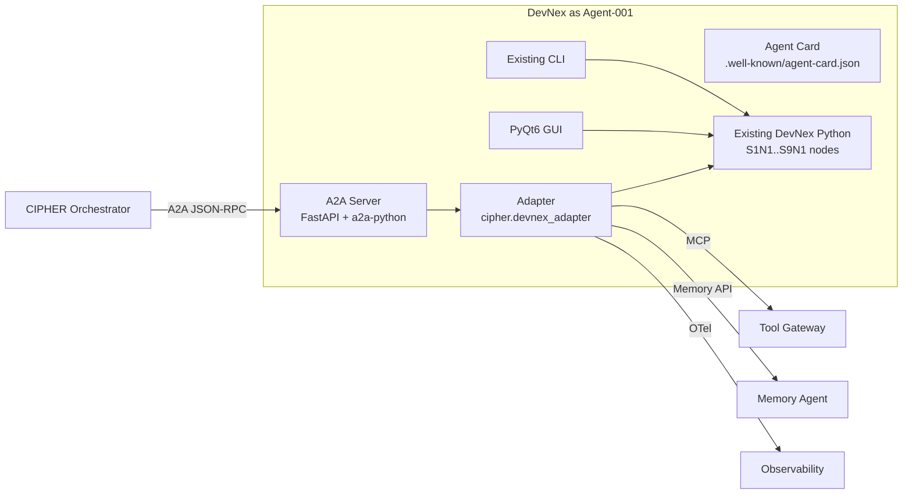

# CIPHER — Cognitive Intelligent Platform for Holistic Embedded R&D Automation
### Architectural Reference Document (v1.0, May 2026)

---

## a. Executive Summary

**CIPHER** is an enterprise-grade, agentic AI platform engineered specifically for the automotive and embedded software development life cycle (SDLC). It is not a single agent and not "yet another Copilot." CIPHER is a **multi-agent operating fabric** — what current literature is starting to call an *Agentic OS* — that treats specialized AI agents as first-class processes, gives them a shared memory and tool substrate, and orchestrates them under safety-critical compliance gates (ISO 26262, AUTOSAR, ASPICE, MISRA C:2025).

**Vision.** Every artifact in a V-cycle automotive project — from a stakeholder need to an HLD diagram, from an LLD module specification to MISRA-clean C code, from a unit test in VectorCAST to a bidirectional traceability matrix — should be *generated, reviewed, linked, and audited* by cooperating agents under explicit human oversight, with every byte traceable to a requirement and every action logged for ASPICE/ISO 26262 audit.

**Value Proposition.**
- **End-to-end V-cycle automation**: a single platform that walks the V from requirements (left) through verification (right), as opposed to point AI tools (LLM test generators, code completers, requirements writers) that only optimize one phase.
- **Compliance-by-construction**: ISO 26262 ASIL classification, MISRA-C:2025 enforcement, ASPICE process artifacts, and bidirectional traceability are *enforced architecturally*, not bolted on. MISRA C:2025 explicitly states AI-generated code must comply identically to handwritten code; CIPHER's review agents enforce that gate before any artifact ships.
- **Open-by-default protocols**: A2A (Agent-to-Agent, Linux Foundation/Google), MCP (Model Context Protocol, Anthropic), JSON-RPC 2.0, OpenTelemetry GenAI semantic conventions. No vendor lock-in.
- **Local-first, cloud-ready**: the same agent contracts run on a developer's laptop in MVP and on a Kubernetes cluster in production, with no rewrite.
- **DevNex as the seed agent**: the existing Python/PyQt6 DevNex tool, with its 13 V-cycle nodes (S1N1→S9N1) and GCA backend, plugs into CIPHER as **Agent-001** without rewriting its internals.

**What makes CIPHER different from CrewAI / AutoGen / LangGraph apps.**
Those are *frameworks*. CIPHER is a *platform* on top of them: it adds a domain-specific agent taxonomy for automotive/embedded SDLC, a compliance-first governance layer, a temporal knowledge graph for forensic-grade traceability, and a deployment model designed for safety-critical engineering organizations rather than generic enterprise chatbots.

---

## b. System Overview

### Architectural Principles

1. **Agents are processes.** Following the *Quine* (arXiv 2026) and *Agentic OS* design pattern, every agent has a unique identity, a lifecycle (spawn → run → suspend → terminate), an inbox, an outbox, and bounded resources (token/CPU/wall-clock budgets). The Orchestrator behaves like an OS scheduler.
2. **Communication is explicit and typed.** All inter-agent traffic uses **A2A** (peer collaboration) and **MCP** (agent↔tool). No agent shares Python memory with another. Opaque agents — internal state never leaks across the wire.
3. **Memory is a first-class subsystem.** Three tiers (working / episodic / semantic), structured separation between "what was true" and "when it was true." Temporal knowledge graph (Graphiti/Zep-style) for long-horizon traceability.
4. **Tools are sandboxed and audited.** Every external tool call (VectorCAST, DOORS, Git, JIRA, compilers) is mediated by an MCP server with explicit scopes, OPA-style policy, and CloudTrail-equivalent logging.
5. **Humans are gates, not exceptions.** Following the HITL routing model, every irreversible action (commit to ASIL-rated branch, push to DOORS, sign off LLD) flows through an explicit approval node. Reversible actions auto-execute with audit trail.
6. **Compliance is a runtime constraint.** ASIL-D rules, MISRA bans, ASPICE artifact requirements are encoded as policies, not prose.
7. **Local ≡ Cloud at the contract level.** All APIs, message schemas, and protocols are identical; only transport (in-process queue ↔ NATS/Kafka), storage (SQLite/Memgraph ↔ Postgres/Neo4j Aura), and runtime (uvicorn ↔ Kubernetes) differ.

### High-Level Diagram (Mermaid)



---

## c. Agent Taxonomy

CIPHER agents are classified along two axes: **role** (what they do in the SDLC) and **trust tier** (how autonomous they are allowed to be). Every agent publishes an **A2A Agent Card** (`/.well-known/agent-card.json`) describing skills, input/output modes, security requirements, and capabilities (`streaming`, `pushNotifications`, `extended_agent_card`).

### Agent Catalog

| ID | Agent | Role | Trust Tier | Backing Pattern |
|----|-------|------|------------|-----------------|
| **AGT-000** | **Orchestrator Agent** | Supervisor; decomposes user intent; assigns tasks; enforces gates | T0 (system) | LangGraph Supervisor / AutoGen GroupChat hybrid |
| **AGT-001** | **DevNex** (existing) | V-cycle automation: HLD→LLD→Code→Test→Traceability across S1N1..S9N1 | T2 (gated) | Sequential graph with checkpoint nodes |
| **AGT-002** | **Planning Agent** | Decomposes feature requests into ASPICE-aligned work breakdown structures; emits SwArch + work-package proposals | T1 (advisory) | ReAct + reflection loop |
| **AGT-003** | **ASIL Review Agent** | Reviews artifacts against ASIL-A..D criteria, ISO 26262-6 clauses; flags violations | T2 (gated) | Constitutional / rubric-based critic |
| **AGT-004** | **Compliance Agent** | Static rule engine for MISRA-C:2025, AUTOSAR coding guidelines, ASPICE BP/GP coverage | T0 (system) | Hybrid LLM + deterministic rule engine (PC-lint Plus / cppcheck wrapped) |
| **AGT-005** | **Research Agent** | Pulls external context: datasheets, AUTOSAR specs, internal wiki, prior projects | T1 (advisory) | Agentic RAG with hybrid retrieval (vector + graph) |
| **AGT-006** | **Garvis Voice/UX Agent** | Wake-word, STT→intent→TTS, hands-free engineering assistance | T1 (advisory) | LiveKit/Pipecat orchestrator + Whisper + on-device LLM |
| **AGT-007** | **Memory Agent** | Owns reads/writes to working/episodic/semantic stores; performs consolidation and pruning | T0 (system) | CraniMem-style gated/bounded scheduler |
| **AGT-008** | **Tool Agent** | Façade between A2A peers and MCP tool servers; enforces per-agent tool scopes | T0 (system) | MCP gateway pattern (Cerbos/ContextForge-style) |
| **AGT-009** | **Test Agent** | Generates unit tests, drives VectorCAST, parses coverage reports, performs Reqs2x-style requirement→test mapping | T2 (gated) | Tool-augmented loop with code-execution sandbox |
| **AGT-010** | **Traceability Agent** | Builds and maintains the bidirectional Requirement↔Design↔Code↔Test graph; runs impact analysis | T1 (advisory) | Graph algorithms over Memgraph/Neo4j |
| **AGT-011** | **Doc Agent** | Renders ASPICE/ISO 26262 work products (SwAS, SwAD, SwUTD, traceability matrix) from graph | T1 (advisory) | Template-driven generation |

### Trust Tiers

- **T0 — System.** Always-on infrastructure agents. Run with elevated but narrowly scoped permissions. Cannot be paused by user; can be paused by operator.
- **T1 — Advisory.** Produce proposals only. All outputs read-only until promoted by a human or T2 agent.
- **T2 — Gated.** May produce mutations to project artifacts (LLD CSVs, source files, JIRA tickets) but only after passing the policy engine and explicit human approval for irreversible actions.

This trust-tiering is directly inspired by the HITL routing pattern: irreversible-action gating reduced critical error rates by ~78% in the production case studies surveyed.

---

## d. Core Architectural Components

### d.1 Agent Orchestration Layer

**Topology.** CIPHER uses a **hierarchical hub-and-spoke with lateral A2A escapes** — sometimes called a *hybrid hierarchical mesh*. The Orchestrator is the hub for high-level task decomposition (the dominant production pattern in 2026 according to the multi-agent survey literature), but specialist agents (DevNex ↔ Review ↔ Compliance) may communicate peer-to-peer over A2A within a bounded sub-graph defined by the orchestrator. This avoids the O(N²) blow-up of pure mesh while keeping the latency benefit of direct lateral communication for tightly-coupled review loops.

**Why hierarchical+hybrid:**
- Auditability (a primary CIPHER constraint) — every task has a single traceable parent. Pure mesh fails audit trails.
- Adaptive topology selection (cf. AdaptOrch on SWE-bench) showed +22.9% over a single-best baseline; the orchestrator can dynamically choose `parallel`, `sequential`, or `hierarchical` sub-strategies per task based on a router.
- Mirrors the hub-and-spoke pattern used by Microsoft Semantic Kernel and AWS Transit Gateway-style routing — well-understood operationally.

**Lifecycle Management (Agent-as-Process).**

```python
# cipher/orchestrator/lifecycle.py
from enum import Enum
from dataclasses import dataclass
from uuid import UUID

class AgentState(Enum):
    SPAWNED = "spawned"
    READY = "ready"
    RUNNING = "running"
    WAITING = "waiting"        # awaiting tool / human gate
    SUSPENDED = "suspended"
    TERMINATED = "terminated"
    FAILED = "failed"

@dataclass
class AgentDescriptor:
    agent_id: UUID                 # PID-equivalent
    agent_card_url: str            # A2A discovery
    parent_id: UUID | None         # spawning agent (lineage)
    trust_tier: str                # T0|T1|T2
    budget_tokens: int             # hard cap per task
    budget_seconds: int
    scopes: list[str]              # tools this agent may call
    state: AgentState
    checkpoint_uri: str | None     # for resume after restart

class Scheduler:
    """OS-scheduler analogue for agents."""
    def spawn(self, card: AgentCard, parent: UUID, budget: Budget) -> AgentDescriptor: ...
    def suspend(self, pid: UUID): ...
    def resume(self, pid: UUID): ...
    def terminate(self, pid: UUID, reason: str): ...
    def reap(self): ...   # GC dead/orphaned agents
```

**Orchestration patterns supported:**
- **Sequential** (default for V-cycle: S1N1→S2N1→…): LangGraph DAG with checkpointing.
- **Parallel fan-out / fan-in** (e.g., parallel HLD review by ASIL Review + Compliance + Research): LangGraph `Send()` primitives.
- **Reflection loop** (DevNex generates → Review critiques → DevNex revises, max-N): bounded loop with explicit termination predicate.
- **Human approval gate** (irreversible actions): synchronous suspend, push notification to reviewer, resume on signed verdict.

**Failure semantics.**
- *Soft failure* (LLM returns malformed JSON, tool timeout): retry with exponential backoff, max 3, then promote to *escalate*.
- *Hard failure* (policy violation, unauthorized scope, ASIL gate denial): terminate with FAILED, persist trace, notify human reviewer through Garvis or web dashboard.
- *Checkpoint / resume*: every task has a serializable state (LangGraph checkpointer to Postgres/SQLite). A killed agent can be resumed from the last successful node — critical for hour-long V-cycle runs.

### d.2 Communication Infrastructure

CIPHER stacks three protocols (the *protocol stacking* approach):

| Layer | Protocol | Use |
|-------|----------|-----|
| Agent ↔ Tool / Data | **MCP** (Anthropic, JSON-RPC 2.0) | VectorCAST, Git, DOORS, filesystem, LLM access |
| Agent ↔ Agent | **A2A** (Linux Foundation/Google, JSON-RPC 2.0 + SSE) | Task delegation, capability discovery, opaque collaboration |
| System ↔ System | **Event Bus** (NATS in MVP, Kafka in cloud) | Async events: artifact-created, gate-pending, compliance-violated |

**A2A Agent Card (concrete example for DevNex):**

```json
{
  "name": "DevNex",
  "description": "V-cycle automation agent for automotive embedded SW (HLD→LLD→Code→Test→Traceability).",
  "version": "1.0.0",
  "url": "https://cipher.local/agents/devnex/a2a",
  "supported_interfaces": [
    {"protocol_binding": "JSONRPC", "url": "https://cipher.local/agents/devnex/a2a"}
  ],
  "default_input_modes": ["application/json", "text/plain"],
  "default_output_modes": ["application/json", "text/csv", "text/x-c"],
  "capabilities": {
    "streaming": true,
    "pushNotifications": true,
    "extended_agent_card": true
  },
  "skills": [
    {
      "id": "lld_from_hld",
      "name": "Generate LLD from HLD",
      "description": "S3N1 node: produces module-level LLD CSV from approved HLD.",
      "tags": ["lld", "v-cycle", "aspice-sws.3"],
      "input_modes": ["application/json"],
      "output_modes": ["text/csv"],
      "examples": ["Generate LLD for ECU_BodyControl from HLD doc-id 4f2..."],
      "security_requirements": [{"scheme": "OAuth2", "scopes": ["devnex:lld:write"]}]
    },
    {
      "id": "annotate_code",
      "name": "Annotate source with requirement IDs",
      "tags": ["traceability", "iso26262"]
    },
    {
      "id": "generate_utd",
      "name": "Produce Unit Test Description doc",
      "tags": ["aspice-sws.4", "vectorcast"]
    }
  ],
  "extensions": [
    {"uri": "cipher.compliance.asil", "values": ["A","B","C","D"]},
    {"uri": "cipher.vcycle.nodes", "values": ["S1N1","S2N1","S3N1","...","S9N1"]}
  ]
}
```

**Message schema (A2A `tasks.send` envelope):**

```json
{
  "jsonrpc": "2.0",
  "id": "req-7c3a",
  "method": "tasks/send",
  "params": {
    "id": "task-a91f",
    "contextId": "ctx-bodyctrl-sprint12",
    "message": {
      "role": "user",
      "parts": [
        {"kind": "text", "text": "Generate LLD for module IndicatorLamp."},
        {"kind": "data", "data": {"hld_doc_id": "doors://BC/HLD/4f2", "asil": "B"}}
      ]
    },
    "metadata": {
      "trace_id": "01HXY9...",
      "parent_agent": "AGT-000",
      "budget": {"tokens": 30000, "seconds": 600}
    }
  }
}
```

**Event Bus topics (NATS subjects / Kafka topics):**
- `cipher.task.created`, `cipher.task.completed`, `cipher.task.failed`
- `cipher.artifact.created` (carries graph URI of the new node)
- `cipher.gate.pending` (HITL approval needed)
- `cipher.compliance.violation` (MISRA / ISO 26262 breach)
- `cipher.memory.consolidate` (Memory Agent triggers)

**Why all three protocols.** A2A is the *peer language* (donated to Linux Foundation, framework-agnostic, supports opaque agents). MCP is the *tool language* (Anthropic, OpenAI, Microsoft, Google all adopted; "USB-C for AI"). The event bus is the *system language* — decouples long-running agents from short-lived requests, supports the saga patterns required for multi-day verification campaigns.

### d.3 Memory and Knowledge Management

CIPHER follows the **five-context-types** model from current context-engineering literature, mapped to four physical stores:

| Memory Type | Store (MVP) | Store (Cloud) | Lifetime | Owner |
|-------------|-------------|---------------|----------|-------|
| **Working / Runtime** (current task scratchpad) | Redis (or in-proc) | Redis Cluster | Task-bound | Each agent |
| **Compression / Summary** | SQLite | Postgres | Session/sprint | Memory Agent |
| **Episodic** (what happened, when) | Memgraph (open-source, BSL) embedded | Neo4j Aura / Memgraph cluster | Project lifetime | Memory Agent |
| **Semantic / Long-term** (facts, requirements, code) | Memgraph + Qdrant (vectors) | Neo4j + Qdrant Cloud / pgvector | Permanent | Memory Agent |
| **Isolation** (sub-agent sandboxes) | Per-agent Redis namespace | Per-agent K8s ConfigMap+Redis | Sub-task | Tool Agent |

**Knowledge Graph Schema (the core IP).** Designed for ASPICE/ISO 26262 bidirectional traceability — the "requirement traceability is a directed graph" model proven by ReqView/Neo4j and the SDLC trace research.

Node labels: `Stakeholder`, `SystemReq`, `SwReq`, `HLD_Module`, `LLD_Module`, `Function`, `SourceFile`, `UnitTest`, `IntegrationTest`, `Coverage`, `Defect`, `ChangeRequest`, `Person`, `Agent`, `Decision`, `Run`.

Edge types (with temporal validity):
- `DERIVES_FROM` (req → req, design → req)
- `IMPLEMENTS` (code → design)
- `VERIFIES` (test → req / test → code)
- `COVERS` (coverage → code)
- `VIOLATES` (artifact → MISRA-rule / ASIL-criterion)
- `GENERATED_BY` (artifact → Agent, with `ts`, `model`, `prompt_hash`)
- `APPROVED_BY` (artifact → Person, with `ts`, `signature`)
- `SUPERSEDES` (artifact → artifact)

Each edge carries `valid_from`, `valid_to`, and `confidence`. This is the **temporal knowledge graph** pattern (Graphiti/Zep/AriGraph), enabling impact analysis like *"if SysReq-42 changes, which units must be re-verified?"* — a single Cypher query.

**Cypher example — full trace from a system requirement to verification status:**

```cypher
MATCH path = (s:SystemReq {id:"SR-042"})
  <-[:DERIVES_FROM*1..3]-(sw:SwReq)
  <-[:IMPLEMENTS]-(c:Function)
  <-[:VERIFIES]-(t:UnitTest)-[:HAS_RESULT]->(r:Run)
WHERE r.timestamp = max(r.timestamp)
RETURN s.id, sw.id, c.name, t.id, r.verdict, r.coverage_pct
```

**Retrieval architecture (RAG + GraphRAG hybrid).**
1. Vector search over chunked artifacts (Qdrant, BGE-M3 embeddings).
2. Graph-augmented expansion (Personalized PageRank seeded by hits) — the GAAMA pattern showed +1pp over pure semantic search and is essential for SDLC questions like "what tests are at risk if I touch this function?"
3. Re-ranker (Cohere Rerank or local cross-encoder).
4. Context assembler with **ACE-style incremental updates** (arXiv 2510.04618) — prevents context collapse over long-running V-cycle runs by structuring contexts as evolving playbooks, not summaries.

**Cross-agent context passing.** Agents do not share Python memory. They pass `context_handles` (URIs into the graph + a small task-local summary). The receiving agent's first action is a Memory API `materialize(handle, budget=N_tokens)` call.

### d.4 Tool Execution Framework

Every tool — VectorCAST, Git, DOORS, JIRA, the LLM gateway itself — is exposed as an **MCP server**. CIPHER has its own *MCP Gateway* (the Tool Agent) that mediates all access, providing the policy and audit layer that core MCP deliberately delegates to implementers.

**Architecture:**



**Per-agent scopes** (least-privilege, à la Auth0 zero-permissions-by-default and Microsoft MCP guidance):

```yaml
# cipher/policies/agent_scopes.yaml
DevNex:
  read:  [git:*, doors:read, vectorcast:read, fs:project/**]
  write: [fs:project/src/**, fs:project/tests/**, vectorcast:env/**]
  deny:  [git:push:main, jira:delete, doors:write]   # explicit deny
ASIL_Reviewer:
  read:  [fs:project/**, kg:read, doors:read]
  write: [kg:write:review_node]
Compliance_Agent:
  read:  [fs:project/src/**, fs:project/tests/**, kg:read]
  write: [kg:write:violation]
  exec:  [pclint:run, cppcheck:run]
```

**Sandboxing** (following Claude Code/Anthropic sandbox-runtime + Docker MCP toolkit best practice):
- All exec-capable tools (`pclint:run`, `vectorcast:harness`, `gcc:compile`) execute in **Docker/bubblewrap-isolated containers** with read-only access to project root, writable scratch only, and no network unless explicitly allow-listed.
- Filesystem MCP enforces directory boundaries; network MCP enforces an allow-list (DOORS host, JIRA host, Git remote) — direct mitigation for CVE-2025-6514-class incidents observed in unsandboxed `mcp-remote` deployments.

**MCP Tool Spec — VectorCAST example (`vectorcast.run_unit_tests`):**

```json
{
  "name": "vectorcast.run_unit_tests",
  "description": "Execute a VectorCAST environment and return coverage + verdicts.",
  "inputSchema": {
    "type": "object",
    "required": ["env_path"],
    "properties": {
      "env_path":     {"type": "string", "description": "absolute path to .vce"},
      "coverage":     {"type": "string", "enum": ["statement","branch","mcdc"]},
      "test_filter":  {"type": "string"},
      "timeout_sec":  {"type": "integer", "default": 600}
    }
  },
  "outputSchema": {
    "type": "object",
    "properties": {
      "verdicts":     {"type": "array"},
      "coverage_pct": {"type": "number"},
      "report_path":  {"type": "string"},
      "trace_id":     {"type": "string"}
    }
  },
  "x-cipher": {
    "asil_relevant": true,
    "audit": "always",
    "approval_required": false
  }
}
```

### d.5 Security and Governance Layer

A safety-critical platform cannot adopt the "MCP delegates auth to implementers" stance literally — CIPHER imposes governance centrally.

**Identity & Auth.**
- Every agent has a unique cryptographic identity (Ed25519 keypair, like SAGA's user-controlled agent identities; arXiv 2504.21034).
- Every A2A request carries a JWT in the `Authorization` header naming `agent_id`, `parent_id`, `task_id`, `scopes` — verified by the receiving agent's A2A server (the public-card `securitySchemes` is the contract).
- Service-to-service mTLS in cloud deployments.

**Authorization.**
- **Policy engine**: Open Policy Agent (OPA) with Rego policies, or AWS Cedar for AWS-native deployments.
- Decisions are logged with input + output for every call.
- Policies are version-controlled and themselves audited.

**Audit Trail (immutable, ASPICE-grade).**
- Every agent action: `(actor, action, target, inputs_hash, outputs_hash, timestamp, parent_task, model, prompt_hash, policy_decision, signature)`.
- Stored append-only (Postgres with `pgaudit`, or AWS QLDB / immudb in cloud).
- Every artifact in the knowledge graph carries a `GENERATED_BY` edge to the exact agent + run.
- Forms the basis for ISO 26262 Part 8 work-product evidence and ASPICE engineering process audit.

**Safety Gates.**
- **Static gates**: encoded as policy (e.g., "no commit to `release/*` without two human approvals on ASIL-D modules").
- **Dynamic gates**: confidence-based routing — if Review Agent's confidence < threshold OR Compliance Agent flags any MISRA Required violation, escalate to human.
- **Reversibility classifier**: every action is tagged reversible/irreversible at design time. Irreversible actions (DOORS write, Git push, JIRA close) always require human approval in T1/T2 flows. This single rule, per the HITL field study, would have prevented ~90% of early production incidents.

**Prompt-injection defense.**
- All retrieved documents (DOORS exports, web research) are sanitized through a dedicated guardrail agent before being concatenated into context.
- LLM Gateway runs a prompt-injection classifier (Lakera / open-source equivalent) on outbound prompts and inbound completions.
- MCP tool descriptions and outputs are treated as **untrusted input** (per Elastic Security Labs / OWASP LLM01 guidance).

**Secrets management.**
- HashiCorp Vault (cloud) or `pass`/`age` (local). Agents never see raw secrets; the Tool Agent injects them at call time.

### d.6 Monitoring and Observability

**Three telemetry layers** following the OpenTelemetry GenAI semantic conventions (now standard in 2026):

1. **Traces** — every agent task is a root span; tool calls and LLM calls are children. Captures input/output, token counts, cost, latency, model, prompt fingerprint. Exported via OTLP to either **Langfuse** (open-source, preferred for self-host) or **LangSmith** (cloud).
2. **Metrics** — Prometheus scrape: `agent_task_duration_seconds`, `tool_call_total{tool=...}`, `tokens_consumed_total{agent,model}`, `gate_pending_total`, `compliance_violation_total{severity}`, `kg_write_latency_seconds`.
3. **Logs** — structured JSON via stdlib `logging` with OTel correlation IDs, shipped to Loki / Elastic.

**Dashboards (Grafana):**
- *V-cycle Progress*: per-project Gantt-style view of S1N1..S9N1 completion.
- *Compliance Dashboard*: MISRA violations by rule, ASIL coverage gaps, ASPICE BP/GP coverage matrix.
- *Agent Health*: queue depths, error rates, budget consumption.
- *Cost*: $ per task, $ per artifact, by agent.

**Evaluation.** LangSmith/Langfuse online evals on a sampled subset of production traces (LLM-as-judge for tone/correctness, deterministic checks for MISRA/coverage). Multi-turn evaluations score full V-cycle conversations.

**Alerting.** PagerDuty/OpsGenie hooks on `compliance.violation.severity=critical`, `gate.pending.age > 24h`, `agent.task.failed.rate > X`.

---

## e. Data Flow Architecture — Request Lifecycle

End-to-end flow for a representative request: *"Add an indicator-lamp blinking feature to the Body Control ECU per requirement BC-SR-189 (ASIL-B)."*



**Key invariants:**
- Every step writes to OpenTelemetry; the `trace_id` is the audit primary key.
- Every artifact lands in the knowledge graph with `GENERATED_BY` and `APPROVED_BY` edges before becoming visible to downstream agents.
- The human gate is **synchronous**: the orchestrator suspends the task (LangGraph `interrupt()`) and resumes on signed verdict.
- All LLM calls are **idempotent at the task level**: the same `task_id` + same `inputs_hash` returns the cached result (saves cost, ensures deterministic re-runs for audits).

---

## f. API Design

Four canonical APIs. All exposed as **gRPC + REST** in cloud, **REST-only on localhost** in MVP. All schemas are OpenAPI 3.1 / Protobuf.

### f.1 Agent API (A2A-compatible)

```
GET    /.well-known/agent-card.json        # discovery
POST   /a2a                                 # JSON-RPC: tasks/send, tasks/get, tasks/cancel
GET    /a2a/tasks/{id}/stream               # SSE streaming
POST   /a2a/tasks/{id}/push                 # webhook for async completion
```

JSON-RPC methods (subset of A2A spec):
- `tasks/send` — submit a task, returns `task_id`
- `tasks/get` — poll status
- `tasks/cancel` — cancel
- `tasks/sendSubscribe` — send + subscribe to stream

### f.2 Tool API (MCP-compatible)

```
POST   /mcp                                 # JSON-RPC over HTTP+SSE
GET    /mcp/tools                           # list tool definitions
POST   /mcp/tools/{name}/invoke             # invoke (gateway adds policy + audit)
```

CIPHER-specific extension: every tool definition carries an `x-cipher` block (`asil_relevant`, `audit`, `approval_required`, `cost_class`).

### f.3 Memory API

```python
class MemoryAPI:
    # Working memory
    def kv_get(scope: str, key: str) -> Any: ...
    def kv_set(scope: str, key: str, value: Any, ttl: int = 3600): ...

    # RAG / vector
    def search(query: str, k: int = 10, filters: dict = {}) -> list[Chunk]: ...

    # Graph
    def cypher(query: str, params: dict, read_only: bool = True) -> list[Record]: ...
    def upsert_node(label: str, props: dict) -> str: ...    # returns URI
    def upsert_edge(src: str, type: str, dst: str, props: dict): ...

    # Hybrid retrieve (vector + graph expand + rerank)
    def retrieve(query: str, hops: int = 2, budget_tokens: int = 4000) -> Context: ...

    # Context handles (cross-agent passing)
    def materialize(handle: ContextHandle, budget_tokens: int) -> str: ...

    # Consolidation
    def consolidate(session_id: str): ...   # promote episodic→semantic
```

REST mirror: `/memory/v1/{search,cypher,nodes,edges,retrieve,materialize}`.

### f.4 Orchestration API

```
POST   /orchestration/v1/intents            # submit user intent → returns plan_id
GET    /orchestration/v1/plans/{id}         # plan + status
POST   /orchestration/v1/plans/{id}/approve # human gate
POST   /orchestration/v1/plans/{id}/reject
GET    /orchestration/v1/agents             # list registered agents (registry)
POST   /orchestration/v1/agents/register    # register agent card
DELETE /orchestration/v1/agents/{id}
GET    /orchestration/v1/audit?trace_id=... # audit retrieval
```

---

## g. Scalability Strategy — Local MVP → Cloud Production

CIPHER is engineered around a single rule: **the contract layer (APIs, message schemas, agent cards, MCP servers, OTel spans) is identical in MVP and Production.** Only transports and storage backings change, swapped via a thin adapter package.

### Migration Path

| Concern | MVP (Local) | Phase 2 (Team) | Production (Cloud) |
|---------|-------------|----------------|--------------------|
| Compute | uvicorn + asyncio per agent in single host | Docker Compose, multi-host LAN | Kubernetes + KEDA (event-driven autoscale) |
| Inter-agent transport | in-process queue + localhost HTTP A2A | NATS (lightweight) | Apache Kafka (durable, partitioned by `project_id`) |
| Tool MCP transport | stdio / localhost HTTP | local Docker network | mTLS gRPC, dedicated MCP Gateway pod |
| Working memory | in-proc dict + SQLite | Redis single | Redis Cluster |
| Vector store | Qdrant embedded / sqlite-vss | Qdrant single | Qdrant Cloud / pgvector on RDS |
| Graph | Memgraph community (single) | Memgraph HA / Neo4j Community | Neo4j Aura Enterprise / Memgraph Cloud HA |
| Document store | SQLite | Postgres single | Aurora Postgres (multi-AZ) |
| Audit log | append-only SQLite | Postgres + pgaudit | QLDB / immudb / append-only S3 with object-lock |
| Secrets | `pass`/`age` | Vault dev | Vault HA / AWS Secrets Manager |
| Observability | Langfuse self-hosted / Jaeger local | Grafana stack | Datadog / Grafana Cloud + Langfuse Pro |
| LLM | GCA via VS Code (DevNex's existing path) + Ollama for local fallback | LLM Gateway (LiteLLM) routing to GCA + Anthropic + Azure | LLM Gateway with vendor diversity, Bedrock/Vertex |
| Auth | local JWT, single tenant | Keycloak / Authentik | Okta / Azure AD + SPIFFE/SPIRE for workload identity |

### Scaling Patterns

- **Per-agent horizontal scale.** Each agent type runs as a Kubernetes Deployment; KEDA scales replicas based on Kafka topic lag (`cipher.task.{agent_id}.requested`). Stateful work is checkpointed to Postgres so any replica can resume any task.
- **Model tiering** (the proven cost lever in production multi-agent systems): cheap/fast models (Haiku, GPT-4.5-mini, GCA fast tier) for routing/triage agents (Orchestrator, Planner, Memory); high-capability models for Review/Compliance/DevNex's hard generation steps.
- **Topology adaptation** at scale: the Orchestrator's router selects sequential vs. parallel vs. hierarchical sub-strategies per task — mirroring AdaptOrch's empirical 22.9% win on SWE-bench Verified.
- **Backpressure**: Kafka consumer groups + token-budget admission control; the orchestrator refuses new top-level intents when total in-flight token budget exceeds a configurable cap.
- **Multi-tenancy isolation**: per-project namespaces in the graph + Redis + Kafka topic prefixes. ASIL-D projects can be pinned to dedicated node pools.

---

## h. Technology Stack Recommendations

### Local MVP (Phase 1)

| Layer | Choice | Rationale |
|-------|--------|-----------|
| Language | **Python 3.12** | DevNex already in Python; richest agent ecosystem |
| Orchestration | **LangGraph 0.4+** | Best production characteristics: checkpointing, time-travel, deterministic execution; clear winner for compliance/auditability per 2026 framework comparisons |
| Agent runtime (alt) | **AutoGen 0.4 / AG2** | For Group-Chat-style review loops where conversational refinement is needed |
| Agent identity / A2A | **a2a-python SDK** + FastAPI server | Reference implementation; supports `to_a2a()` quickstart |
| Tool protocol | **mcp-python (Anthropic)** + custom servers | The de-facto 2026 standard |
| Voice (Garvis) | **LiveKit Agents** + Whisper-large-v3 + Piper TTS + on-device LLM (Llama-3.1-8B-Instruct GGUF via llama.cpp) | Open-source full stack; offline-capable |
| GUI | **PyQt6** (existing DevNex) + **VS Code extension** (Language Model Tools API) | Two surfaces, same backend |
| Vector | **Qdrant** (embedded mode) + **BGE-M3** embeddings | Open-source, Rust-based, fast, hybrid dense+sparse |
| Graph | **Memgraph Community** (Cypher-compatible, in-memory, fast) | OSS alternative to Neo4j Community; better local perf |
| Document store | **SQLite + SQLAlchemy** | Zero-ops |
| Working memory | **Redis** (or `redislite` for true zero-config) | Standard |
| Event bus | **NATS** (or in-proc queue) | Lightweight, sub-ms |
| Observability | **Langfuse** (self-hosted Docker) + **OpenTelemetry SDK** | OSS, supports OTel ingest |
| Policy | **Open Policy Agent** (sidecar) | Battle-tested |
| LLM access | **GCA via DevNex's existing VS Code bridge** + **LiteLLM proxy** for fallback to Ollama (Qwen3-Coder, DeepSeek-R1-Distill) | Preserves DevNex's existing GCA integration; Ollama for offline |
| Sandboxing | **Docker** + **bubblewrap** for Linux | Per Anthropic / Claude Code guidance |
| CI/CD | **GitHub Actions** locally with `act` runner | Developer-friendly |

### Production Cloud (Phase 3)

| Layer | Choice | Rationale |
|-------|--------|-----------|
| Compute | **Kubernetes 1.30+** on EKS/GKE/AKS | Industry standard |
| Autoscaling | **KEDA** (Kafka-lag triggers) + HPA | Event-driven |
| Service mesh | **Istio** or **Linkerd** | mTLS, observability |
| Event bus | **Apache Kafka 4.1+** (Confluent / MSK / Strimzi) | Durable, partitioned; eBay processes 10B events/day with sub-ms latency at this scale |
| Vector | **Qdrant Cloud** or **pgvector on Aurora** | Managed, hybrid search |
| Graph | **Neo4j Aura Enterprise** (managed) — chosen over ArangoDB for native graph storage (index-free adjacency = constant-time hops), strong tooling (Bloom, GDS), and existing automotive-engineering case studies. Memgraph remains supported for cost-sensitive deployments | Native graph is the right primitive for traceability |
| Document store | **Aurora PostgreSQL (multi-AZ)** with `pgaudit` | Durable + auditable |
| Audit log | **Amazon QLDB** or **immudb** | Cryptographic immutability for ISO 26262 evidence |
| LLM Gateway | **LiteLLM** or **Portkey** in front of GCA / Anthropic / Bedrock / Vertex | Multi-vendor, cost routing |
| Tool sandbox | **gVisor** / **Firecracker** microVMs | Stronger isolation than containers |
| Secrets | **HashiCorp Vault HA** (or cloud KMS) | Dynamic secrets, lease-based |
| Identity | **Keycloak** / **Okta** / **Azure AD** + **SPIFFE/SPIRE** for workloads | Standards-based |
| Policy | **OPA** (centralized via Styra DAS) or **AWS Cedar** | Versioned, audited policies |
| MCP gateway | **ContextForge** (IBM-ecosystem, OSS) or **Traefik Hub MCP** | Triple-gate pattern (AI/MCP/API) |
| Observability | **Grafana Cloud + Tempo + Loki + Mimir** + **Langfuse Pro** | Full OTel pipeline |
| Compliance scanners | **PC-lint Plus** (LDRA), **Polyspace**, **Coverity**, **cppcheck** as MCP-exposed tools | MISRA C:2025 + AUTOSAR coding rules |
| Test execution | **VectorCAST 2026** with the Reqs2x AI feature, **LDRA TBrun**, GoogleTest for SIL | Industry standard for ASIL-D |

### Reference Libraries Map

```
cipher/
├── core/                # protocols, schemas, agent SDK
├── orchestrator/        # LangGraph supervisor + scheduler
├── memory/              # Memory Agent + adapters (Qdrant/Memgraph/Redis)
├── tools/               # MCP gateway + per-tool servers
│   ├── vectorcast_mcp/
│   ├── doors_mcp/       # ReqIF parser/writer
│   ├── git_mcp/
│   ├── jira_mcp/
│   └── llm_gateway/
├── agents/
│   ├── devnex_assistant/ # Agent-001 implementation integrated into the agent tree
│   ├── planner/
│   ├── asil_reviewer/
│   ├── compliance/
│   ├── research/
│   ├── garvis/
│   ├── test_agent/
│   └── traceability/
├── governance/          # OPA policies, audit, identity
├── observability/       # OTel instrumentation
└── deploy/
    ├── local/           # docker-compose, scripts/checkstyle
    └── cloud/           # helm charts, terraform
```

---

## i. Implementation Roadmap

### Phase 1 — Local MVP "DevNex Inside CIPHER" (Months 0–3)

**Goal:** prove the CIPHER contract layer using DevNex as the only mutating agent, with a thin Orchestrator and stub agents for the rest.

Deliverables:
1. `cipher.core` package — A2A SDK, MCP SDK, Agent Card schema, message envelopes, OTel spans.
2. **Agent-001 (DevNex)** wrapped: each of S1N1..S9N1 exposed as an A2A skill; PyQt6 GUI continues to work but now talks to local A2A endpoint.
3. **Orchestrator** as a LangGraph supervisor with sequential V-cycle execution and checkpointing to SQLite.
4. **Memory Agent v1**: SQLite + Memgraph + Qdrant; minimum schema (Requirement, Module, Function, Test, Run + temporal edges).
5. **Tool Agent v1** with MCP servers for: Git, sandboxed FS, ReqIF (DOORS export), VectorCAST CLI, GCA LLM (via existing DevNex bridge).
6. **Compliance Agent v1**: wraps PC-lint Plus / cppcheck; produces `VIOLATES` edges into the graph.
7. **Audit log** to SQLite + Langfuse self-hosted.
8. **CLI + VS Code extension** (Language Model Tools API integration).
9. End-to-end demo: "from a DOORS-exported requirement, produce LLD CSV → annotated C → unit-test stubs → coverage run → traceability matrix".

Exit criteria: same artifacts DevNex produces today, but every artifact has a graph identity, audit trail, OTel trace, and survives an Orchestrator restart via checkpoint.

### Phase 2 — Team-scale, Multi-agent (Months 3–8)

1. Add **Planning Agent** (ReAct, ASPICE-WBS aware).
2. Add **ASIL Review Agent** (rubric-based, ASIL-A..D matrices encoded).
3. Add **Research Agent** (RAG over internal wiki + AUTOSAR specs + datasheets).
4. Add **Garvis Voice Agent** (LiveKit + Whisper + Piper).
5. **HITL gate** UI (web dashboard) with signed approvals.
6. Migrate transport: in-proc → **NATS**.
7. **Docker Compose** stack for shared team deployment.
8. Hybrid retrieval (vector + graph PageRank + rerank).
9. **ACE-style** evolving playbooks for DevNex's per-project context.
10. Multi-tenant isolation (per-project namespaces).
11. Per-agent OPA scopes.

Exit criteria: 3+ engineers concurrently driving multi-agent V-cycle runs on shared graph; review loops measurably catch ≥80% of MISRA violations before HITL.

### Phase 3 — Cloud Production (Months 8–14)

1. Helm charts; **Kubernetes** deployment with KEDA.
2. **Kafka** as durable event bus; **Postgres**/**Aurora** for state; **Neo4j Aura** for graph.
3. **mTLS** + **SPIFFE/SPIRE** + **Vault**.
4. **MCP Gateway** with policy/audit (ContextForge-style).
5. **LLM Gateway** with vendor routing + cost tiering.
6. **QLDB/immudb** audit log for ISO 26262 evidence.
7. **Compliance dashboard** (ASIL coverage, MISRA-by-rule, ASPICE BP/GP coverage).
8. **Sandbox hardening**: gVisor / Firecracker for code execution.
9. Penetration test against MCP attack surface (Elastic/OWASP playbook).
10. ASPICE assessment dry-run on a pilot project; adjust artifacts.

Exit criteria: ASPICE CL2 dry-run pass on a pilot ECU project; ISO 26262-6 Part-8 evidence package generated automatically from the graph.

### Phase 4 — Continuous (Month 14+)

- Add specialized domain agents (AUTOSAR Classic vs Adaptive specialists, Cybersecurity / ISO 21434 reviewer, SOTIF / ISO 21448 analyzer).
- Self-organizing agent teams (TheBotCompany pattern) for novel features.
- Fine-tuned domain models (Qwen3-Coder/DeepSeek-Coder distilled on internal codebase, host-deployed for IP protection).
- Federated learning across customer deployments.

---

## j. DevNex Integration — Plug-in as Agent-001

This section is the bridge between the existing DevNex codebase and the new CIPHER fabric. **No DevNex internals need to be rewritten.** We wrap, we don't refactor.

### Existing DevNex Surface

- Python package; CLI + PyQt6 GUI.
- 13 V-cycle nodes: `S1N1` (intake) → `S9N1` (UTD).
- Backend: GCA (Google Code Assist) via VS Code as the LLM access path.
- Artifacts: LLD CSV, annotated `.c`/`.h`, traceability matrix, UTD docx.

### Integration Strategy



### Concrete Wrapping (pseudocode)

```python
# cipher/agents/devnex_assistant/server.py
from a2a import AgentCard, AgentSkill, AgentCapabilities, A2AServer
from a2a.tasks import Task, TaskStatus
from cipher.core.memory import MemoryClient
from cipher.core.tools import ToolClient
from cipher.core.otel import traced
import devnex                        # the existing package, untouched

VCYCLE_NODES = ["S1N1","S2N1","S3N1","S4N1","S5N1","S6N1","S7N1","S8N1","S9N1"]

def _skill(node_id: str, name: str, desc: str) -> AgentSkill:
    return AgentSkill(
        id=f"vcycle_{node_id.lower()}",
        name=name,
        description=desc,
        tags=["v-cycle", node_id, "iso26262", "aspice"],
        input_modes=["application/json"],
        output_modes=["application/json", "text/csv", "text/x-c", "text/markdown"],
        examples=[f"Run {node_id} on module {{module_id}}"],
    )

CARD = AgentCard(
    name="DevNex",
    description="V-cycle automation for automotive embedded SW (Agent-001).",
    version=devnex.__version__,
    url="http://localhost:7001/a2a",
    capabilities=AgentCapabilities(streaming=True, extended_agent_card=True),
    default_input_modes=["application/json"],
    default_output_modes=["application/json"],
    skills=[
        _skill("S1N1", "Intake & scoping", "Parse user intent, fetch requirements."),
        _skill("S3N1", "LLD generation", "HLD → LLD CSV per ASPICE SWE.3."),
        _skill("S5N1", "Code annotation", "Annotate source with req IDs."),
        _skill("S7N1", "Unit-test scaffolding", "VectorCAST harness + tests."),
        _skill("S9N1", "Trace + UTD", "Bidirectional matrix + Unit Test Description."),
        # ...remaining nodes
    ],
)

class DevNexExecutor:
    def __init__(self):
        self.memory = MemoryClient(base_url="http://localhost:7100")
        self.tools  = ToolClient(base_url="http://localhost:7200")  # MCP gateway

    @traced("devnex.task")
    async def execute(self, task: Task) -> Task:
        skill_id = task.params["skill"]
        node_id = skill_id.replace("vcycle_", "").upper()

        # 1. Materialize context from CIPHER memory (replaces DevNex's old file IO)
        ctx_handle = task.params.get("context_handle")
        ctx = await self.memory.materialize(ctx_handle, budget_tokens=20_000) \
              if ctx_handle else ""

        # 2. Bridge GCA: existing DevNex calls GCA directly today.
        #    In CIPHER we route through the LLM Gateway (still backed by GCA),
        #    so all calls are audited + cost-tracked. Monkey-patch:
        devnex.llm.complete = lambda prompt, **kw: self.tools.call(
            "llm.complete", {"prompt": prompt, "context": ctx, **kw})

        # 3. Tools: every fs/git/vectorcast call goes through the MCP gateway.
        devnex.io.read_file  = lambda p: self.tools.call("fs.read",  {"path": p})
        devnex.io.write_file = lambda p, c: self.tools.call("fs.write", {"path": p, "content": c})
        devnex.tools.run_vectorcast = lambda env: self.tools.call(
            "vectorcast.run_unit_tests", {"env_path": env, "coverage": "mcdc"})

        # 4. Run the original DevNex node
        result = devnex.nodes.run(node_id, params=task.params)

        # 5. Persist artifacts to the knowledge graph
        for art in result.artifacts:
            uri = await self.memory.upsert_node(
                label=art.label,                  # e.g. "LLD_Module"
                props={**art.props,
                       "generated_by": "AGT-001",
                       "node": node_id,
                       "trace_id": task.trace_id})
            for edge in art.edges:                # e.g. DERIVES_FROM, IMPLEMENTS
                await self.memory.upsert_edge(uri, edge.type, edge.target_uri, edge.props)

        task.artifacts = [a.to_a2a_part() for a in result.artifacts]
        task.status = TaskStatus(state="completed")
        return task

if __name__ == "__main__":
    A2AServer(card=CARD, executor=DevNexExecutor()).run(host="0.0.0.0", port=7001)
```

### What This Buys DevNex (without rewriting it)

1. **Discoverable**: any CIPHER agent can find DevNex via its agent card.
2. **Composable**: the Orchestrator can run DevNex's S3N1 in parallel with Research Agent's datasheet lookup, then call Review Agent on the merged output.
3. **Audited**: every GCA call, every file read, every VectorCAST run is in OTel + the audit log.
4. **Traceable**: every artifact lands in the graph with a `GENERATED_BY` edge — instantly enables ISO 26262 / ASPICE evidence.
5. **Scalable**: the same wrapped DevNex container can run as a Kubernetes Deployment with N replicas in Phase 3, no code changes; per-task checkpointing makes replicas interchangeable.
6. **Safer**: tool calls are scoped — DevNex literally cannot push to `release/main`, even if asked, because the policy engine denies the action.
7. **Continuity**: the PyQt6 GUI and CLI keep working; they now ALSO trigger A2A tasks under the hood, so all UX surfaces share the same audit story.

### Existing-to-CIPHER Concept Mapping

| DevNex (today) | CIPHER (Agent-001) |
|---|---|
| 13 V-cycle nodes | 13 A2A skills on one Agent Card |
| Direct GCA calls | LLM Gateway MCP (GCA still backend, now audited) |
| Local file IO | Sandboxed FS MCP server |
| LLD CSV on disk | `LLD_Module` nodes in Memgraph/Neo4j with edges to source `SwReq` |
| Annotated `.c` files | `Function` + `SourceFile` nodes with `IMPLEMENTS` edges |
| Traceability matrix as CSV | Graph query (regenerable on demand) |
| UTD docx | Doc Agent renders from graph |
| PyQt6 GUI | unchanged; calls local A2A in addition |
| One-shot script | resumable LangGraph task with checkpoints |

---

## Caveats and Open Questions

- **Protocol churn.** A2A and MCP are evolving rapidly (A2A donated to Linux Foundation in 2025; MCP introduced late-2024). CIPHER pins A2A v1.x and MCP 2025-06 at MVP; an adapter layer in `cipher.core` is mandatory to absorb future breaking changes. Implementers should expect protocol-level migrations annually for the next 2–3 years.
- **MCP security maturity.** Several CVEs in 2025 (CVE-2025-6514 in `mcp-remote` CVSS 9.6; CVE-2025-49596 in MCP Inspector CVSS 9.4) demonstrate the early-protocol risk surface. CIPHER's MCP Gateway with OPA policy, sandboxing, and explicit scopes is **non-negotiable** even for MVP — do not expose raw MCP servers to agents.
- **AI-generated code under MISRA C:2025 and ISO 26262.** MISRA C:2025 explicitly states AI-generated code must comply identically to handwritten code — origin is irrelevant, only quality. CIPHER's Compliance Agent enforces this, but **organizational acceptance** of AI-generated artifacts in ASIL-rated projects is still ahead of formal certification body guidance. Tool qualification (ISO 26262-8) for agent outputs is an open industry topic; treat any "qualified AI" claim with skepticism until TCL is granted by an external assessor.
- **LLM non-determinism.** Even with `temperature=0`, multi-turn agent runs are not bit-identical across vendor model updates. CIPHER caches `(task_id, inputs_hash) → output` for replay, but bit-exact reproducibility for an audit five years later requires either pinning model versions (and paying for long-term hosting) or accepting that the audit replays a *cached* artifact, not a *re-generated* one. This trade-off must be agreed with assessors up-front.
- **VectorCAST 2026's own AI features (Reqs2x).** The vendor's `--vc-coded-tests` and Reqs2x toolchain overlap with CIPHER's Test Agent. CIPHER treats Reqs2x as just another MCP tool — the integration is additive, but teams must decide whether DevNex/Test Agent or Reqs2x is the canonical generator on a per-project basis to avoid double-generation.
- **DOORS / DOORS Next licensing**. ReqIF round-trip is robust; live DOORS Next API is rate-limited and license-counted. Plan for a queueing layer in the DOORS MCP server.
- **Voice-driven engineering (Garvis).** The Voice/UX Agent is genuinely useful for hands-free shop-floor scenarios but can degrade in noisy automotive lab environments; treat it as a productivity helper, not a critical path. P95 latency targets of <800 ms (industry voice-AI standard) are aggressive for full agentic workflows — expect 2–5 s perceived latency for non-trivial tasks.
- **Cost discipline.** AutoGen-style conversational patterns can balloon to 20+ LLM calls per task. CIPHER's LangGraph-first orchestration is chosen explicitly to keep this linear, but Review/Reflection loops still need hard turn caps in production.
- **Self-hosted graph at scale.** Memgraph and Neo4j Community both have operational ceilings; large multi-project ASPICE deployments will likely require Neo4j Aura Enterprise or commercial Memgraph support. Budget accordingly.
- **Some 2026 statistics referenced in surveys** (Gartner inquiry surge, eBay 10B events/day on Kafka 4.1, AdaptOrch 22.9% on SWE-bench) come from secondary sources; treat them as directional signals rather than guarantees. The architectural choices are defensible on first principles regardless.
- **MCP "permissionless by default."** Core MCP delegates access control to implementers. CIPHER closes this with the Tool Gateway, but any third-party MCP server pulled in from the public ecosystem must be audited before connection — the supply-chain risk is real.

This document is the implementation contract. Engineers can begin with Phase 1 today: wrap DevNex with the A2A server stub above, stand up Memgraph + Qdrant + Langfuse via Docker Compose, point the Orchestrator at it, and the rest of the system grows around the contract — exactly as designed.
