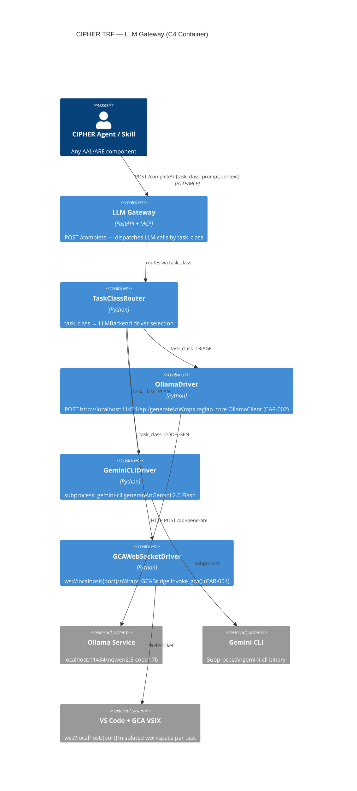

# ADR-0001: LLM Gateway — Task-Class Routing to Local Backends

- **Status:** Accepted
- **Deciders:** CIPHER Architecture Team
- **Date:** 2026-05-16
- **Layer:** TRF (Tool & Resource Fabric)
- **Tags:** llm, gateway, ollama, gemini-cli, gca, trf, poc

---

## 1. Context and Problem Statement

CIPHER must invoke Large Language Models for a variety of task classes — intent classification, requirement planning, LLD code generation — without making any paid cloud API calls. Three local LLM backends are available per §1.1 of the CIPHER design specification:

1. **Ollama** (local, port 11434) — serves open-source models (e.g., `qwen2.5-coder:7b`) via HTTP API
2. **Gemini CLI** (subprocess) — invokes the `gemini-cli` command-line tool for Google Gemini model access
3. **GCA via VS Code WebSocket** (`ws://localhost:7820`) — invokes GitHub Copilot Agent (GCA) via an installed VSIX extension in an isolated VS Code workspace

Each backend has different latency characteristics, context window sizes, and suitability for different task types. Without a routing layer, individual agents and skills must implement their own backend selection logic, duplicating connection management and error handling across the codebase.

The problem is: **how do CIPHER agents and skills invoke an LLM without knowing which physical backend is used, while still ensuring the right backend is chosen for each task class?**

This decision is also required to resolve the architectural debt item DEBT-001 from CAR-001 (DevNex): the `GCABridge` class in DevNex directly manages VS Code workspace isolation and WebSocket connection — this logic must be abstracted behind a gateway so that other agents can invoke GCA without duplicating the 5-step bridge logic.

---

## 2. Decision Drivers

- **Hard constraint (§1.1)**: Only three LLM backends are permitted — Ollama (local), Gemini CLI (subprocess), GCA WebSocket. No paid cloud API calls.
- **Hard constraint (§1.3)**: Deployment via Docker Compose only; no Kubernetes.
- **Hard constraint (Python stack)**: Python 3.11+, pydantic v2, fastapi, opentelemetry-sdk.
- **POC determinism**: Each task class must have exactly one backend in POC (no automatic fallover) to ensure reproducible results.
- **Observability requirement (ADR-0008)**: All LLM calls must emit OTel spans with backend, task_class, latency_ms, and token count attributes.
- **CAR-001 integration**: `GCABridge.invoke_gca()` 5-step pattern must be preserved and exposed via the gateway rather than duplicated.
- **CAR-002 integration**: `raglab_core.generation.OllamaClient` is the Ollama driver source and must be wrapped, not rewritten.

---

## 3. Considered Options

### Option A: Direct Backend Calls Per Skill (No Gateway)
Each skill or agent imports and calls the appropriate backend directly. GCABridge used directly in LLD skills; OllamaClient used directly in classification skills.

**Pros**: Simple, no indirection.
**Cons**: Backend selection logic duplicated in every skill; no central observability; DEBT-001 (_ADP_ROOT) must be fixed in every skill that uses GCA; cannot add a new backend without modifying every skill; violates single-responsibility principle.

### Option B: Thin Routing Wrapper (Selected)
A `TaskClassRouter` maps `task_class` to a backend driver. A `LLMGateway` FastAPI + MCP server exposes a single `complete()` endpoint. Three concrete driver classes implement the `LLMBackend` Protocol. All agents call the gateway — no agent knows which physical backend is used.

**Pros**: Single place for backend selection logic; single OTel instrumentation point; backend can be changed per task class by updating routing config; clean Protocol-based interface; SOLID compliant.
**Cons**: One additional network hop for all LLM calls (mitigated by localhost-only deployment).

### Option C: LangGraph Tool Nodes (One Node Per Backend)
Each backend is a LangGraph tool node. The workflow graph routes to the correct node based on edge conditions.

**Pros**: Native LangGraph integration.
**Cons**: Locks LLM selection into the graph topology; cannot invoke backends from outside LangGraph flows (e.g., from FastAPI skills); harder to add OTel; more coupling.

---

## 4. Decision

**Selected: Option B — Thin Routing Wrapper (LLM Gateway as TRF MCP Server)**

Implement `LLMGateway` as a TRF MCP server exposing a single `LLMBackend` Protocol. Three concrete driver classes implement the protocol. A `TaskClassRouter` selects the driver based on the `task_class` field of the incoming LLM request.

### 4.1 LLMBackend Protocol

```python
from typing import Protocol, runtime_checkable
from pydantic import BaseModel

class LLMResponse(BaseModel):
    text: str
    backend_id: str
    task_class: str
    duration_ms: float
    prompt_tokens: int | None = None
    completion_tokens: int | None = None
    instance_id: str | None = None   # GCA instance UUID, if applicable

class LLMUnavailableError(Exception):
    def __init__(self, backend: str, reason: str): ...

@runtime_checkable
class LLMBackend(Protocol):
    async def complete(self, prompt: str, context: dict) -> LLMResponse: ...
    async def is_available(self) -> bool: ...
    @property
    def backend_id(self) -> str: ...
```

### 4.2 Concrete Driver Classes

```python
class OllamaDriver:
    """Wraps raglab_core.generation.OllamaClient (CAR-002 WRAP)."""
    backend_id: str = "ollama"
    base_url: str  # from env: OLLAMA_BASE_URL, default "http://localhost:11434"
    model: str     # from env: OLLAMA_MODEL, default "qwen2.5-coder:7b"

    async def complete(self, prompt: str, context: dict) -> LLMResponse: ...
    async def is_available(self) -> bool:
        """GET http://localhost:11434/api/tags — return True if 200."""

class GeminiCLIDriver:
    """Invokes gemini-cli via subprocess."""
    backend_id: str = "gemini_cli"
    cli_path: str  # from env: GEMINI_CLI_PATH, default "gemini"
    model: str     # from env: GEMINI_MODEL, default "gemini-2.0-flash"

    async def complete(self, prompt: str, context: dict) -> LLMResponse:
        """subprocess.run([cli_path, 'generate', '--model', model, '--prompt', prompt])"""
    async def is_available(self) -> bool:
        """subprocess.run([cli_path, '--version']) return True if returncode==0."""

class GCAWebSocketDriver:
    """Wraps GCABridge.invoke_gca() (CAR-001 WRAP)."""
    backend_id: str = "gca_websocket"
    # GCA_REGISTRY_PATH from env (default ~/.gca_instances.json) — ADR-0002

    async def complete(self, prompt: str, context: dict) -> LLMResponse:
        """Delegates to GCABridge.invoke_gca(prompt, workspace_hint)."""
    async def is_available(self) -> bool:
        """Check if registry file exists and has at least one entry."""
```

### 4.3 Task-Class Routing Matrix

| task_class | Backend | Driver Class | Models | Examples |
|---|---|---|---|---|
| `TRIAGE` | Ollama (local) | `OllamaDriver` | `qwen2.5-coder:7b` | Intent classification, context summarisation, routing decisions |
| `PLAN` | Gemini CLI | `GeminiCLIDriver` | `gemini-2.0-flash` | Requirement parsing, planning, documentation generation |
| `CODE_GEN` | GCA WebSocket | `GCAWebSocketDriver` | GCA-managed | LLD generation (S1N1–S4), code annotation, full V-cycle |

### 4.4 TaskClassRouter

```python
class TaskClassRouter:
    """Maps task_class → LLMBackend driver instance."""
    _routing_table: dict[str, LLMBackend]  # populated from ROUTING_CONFIG env var or defaults

    def route(self, task_class: str) -> LLMBackend:
        """Return driver for task_class. Raise LLMUnavailableError if task_class unknown."""

    @classmethod
    def from_env(cls) -> "TaskClassRouter":
        """Build routing table from environment config."""
```

### 4.5 LLMGateway FastAPI + MCP Server

```python
# trf/mcp_servers/llm_gateway/server.py

app = FastAPI(title="CIPHER LLM Gateway", version="0.1.0")
router = TaskClassRouter.from_env()

class LLMRequest(BaseModel):
    task_class: str           # TRIAGE | PLAN | CODE_GEN
    prompt: str
    context: dict = {}
    workspace_hint: str = ""  # passed to GCAWebSocketDriver if task_class==CODE_GEN

@app.post("/complete", response_model=LLMResponse)
@traced("llm_gateway.complete")
async def complete(request: LLMRequest) -> LLMResponse:
    backend = router.route(request.task_class)
    return await backend.complete(request.prompt, request.context)

@app.get("/health")
async def health() -> dict:
    return {
        b.backend_id: await b.is_available()
        for b in router._routing_table.values()
    }
```

---

## 5. Architecture Diagram



---

## 6. Failover Policy

**POC rule: No automatic cross-backend failover. Each task_class has exactly one backend.**

Rationale: Automatic failover would produce non-deterministic results during POC evaluation. If Ollama returns different results than GCA for a CODE_GEN task, the evaluation data is contaminated.

Specific error behaviour:

| Backend | Failure Condition | Error Raised | Caller Behaviour |
|---|---|---|---|
| `OllamaDriver` | `http://localhost:11434` unreachable or returns non-200 | `LLMUnavailableError(backend="ollama", reason=...)` | Skill returns `TaskResult(status="error", errors=[...])` |
| `GeminiCLIDriver` | subprocess non-zero return code | `LLMUnavailableError(backend="gemini_cli", reason=str(stderr))` | Skill returns `TaskResult(status="error", errors=[...])` |
| `GCAWebSocketDriver` | `GCANotAvailableError` from GCABridge after 5 retries | Re-raises `LLMUnavailableError(backend="gca_websocket")` | Skill returns `TaskResult(status="error", errors=[...])` |

**In MVP (post-POC)**: A configurable fallback chain may be added per task_class (e.g., `CODE_GEN`: GCA → GeminiCLI). This is explicitly out of scope for POC.

---

## 7. OTel Instrumentation

Every `complete()` call must emit an OTel span with the following attributes:

```python
with tracer.start_as_current_span("llm_gateway.complete") as span:
    span.set_attribute("llm.backend_id", backend.backend_id)
    span.set_attribute("llm.task_class", request.task_class)
    span.set_attribute("llm.model", model_name)
    span.set_attribute("llm.prompt_length", len(request.prompt))
    # After completion:
    span.set_attribute("llm.duration_ms", response.duration_ms)
    span.set_attribute("llm.completion_length", len(response.text))
    if response.prompt_tokens:
        span.set_attribute("llm.prompt_tokens", response.prompt_tokens)
    if response.completion_tokens:
        span.set_attribute("llm.completion_tokens", response.completion_tokens)
```

Spans are exported to the OTel Collector configured in `deploy/otel-collector.yaml` and forwarded to Langfuse for trace storage.

---

## 8. Reference Codebase Impact

| CAR | Module | Disposition | Notes |
|---|---|---|---|
| CAR-001 | `bridge/gca_bridge.py` | WRAP | `GCAWebSocketDriver` wraps `GCABridge.invoke_gca()`; 5-step flow preserved |
| CAR-001 | `bridge/vscode_controller.py` | WRAP | Used internally by `GCABridge` (unchanged) |
| CAR-002 | `raglab_core/generation.py` → `OllamaClient` | WRAP | `OllamaDriver` wraps `OllamaClient`; base_url and model read from env |
| — | `GeminiCLIDriver` | NEW | No reference codebase exists for Gemini CLI subprocess invocation |

---

## 9. Consequences

**Positive**:
- All LLM calls in CIPHER flow through a single instrumented gateway — one place to add OTel, budget enforcement, audit logging.
- Adding a fourth backend in MVP requires only: (a) a new driver class implementing `LLMBackend`, (b) a new entry in the routing table. No skill code changes.
- `GCABridge` architectural debt (DEBT-001: `_ADP_ROOT`, DEBT-006: non-configurable port) is resolved in one place (`GCAWebSocketDriver`) rather than in every skill.
- Health check endpoint (`GET /health`) enables Docker Compose `healthcheck` dependency ordering.

**Negative**:
- One additional HTTP hop for all LLM calls. At localhost, this adds ~1–5ms per call — acceptable.
- GCA WebSocket tasks have high latency (VS Code launch + registry poll + WS handshake ≈ 10–30s) regardless of gateway. This is a GCA characteristic, not a gateway penalty.

**Neutral**:
- The POC "no failover" rule must be revisited for MVP. A decision on fallback chains should be captured in an ADR-0001 amendment.

---

## 10. Related Decisions

- **ADR-0002**: GCA WebSocket Bridge Protocol — details the 5-step isolation pattern and registry configuration
- **ADR-0003**: POC Scope Lock — CODE_GEN task class and GCA backend are POC scope; Gemini CLI for PLAN is POC scope
- **ADR-0007**: Skill Loader — skills call LLM Gateway via `task_class` field in skill execution context
- **ADR-0008**: Observability — OTel span attributes defined here are part of the CIPHER observability standard
- **CAR-001**: DevNex GCABridge — source of `GCAWebSocketDriver`
- **CAR-002**: RAG_Lab OllamaClient — source of `OllamaDriver`
