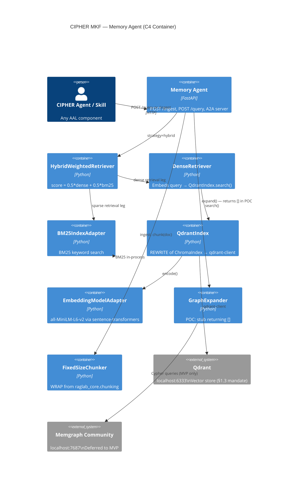

# ADR-0004: Memory Agent Hybrid RAG

- **Status:** Accepted
- **Deciders:** CIPHER Architecture Team
- **Date:** 2026-05-16
- **Layer:** MKF (Memory Agent with Hybrid RAG)
- **Tags:** rag, memory, qdrant, bm25, hybrid-retrieval, mkf, poc

---

## 1. Context and Problem Statement

CIPHER agents require access to a persistent, queryable memory store that can retrieve relevant automotive engineering documents, requirement artefacts, code snippets, and prior LLD outputs given a natural language or structured query. This memory system must support:

1. **Vector (dense) retrieval**: semantic similarity search over embedded document chunks
2. **Sparse retrieval**: keyword-matching via BM25 for exact term retrieval (critical for requirement IDs, signal names, SWC names)
3. **Hybrid combination**: merging dense and sparse scores for better recall than either alone
4. **Graph expansion** (future): traversal of a knowledge graph to include related entities

The RAG_Lab-Main codebase (CAR-002) provides 42 reference applications covering the full RAG pipeline and a `raglab_core` package with reusable components. The primary reference is `raglab_core.retrieval.HybridWeightedRetriever` (Rag13) which implements `score = alpha * dense_score + (1 - alpha) * bm25_score`.

The central architectural problem for CIPHER is that **CAR-002 uses ChromaDB as its vector store**, and CIPHER §1.3 mandates Qdrant as the exclusive vector store. ChromaDB and Qdrant have incompatible APIs and storage formats — a direct WRAP is not possible for the vector index layer. This ADR resolves that incompatibility and defines the complete MKF Memory Agent architecture for POC.

---

## 2. Decision Drivers

- **Hard constraint (§1.3)**: Qdrant is the mandated vector store. ChromaDB is explicitly not permitted.
- **Hard constraint (§1.3)**: Memgraph is the mandated graph database. In-memory graph (NetworkX, as used in CAR-002 Rag33–38) is not permitted for production graph operations.
- **Hard constraint (§1.1)**: Only Ollama, Gemini CLI, or GCA WebSocket for LLM invocations. No external embedding API calls.
- **CAR-002 retrieval formula**: `HybridWeightedRetriever` with `score = alpha*dense + (1-alpha)*BM25` is the target algorithm — it is the POC retrieval strategy.
- **POC scope (ADR-0003)**: Graph expansion is stub-only in POC. Full Memgraph integration is MVP.
- **A2A interface**: MKF Memory Agent must be callable via A2A protocol (AgentCard registered in ARE).
- **Observability (ADR-0008)**: All retrieval and indexing operations must emit OTel spans.

---

## 3. Considered Options

### Option A: Keep ChromaDB (Violation of §1.3)
Use CAR-002 components as-is with ChromaDB.

**Pros**: Minimal integration effort.
**Cons**: Direct violation of §1.3 hard constraint. Not considered further.

### Option B: REWRITE ChromaIndex as QdrantIndex with Identical Interface (Selected)
Write `QdrantIndex` class with the same `add(docs, metadata)` / `search(query, top_k)` / `delete_collection()` interface as `ChromaIndex`, backed by Qdrant. WRAP all other `raglab_core` components unchanged above the index layer.

**Pros**: All components above the index layer (`DenseRetriever`, `HybridWeightedRetriever`) require no changes. Clean architectural boundary. Qdrant's rich metadata filtering is available for future use.
**Cons**: Must implement `QdrantIndex` from scratch (no copy from CAR-002). Medium effort.

### Option C: Replace raglab_core Entirely with LangChain RAG
Use LangChain's Qdrant integration and RAG chain instead of raglab_core.

**Pros**: LangChain has native Qdrant support.
**Cons**: Discards the 42-app reference knowledge from CAR-002; introduces LangChain as a new dependency; LangChain's chain abstraction conflicts with LangGraph StateGraph already chosen for PKL layer; adds risk.

---

## 4. Decision

**Selected: Option B — REWRITE ChromaIndex as QdrantIndex; WRAP all other raglab_core components**

### 4.1 Component Disposition Table

| raglab_core Source | CIPHER Target | Disposition | Details |
|---|---|---|---|
| `raglab_core.chunking.FixedSizeChunker` | `mkf/memory_agent/chunker.py` | WRAP | Default chunking strategy; expose via `ChunkerProtocol` |
| `raglab_core.chunking.RecursiveSplitter` | `mkf/memory_agent/chunker.py` | WRAP | Configurable alternative; selected via `MKF_CHUNK_STRATEGY` env var |
| `raglab_core.indexing.ChromaIndex` | `mkf/memory_agent/qdrant_index.py` | REWRITE | Implement `QdrantIndex` with identical public interface; backed by `qdrant-client` |
| `raglab_core.indexing.BM25Index` | `mkf/memory_agent/bm25_index.py` | WRAP | Wrap in `BM25IndexAdapter`; add pydantic v2 config |
| `raglab_core.indexing.EmbeddingModel` | `mkf/memory_agent/embedder.py` | WRAP | Model name from `MKF_EMBED_MODEL` env (default `all-MiniLM-L6-v2`) |
| `raglab_core.retrieval.DenseRetriever` | `mkf/memory_agent/retriever.py` | WRAP | Repoint dense_index to `QdrantIndex` |
| `raglab_core.retrieval.HybridWeightedRetriever` | `mkf/memory_agent/retriever.py` | WRAP | Alpha from `MKF_HYBRID_ALPHA` env (default `0.5`); POC retrieval strategy |
| `raglab_core.generation.OllamaClient` | `trf/mcp_servers/llm_gateway/ollama_driver.py` | WRAP (in TRF) | Does NOT live in MKF; MKF calls TRF LLM Gateway |
| `raglab_core.prompting.PromptBuilder` | `core/memory_client/prompt_builder.py` | WRAP | Add `PromptBuilderConfig` pydantic v2 model |
| `raglab_core.eval.calculate_retrieval_metrics` | `tests/eval/retrieval_metrics.py` | WRAP | Adapt to CIPHER fixture format |
| `raglab_core.io.RunWriter` | `tests/eval/run_writer.py` | WRAP | Redirect to `tests/fixtures/runs/` |
| `raglab_core.io.DatasetRegistry` | `tests/fixtures/dataset_registry.py` | WRAP | Point to `tests/fixtures/legacy/ragtest/` |
| Rag33–38 graph construction | `mkf/memory_agent/graph_expansion.py` | REFACTOR (MVP) | POC: stub returning `[]`; MVP: Memgraph Cypher |
| Rag39 BEIR adapter | `tests/eval/beir_adapter.py` | WRAP | Local fixture files, no HuggingFace download |
| Rag40 RAGAS_Local | `tests/eval/ragas_adapter.py` | WRAP | Local Ollama as judge, no external API |
| `datasets/ragtest/` | `tests/fixtures/legacy/ragtest/` | CARRY-FORWARD | docs.jsonl, golden.jsonl, meta.json copied as-is |

### 4.2 QdrantIndex — REWRITE Specification

`QdrantIndex` must implement the same interface as `ChromaIndex` so that `DenseRetriever` and `HybridWeightedRetriever` require no changes:

```python
from qdrant_client import QdrantClient
from qdrant_client.models import Distance, VectorParams, PointStruct
from pydantic import BaseModel

class QdrantIndexConfig(BaseModel):
    host: str = "localhost"
    port: int = 6333
    collection_prefix: str = "cipher"
    vector_size: int = 384  # all-MiniLM-L6-v2 output dimension
    distance: str = "Cosine"

class QdrantIndex:
    """
    Qdrant-backed vector index.
    Replaces raglab_core.indexing.ChromaIndex with identical public interface.
    """

    def __init__(self, collection_name: str, embedding_model, config: QdrantIndexConfig | None = None):
        self.config = config or QdrantIndexConfig()
        self.collection_name = f"{self.config.collection_prefix}_{collection_name}"
        self.embedding_model = embedding_model
        self.client = QdrantClient(host=self.config.host, port=self.config.port)
        self._ensure_collection()

    def _ensure_collection(self) -> None:
        """Create collection if it does not exist."""
        existing = [c.name for c in self.client.get_collections().collections]
        if self.collection_name not in existing:
            self.client.create_collection(
                collection_name=self.collection_name,
                vectors_config=VectorParams(
                    size=self.config.vector_size,
                    distance=Distance.COSINE
                )
            )

    def add(self, docs: list[str], metadata: list[dict]) -> None:
        """
        Embed docs using embedding_model.encode(docs).
        Upsert as PointStruct objects with payload=metadata[i].
        """
        vectors = self.embedding_model.encode(docs)
        points = [
            PointStruct(
                id=i,
                vector=vectors[i],
                payload={**metadata[i], "text": docs[i]}
            )
            for i in range(len(docs))
        ]
        self.client.upsert(collection_name=self.collection_name, points=points)

    def search(self, query: str, top_k: int) -> list[dict]:
        """
        Embed query. Search collection for top_k nearest vectors.
        Returns list of dicts with keys: text, score, metadata fields.
        """
        query_vector = self.embedding_model.encode([query])[0]
        results = self.client.search(
            collection_name=self.collection_name,
            query_vector=query_vector,
            limit=top_k
        )
        return [
            {"text": r.payload["text"], "score": r.score, **r.payload}
            for r in results
        ]

    def delete_collection(self) -> None:
        """Delete the Qdrant collection."""
        self.client.delete_collection(collection_name=self.collection_name)
```

### 4.3 HybridWeightedRetriever — POC Configuration

```python
class HybridWeightedRetriever:
    """
    score = alpha * dense_score + (1 - alpha) * bm25_score
    POC default: alpha = 0.5 (equal weight to dense and sparse)
    """
    def __init__(
        self,
        dense_index: QdrantIndex,    # REWRITTEN from ChromaIndex
        bm25_index: BM25IndexAdapter,
        alpha: float = 0.5           # from env: MKF_HYBRID_ALPHA
    ): ...

    def retrieve(self, query: str, top_k: int) -> list[dict]:
        dense_results = self.dense_index.search(query, top_k * 2)
        sparse_results = self.bm25_index.search(query, top_k * 2)
        # Normalise scores to [0,1], merge by doc_id, compute hybrid score
        # Return top_k docs sorted by hybrid score descending
```

**Alpha tuning**: alpha=0.5 (equal weight) is the POC default. In post-POC evaluation, alpha should be tuned on the automotive requirement corpus. alpha=0.3 (favour BM25) is recommended as a starting point for requirement retrieval where exact term matching (SWC names, signal IDs, requirement IDs) is critical.

### 4.4 Graph Expansion — POC Stub

```python
# mkf/memory_agent/graph_expansion.py

class GraphExpander:
    """
    POC: stub implementation — always returns empty list.
    MVP: connects to Memgraph Community via neo4j Python driver.
    """

    async def expand(self, query: str, seed_docs: list[dict]) -> list[dict]:
        """
        POC: return []
        MVP implementation:
            1. Extract entities from query + seed_docs via Ollama NER
            2. MATCH (e)-[r*1..2]->(t) WHERE e.name IN $entities RETURN e, r, t
            3. Return additional context nodes as docs
        """
        return []  # POC stub

    async def upsert_entities(self, docs: list[dict]) -> None:
        """
        POC: no-op
        MVP: extract entities from docs, MERGE into Memgraph
        """
        pass  # POC no-op
```

### 4.5 MemoryAgent FastAPI Service

```python
# mkf/memory_agent/service.py

from fastapi import FastAPI
from pydantic import BaseModel

class MemoryIngestRequest(BaseModel):
    collection: str
    docs: list[str]
    metadata: list[dict] = []

class MemoryQueryRequest(BaseModel):
    collection: str
    query: str
    top_k: int = 5
    strategy: str = "hybrid"   # "hybrid" | "dense" | "sparse"

class MemoryQueryResponse(BaseModel):
    results: list[dict]
    strategy_used: str
    duration_ms: float

app = FastAPI(title="CIPHER Memory Agent", version="0.1.0")

@app.post("/ingest")
@traced("memory_agent.ingest")
async def ingest(req: MemoryIngestRequest) -> dict: ...

@app.post("/query", response_model=MemoryQueryResponse)
@traced("memory_agent.query")
async def query(req: MemoryQueryRequest) -> MemoryQueryResponse: ...

@app.delete("/collection/{collection_name}")
async def delete_collection(collection_name: str) -> dict: ...

@app.get("/health")
async def health() -> dict: ...
```

### 4.6 Configuration Reference

| Environment Variable | Default | Description |
|---|---|---|
| `MKF_QDRANT_HOST` | `localhost` | Qdrant host |
| `MKF_QDRANT_PORT` | `6333` | Qdrant HTTP port |
| `MKF_QDRANT_COLLECTION_PREFIX` | `cipher` | Prefix for all CIPHER collections |
| `MKF_EMBED_MODEL` | `all-MiniLM-L6-v2` | Sentence-transformer model name |
| `MKF_EMBED_DEVICE` | `cpu` | Embedding device (`cpu` or `cuda`) |
| `MKF_HYBRID_ALPHA` | `0.5` | Hybrid retrieval weight (0=BM25 only, 1=dense only) |
| `MKF_CHUNK_STRATEGY` | `fixed` | Chunking strategy (`fixed` | `recursive`) |
| `MKF_CHUNK_SIZE_TOKENS` | `512` | Target chunk size in tokens |
| `MKF_CHUNK_OVERLAP_TOKENS` | `64` | Chunk overlap in tokens |
| `MKF_SERVICE_PORT` | `8002` | MemoryAgent FastAPI port |

---

## 5. Architecture Diagram



---

## 6. POC Scope Boundary

Per ADR-0003 (POC Scope Lock), the following clarifications apply to MKF POC scope:

**In scope for POC**:
- `QdrantIndex` REWRITE (T-007) — required to satisfy §1.3 hard constraint
- `BM25IndexAdapter` WRAP (T-008)
- `EmbeddingModelAdapter` WRAP (T-009)
- `HybridWeightedRetriever` WRAP (T-010) with alpha=0.5 default
- `MemoryAgent` FastAPI service with `/ingest` and `/query` endpoints (T-011)
- `GraphExpander` stub returning `[]` (included in T-011)

**Out of scope for POC (deferred to MVP)**:
- Memgraph connection and Cypher queries in `GraphExpander`
- Cross-encoder reranking (Rag20 pattern)
- Query rewriting strategies (MultiRewrite, HyDE, StepBack — Rag16/17/18)
- `HybridRRFRetriever` (Rag14) — alpha-weighted is sufficient for POC
- Conversation memory (Rag29/30/31) — deferred to MVP

---

## 7. Consequences

**Positive**:
- CIPHER is compliant with §1.3 (Qdrant as vector store) from day one.
- The `QdrantIndex` REWRITE is clean and bounded: only the index layer changes; all retrieval logic above it (`HybridWeightedRetriever`) is a direct WRAP from CAR-002.
- The hybrid formula `score = alpha*dense + (1-alpha)*BM25` is algorithmically validated by CAR-002 Rag13 experiments; CIPHER adopts proven, benchmarked logic.
- `GraphExpander` stub allows the complete retrieval pipeline to be tested and validated in POC without Memgraph, reducing POC complexity.

**Negative**:
- `QdrantIndex` must be implemented from scratch — no code from CAR-002 can be copied for this component (medium effort, ~100 lines + tests).
- The embedding model (`all-MiniLM-L6-v2`) runs on CPU by default. On machines without GPU, embedding 512-token chunks takes ~50–200ms per chunk. Large corpus ingestion will be slow in POC.
- Graph expansion returning `[]` in POC means CIPHER's retrieval quality in POC is purely vector+sparse. For requirement documents with rich entity relationships (SWC→port→signal→ASIL), graph expansion would improve recall. This is an accepted POC limitation.

**Neutral**:
- The `PromptBuilder` (WRAP from raglab_core.prompting) is placed in `core/memory_client/` rather than `mkf/` because prompt assembly is a shared concern used by all agents, not MKF-specific.

---

## 8. Related Decisions

- **ADR-0001**: LLM Gateway — MKF does NOT call Ollama directly; all LLM calls (e.g., for graph entity extraction in MVP) go through TRF LLM Gateway
- **ADR-0003**: POC Scope Lock — graph expansion deferred to MVP; HybridWeightedRetriever alpha=0.5 is POC default
- **ADR-0009** (draft): Graph Expansion — Memgraph connection design; pending CAR-002 graph-RAG pattern analysis
- **ADR-0010** (draft): Evaluation Harness — BEIR/RAGAS adapted to CIPHER fixture format
- **CAR-002**: RAG_Lab-Main — source of all WRAP'd components and the REWRITE target interface
- **WBS T-007 through T-011**: POC implementation tasks for MKF layer
