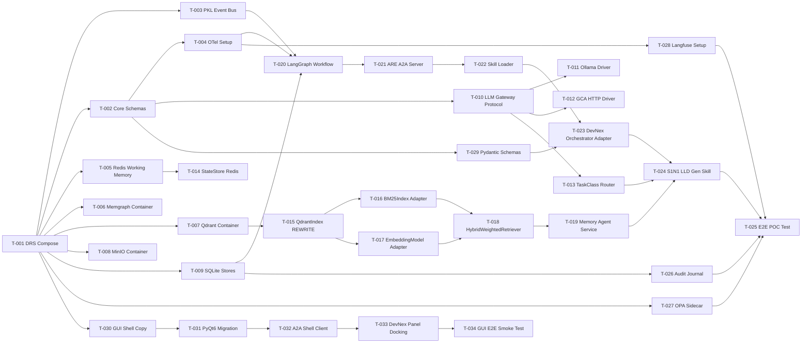

# WBS-0001: POC Spine — "Prove the Spine"

- **Milestone:** POC-1
- **Target completion:** Sprint 2 (Week 6)
- **ADRs implemented:** ADR-0001, ADR-0002, ADR-0003, ADR-0004, ADR-0005

---

## Critical Path

---

## Task Table

| ID | Task | Layer | ADR | CAR | Disposition | Files Touched | Effort | Depends On | Definition of Done |
|----|------|-------|-----|-----|-------------|---------------|--------|------------|---------------------|
| **T-001** | Scaffold DRS Docker Compose | DRS | ADR-0003 | — | NEW | `deploy/local/docker-compose.yml`, `deploy/local/.env`, `deploy/local/Makefile` | M | — | `docker compose up --wait` starts all 8 services healthy within 120s; `make lint` target exists |
| **T-002** | Core Pydantic schemas (TaskContract, ArtifactRelation, AgentCard) | core | ADR-0003 | — | NEW | `cipher/core/schemas/task_contract.py`, `artifact_relation.py`, `agent_card.py` | M | — | Schemas pass pyright strict; JSON round-trip tests pass |
| **T-003** | PKL NATS JetStream event bus wrapper | PKL | ADR-0003 | — | NEW | `cipher/pkl/event_bus/nats_bus.py`, `cipher/pkl/event_bus/__init__.py` | M | T-001 | Publish/subscribe test passes with real NATS container |
| **T-004** | OTel + Langfuse tracing setup | PKL | ADR-0003 | — | NEW | `cipher/core/otel/tracing.py`, `cipher/core/otel/__init__.py`, `cipher/pkl/observability/` | M | T-002 | `@traced` decorator emits spans visible in Langfuse UI |
| **T-005** | Redis 7 working memory container + client | DRS | ADR-0003 | — | NEW | `cipher/core/adapters/redis_client.py` | S | T-001 | Redis ping succeeds; get/set/expire integration test passes |
| **T-006** | Memgraph container + health check | DRS | ADR-0003 | — | NEW | Entry in docker-compose.yml; health check script | S | T-001 | `MATCH (n) RETURN count(n)` query succeeds |
| **T-007** | Qdrant container + health check | DRS | ADR-0004 | CAR-003 | NEW | Entry in docker-compose.yml; health check | S | T-001 | Qdrant REST health endpoint returns 200 |
| **T-008** | MinIO container + bucket creation | DRS | ADR-0003 | — | NEW | Entry in docker-compose.yml; init script creates `cipher-artifacts` bucket | S | T-001 | `mc ls cipher/cipher-artifacts` succeeds |
| **T-009** | SQLite stores (cipher.db, audit.db, checkpoints.db) | DRS | ADR-0003 | — | NEW | `cipher/core/adapters/sqlite_factory.py` | S | T-001 | All three DBs created with schema; WAL mode enabled |
| **T-010** | LLM Gateway `LLMBackend` Protocol + MCP server scaffold | TRF | ADR-0001 | CAR-002 | NEW | `cipher/trf/mcp_servers/llm_gateway/__init__.py`, `protocol.py`, `server.py` | M | T-002 | Protocol type-checks; MCP server starts on configured port |
| **T-011** | OllamaDriver implementing LLMBackend | TRF | ADR-0001 | CAR-003 | WRAP | `cipher/trf/mcp_servers/llm_gateway/ollama_driver.py` | M | T-010 | Unit test: POST to Ollama returns response; OTel span emitted |
| **T-012** | GCAHttpDriver implementing LLMBackend | TRF | ADR-0002 | CAR-002 | WRAP | `cipher/trf/mcp_servers/llm_gateway/gca_http_driver.py` | M | T-010 | Unit test with MockGCABridge; parameterized URL from env |
| **T-013** | TaskClassRouter (task_class → backend mapping) | TRF | ADR-0001 | — | NEW | `cipher/trf/mcp_servers/llm_gateway/router.py` | S | T-011, T-012 | Route TRIAGE→Ollama, PLAN→Gemini(stub), CODE_GEN→GCA; integration test |
| **T-014** | StateStore Redis refactor | core | ADR-0003 | CAR-002 | REFACTOR | `cipher/core/adapters/state_store.py` | M | T-005 | Preserves `load()`/`save()` API; Redis-backed; unit tests from CAR-002 pass |
| **T-015** | QdrantIndex REWRITE (ChromaDB replacement) | MKF | ADR-0004 | CAR-003 | REWRITE | `cipher/mkf/memory_agent/qdrant_index.py` | M | T-007 | `add()`, `search()`, `delete_collection()` match ChromaIndex interface; integration test with real Qdrant |
| **T-016** | BM25Index adapter | MKF | ADR-0004 | CAR-003 | WRAP | `cipher/mkf/memory_agent/bm25_index.py` | S | T-015 | `fit()` and `search()` unit tests pass |
| **T-017** | EmbeddingModel adapter | MKF | ADR-0004 | CAR-003 | WRAP | `cipher/mkf/memory_agent/embedder.py` | S | T-015 | Encode test passes; model name from env var |
| **T-018** | HybridWeightedRetriever adapter | MKF | ADR-0004 | CAR-003 | WRAP | `cipher/mkf/memory_agent/retriever.py` | S | T-016, T-017 | `retrieve()` returns combined scores; alpha=0.5 default; Recall@5 ≥ 0.70 on golden set |
| **T-019** | Memory Agent FastAPI service | MKF | ADR-0004 | CAR-003 | NEW | `cipher/mkf/memory_agent/service.py`, `schemas.py` | M | T-018 | `POST /v1/memory/query` returns top-k results; OTel span emitted |
| **T-020** | LangGraph StateGraph workflow engine | PKL | ADR-0003 | CAR-002 | REFACTOR | `cipher/pkl/workflow/workflow_engine.py`, `workflow_utils.py` | L | T-003, T-004, T-009 | Sequential workflow executes 1 node; checkpoint persists to SQLite; resume works |
| **T-021** | ARE A2A Server (FastAPI + a2a-python) | ARE | ADR-0003 | — | NEW | `cipher/are/a2a_server/server.py`, `task_handler.py` | M | T-020 | `POST /v1/tasks` accepts TaskContract; returns task_id; SSE stream emits updates |
| **T-022** | Skill Loader (Stages 1+2) | ARE | ADR-0003 | CAR-002 | WRAP | `cipher/are/skill_loader/loader.py`, `skill_registry.py` | M | T-021 | Resolves skill_id → skill instance; SKILL.md Stage 1 (description) loaded |
| **T-023** | DevNex Orchestrator A2A Adapter | AAL | ADR-0003 | CAR-002 | WRAP | `cipher/agents/devnex/adapter.py`, `cipher/agents/devnex/__init__.py` | M | T-022, T-029 | A2A task triggers `run_node("S1N1")`; NodeResult returned as TaskResult |
| **T-024** | S1N1 LLD Generation Skill (POC skill) | AAL | ADR-0003 | CAR-002 | WRAP | `cipher/agents/devnex/skills/vcycle_s1n1/skill.py`, `prompt_contract.py`, `SKILL.md` | M | T-023, T-013, T-019 | Feed synthetic HLD → get LLD CSV with ≥5 rows in MinIO; OTel trace complete |
| **T-025** | E2E POC Spine Test | tests | ADR-0003 | — | NEW | `tests/e2e/test_poc_spine.py` | M | T-024, T-026, T-027, T-028 | All 6 POC exit criteria pass (§7 of protocol) |
| **T-026** | Audit Journal (append-only SQLite) | GCL | ADR-0003 | — | NEW | `cipher/gcl/audit_journal/journal.py`, `schemas.py` | S | T-009 | Every GCA/LLM call produces signed AuditRecord in audit.db |
| **T-027** | OPA sidecar + permissive POC policy | GCL | ADR-0003 | — | NEW | `cipher/gcl/policy_engine/opa_client.py`, `deploy/local/policies/poc_allow_all.rego` | S | T-001 | OPA healthcheck passes; policy evaluation returns `allow: true` |
| **T-028** | Langfuse container + OTel Collector config | PKL | ADR-0003 | — | NEW | docker-compose entry; `cipher/pkl/observability/otel_config.yaml` | S | T-004 | Traces visible in Langfuse UI at localhost:3000 |
| **T-029** | DevNex pydantic schema migration | core | ADR-0003 | CAR-002 | REFACTOR | `cipher/core/schemas/devnex_types.py` | S | T-002 | All CAR-002 dataclasses converted; pyright passes |
| **T-030** | Copy MainCipher shell to `cipher/gui/shell/` | GUI | ADR-0005 | CAR-001 | WRAP | `cipher/gui/shell/` (all files from CAR-001 in-scope) | S | T-001 | Shell files present at canonical CIPHER paths |
| **T-031** | PyQt5→PyQt6 migration of shell | GUI | ADR-0005 | CAR-001 | REFACTOR | All files in `cipher/gui/shell/` | S | T-030 | Shell launches under PyQt6; no PyQt5 imports remain |
| **T-032** | CipherShellClient (A2A + SSE) | GUI | ADR-0005 | — | NEW | `cipher/gui/client/a2a_client.py`, `sse_client.py` | M | T-031, T-021 | Client can submit TaskContract and receive SSE updates |
| **T-033** | DevNex panel docking (PanelDescriptor) | GUI | ADR-0005 | CAR-002 | REFACTOR | `cipher/gui/panels/devnex/__init__.py`, `panel_descriptor.py`, widget files | M | T-032 | DevNex panel renders inside shell; StepIndicator shows; workflow submission works via A2A |
| **T-034** | GUI E2E smoke test | tests | ADR-0005 | — | NEW | `tests/e2e/test_gui_smoke.py` | S | T-033 | Shell launches, DevNex panel loads, LLD submission completes (headless QTest or screenshot) |

---

## Risks & Open Questions

- **Risk:** LangGraph StateGraph learning curve → mitigation: start with simplest sequential graph (1 node), expand later.
- **Risk:** Qdrant client API may differ from ChromaDB significantly → mitigation: QdrantIndex interface is only 3 methods; well-documented client library.
- **Risk:** GCA Bridge VSIX availability in dev → mitigation: MockGCABridge for all tests; real bridge only in nightly E2E.
- **Risk:** PyQt6 migration breaks themed widgets → mitigation: batch all Qt changes in T-031 before any functional work.
- **Open Q for Architect:** Should the Gemini CLI driver be stubbed in POC (returns mock) or fully implemented? (ADR-0001 says POC uses only one backend per task_class; if CODE_GEN goes to GCA and TRIAGE goes to Ollama, Gemini is not exercised in POC.)

---

## Test Plan Outline (for QA-TEST)

- **Component tests required for:** T-002, T-010, T-011, T-012, T-013, T-014, T-015, T-016, T-017, T-018, T-019, T-022, T-023, T-024, T-026
- **Integration tests required for:** T-020+T-021 (workflow→A2A), T-015+T-016+T-017+T-018 (full retrieval pipeline), T-024+T-013+T-019 (skill→gateway→memory)
- **E2E test:** T-025 (the POC exit criterion test)
- **GUI smoke:** T-034

---

## QA Gates (for QA-PROC)

- **G0 (Architecture Review):** Already passed — CARs + ADRs accepted.
- **G1 (Foundation Fixes):** After T-001..T-009 complete — all containers healthy, stores accessible.
- **G2 (Implementation Conformance):** After T-024 — first skill produces output through full stack.
- **G4 (Behaviour Verification):** After T-025 — all 6 POC exit criteria demonstrated.

---

## Sprint Allocation

| Sprint | Tasks | Gate |
|--------|-------|------|
| Sprint 0 (Wk 1-2) | T-001 through T-009 (DRS foundation) + T-002 (schemas) | G1 |
| Sprint 1 (Wk 3-4) | T-010..T-020 (TRF + MKF + PKL) + T-029 | G2 prep |
| Sprint 2 (Wk 5-6) | T-021..T-028 (ARE + AAL + GCL + E2E) + T-030..T-034 (GUI) | G2 + G4 |
